# Getting Started with @pagesmith/docs

`@pagesmith/docs` is a convention-based documentation site builder. It turns a directory of markdown files -- with optional JSON5 config when you need overrides -- into a complete docs site with navigation, sidebar, table of contents, Pagefind search, and a default theme -- all without writing any JavaScript or layout code.

This guide covers everything you need to go from an empty project to a running docs site.

Follow the arrows left to right: install pulls in core, init lays down config and content, and your scripts drive dev, build, and search indexing.




## AI-First Setup

Paste this into your AI assistant when you want it to retrofit docs into an existing repo or create a fresh docs section with the right Pagesmith structure:

> Set up docs using Pagesmith for this repository. Read `https://projects.sujeet.pro/pagesmith/prompts/setup-docs.md` first and follow it exactly. Use `npx pagesmith-docs init --yes --ai` for bootstrap work and keep `pagesmith.config.json5` at the repo root.

If `@pagesmith/docs` is already installed and you want the version-matched local file instead of the hosted one:

> Set up docs using Pagesmith for this repository. Read `node_modules/@pagesmith/docs/skills/pagesmith-docs-setup/references/setup-docs.md` first and follow it exactly.

If you want full copy-paste prompt bodies for both initial setup and upgrades, use [Agent Prompts Cookbook](/guide/prompts-cookbook). That page includes the repo-configuration prompt plus the upgrade prompt for an existing `@pagesmith/docs` integration.

Your agent will create:
- `pagesmith.config.json5` -- site configuration, including a `$schema` pointer to the installed package schema
- a chosen docs folder (`docs/` by default, or an existing docs-like folder after confirmation)
- starter `guide/` and `reference/` sections with `meta.json5` and `README.md` pages
- root `package.json` scripts: `docs:dev`, `docs:build`, `docs:preview`
- AI context files and markdown guidelines
- `CLAUDE.md` / `AGENTS.md` pointers to the package guidance, setup prompt, and schema files
- Claude skills for docs maintenance (`/update-docs`, `/ps-update-all-docs`) when AI artifacts are installed

When the repo has a GitHub remote, the setup flow defaults to GitHub Pages:

- `basePath` defaults to `/<repo-name>`
- `origin` starts from `https://<owner>.github.io` and uses the resolved host if that URL redirects
- if you want root-hosted docs instead, edit `pagesmith.config.json5` manually after setup

The rest of this guide explains each piece in detail for manual setup or customization.

---

## Install

```bash
npm add @pagesmith/docs
```

This is the only Pagesmith package you need for the docs workflow. You do not need to install `@pagesmith/core` or `@pagesmith/site` separately when using `@pagesmith/docs`.

After installation, the canonical docs CLI is available as `npx pagesmith-docs`. The package also exposes `@pagesmith/docs/preset` for `pagesmith-site`, but docs projects should prefer `pagesmith-docs`.

## Quick Init

The fastest non-interactive setup flow is:

```bash
npx pagesmith-docs init --yes --ai
```

For an agent or scriptable workflow, pass explicit values:

```bash
npx pagesmith-docs init --yes --ai --content-dir docs --base-path /my-repo --origin https://my-user.github.io
```

If `https://my-user.github.io` redirects to a custom host, use the redirected origin. If you want the docs site hosted at the root instead of `/<repo-name>`, edit `pagesmith.config.json5` manually after init.

It is safe to rerun `pagesmith-docs init` later. The command updates `pagesmith.config.json5` to add missing scaffold fields and refresh the `$schema` path instead of skipping the file outright.

## Create a Configuration File

If your repository already follows the default conventions, `pagesmith-docs dev`, `pagesmith-docs build`, `pagesmith-docs preview`, and `pagesmith-docs mcp --stdio` work without a config file at all. In zero-config mode, Pagesmith uses `<repo-root>/docs` when it exists, falls back to `<repo-root>/content`, and writes the build to `<repo-root>/gh-pages`.

Add `pagesmith.config.json5` at the project root when you want to override those defaults:

```json5
{
  $schema: './node_modules/@pagesmith/docs/schemas/pagesmith-config.schema.json',
  // Required: site identity
  name: 'My Docs',
  title: 'My Docs',
  description: 'Documentation for my project',
  origin: 'https://docs.example.com',

  // Optional: content and output paths
  contentDir: './docs',
  outDir: './gh-pages',

  // Optional: deployment under a subdirectory
  basePath: '/docs',

  // Optional: footer attribution
  maintainer: {
    name: 'Sujeet Jaiswal',
    link: 'https://sujeet.pro',
  },

  // Optional: footer copyright
  copyright: {
    projectName: 'Acme Docs',
    startYear: 2024,
    endYear: null,
  },

  // Optional: footer navigation
  footerLinks: [
    {
      header: 'Docs',
      links: [
        { label: 'Guide', path: '/guide' },
        { label: 'API Reference', path: '/reference' },
      ],
    },
    {
      header: 'Project',
      links: [{ label: 'GitHub', path: 'https://github.com/example/repo' }],
    },
  ],

  // Optional: search (enabled by default)
  search: {
    enabled: true,
  },
}
```

### Configuration Fields

| Field | Type | Default | Description |
|---|---|---|---|
| `name` | `string` | directory name | Short site name shown in the header |
| `title` | `string` | same as `name` | Full site title used in page titles and meta tags |
| `description` | `string` | `"Documentation site powered by @pagesmith/docs"` | Meta description for the site |
| `origin` | `string` | git-detected GitHub Pages host or `"https://example.com"` | Production URL origin (used for canonical links, sitemap) |
| `language` | `string` | `"en"` | HTML `lang` attribute |
| `contentDir` | `string` | `"docs/"` if exists, else `"content/"` | Path to the content directory, relative to the config file |
| `outDir` | `string` | `"gh-pages"` | Build output directory, relative to the config file |
| `publicDir` | `string` | `"./public"` | Static assets directory copied verbatim to output |
| `basePath` | `string` | git-detected repo name or `"/"` | URL prefix for deployment under a subdirectory. Can also be set via the `BASE_URL` environment variable or the `--base-path` CLI flag. Priority: CLI flag > `BASE_URL` env > config value > git-detected repo name > default `"/"` |
| `maintainer` | `object` | `package.json author` | Maintainer credit used by the default footer sign-off |
| `footerLinks` | `array` | top-level nav links | Links shown in the page footer as either a flat wrapped row or grouped columns with optional headers. When omitted, Pagesmith reuses the major top-level nav links |
| `footerText` | `string` | — | Override only the Pagesmith sign-off segment in the footer's bottom legal line |
| `copyright` | `object` | — | Footer copyright config. `startYear` defaults to the repo's first git commit year when available, and `endYear: null` keeps the rendered year dynamic |
| `search` | `object` | `{ enabled: true }` | Search configuration. Set `{ enabled: false }` to disable |
| `theme` | `object` | -- | Theme overrides including `lightColor`, `darkColor`, and `layouts` |
| `analytics` | `object` | -- | Analytics config, currently supports `googleAnalytics` tracking ID |
| `editLink` | `object \| false` | auto-detected | "Edit this page" link configuration, or `false` to disable the default git-remote detection |
| `lastUpdated` | `boolean` | `true` | Git-based last updated timestamps. Set `false` to opt out |
| `markdown` | `object` | -- | Markdown pipeline config passed to `@pagesmith/core` (custom remark/rehype plugins) |

## Content Directory Structure

The content directory is the source of truth for your docs site. Top-level folders become navigation sections, and each markdown file inside one of those folders becomes a page for that section.

```text
content/
  README.md              # Home page (the site landing page)
  guide/
    README.md            # "Guide" section landing page
    meta.json5           # Section configuration (optional)
    getting-started/
      README.md          # /guide/getting-started
    advanced-usage/
      README.md          # /guide/advanced-usage
  reference/
    README.md            # "Reference" section landing page
    meta.json5           # Section configuration (optional)
    api/
      README.md          # /reference/api
    docs-cli/
      README.md          # /reference/docs-cli
```

Key conventions:

- **`content/README.md`** is always the home page, rendered at `/`.
- **Top-level folders** (e.g. `guide/`, `reference/`) define the docs sections. By default they appear in the header; use `headerLinks` in `meta.json5` to control which sections are shown.
- **`README.md` inside a section folder** is the section landing page (e.g. `guide/README.md` serves `/guide`).
- **Markdown files inside a section** become pages even when nested. Nested folders keep their URL paths, but the section sidebar stays flat from the docs reader's perspective.
- **`meta.json5` series** group pages into sidebar buckets. Pages not referenced by any series stay visible under an automatic `Miscellaneous` group.
- Files and folders starting with `.` or `_` are ignored.
- Files with `draft: true` in frontmatter are excluded from the build.

## README.md Files as Pages

The docs system uses `README.md` as the entry file for each page. This is intentional: it mirrors how GitHub renders folder READMEs, so your content reads well both on the rendered site and when browsing the repository directly.

A simple page looks like:

```markdown
# Page Title

Your content here. The first `h1` heading is used as the page title
if no `title` frontmatter is provided.
```

## Frontmatter Options

Frontmatter is optional. When provided, it is written in YAML between `---` fences at the top of the markdown file.

```yaml
---
title: Getting Started
description: Learn how to set up your first docs site.
navLabel: Start Here
sidebarLabel: Quick Start
order: 1
draft: false
---
```

| Field | Type | Description |
|---|---|---|
| `title` | `string` | Page title. Falls back to the first h1 heading, then to the slug converted to title case |
| `description` | `string` | Page description used in meta tags and sidebar |
| `navLabel` | `string` | Override the label shown in the top navigation bar for section landing pages |
| `sidebarLabel` | `string` | Override the label shown in the sidebar for this page |
| `order` | `number` | Numeric sort order within a section. Lower numbers appear first. Pages without `order` sort alphabetically after ordered pages |
| `draft` | `boolean` | When `true`, the page is excluded from the build entirely |
| `socialImage` | `string` | Path to a custom Open Graph image for this page |

Additional frontmatter fields are passed through to layout components, so you can define custom fields and access them in layout overrides.

## Home Page Setup

The root `content/README.md` is rendered using the `home` layout. It supports special frontmatter fields to build a hero section and features grid without writing HTML.

```yaml
---
title: My Project
tagline: The Best Documentation Tool
description: Build beautiful docs sites with zero configuration.
actions:
  - text: Get Started
    link: /guide/getting-started
    theme: brand
  - text: View on GitHub
    link: https://github.com/example/repo
    theme: alt
features:
  - title: Fast Setup
    details: Go from zero to a published docs site in under five minutes.
  - title: Built-in Search
    details: Full-text search powered by Pagefind, no configuration needed.
  - title: Markdown First
    details: Write in markdown, get a polished site with navigation and TOC.
---

## Additional Content

Any markdown below the frontmatter is rendered in a content section below the hero and features.
```

### Hero Fields

The home layout builds the hero from frontmatter. You can either use the top-level convenience fields (`title`, `tagline`, `description`, `actions`) or provide an explicit `hero` object:

```yaml
---
hero:
  name: My Project
  text: The documentation framework
  tagline: Convention over configuration
  actions:
    - text: Quick Start
      link: /guide
      theme: brand
---
```

Each action in the `actions` array has:

- `text` -- the button label
- `link` -- the URL (internal path or external URL)
- `theme` -- visual style, either `"brand"` (primary color) or `"alt"` (secondary style)

### Features Fields

The `features` array renders a card grid below the hero:

```yaml
features:
  - title: Feature Name
    icon: "rocket symbol or emoji"
    details: A short description of the feature.
```

Each feature has `title` (required), `details` (required), and an optional `icon` string.

## Running the Dev Server

Start the development server with live reload:

```bash
npx pagesmith-docs dev
```

The dev server defaults to port 3000. Use `--port` to change it:

```bash
npx pagesmith-docs dev --port 8080
```

Use `--open` to automatically open the site in your default browser:

```bash
npx pagesmith-docs dev --open
```

The dev server watches the content directory and rebuilds pages on change. A WebSocket connection triggers automatic browser reload when content is updated.

## Building for Production

Build a static site:

```bash
npx pagesmith-docs build
```

The output goes to the configured `outDir` (default `gh-pages/`). The build:

1. Processes all markdown files through the markdown pipeline
2. Renders each page using the appropriate layout
3. Bundles the theme CSS and runtime JavaScript
4. Copies static assets from `publicDir`
5. Runs Pagefind to generate the search index (if search is enabled)

Override the output directory or base path from the CLI:

```bash
npx pagesmith-docs build --out-dir ./public --base-path /my-docs
```

## Previewing the Build

Preview the built site locally:

```bash
npx pagesmith-docs preview
```

This starts a static file server pointing at the output directory. Use `--port` to change the default port (4000):

```bash
npx pagesmith-docs preview --port 5000
```

## CLI Reference

```text
pagesmith-docs dev [options]       Start a docs dev server
pagesmith-docs build [options]     Build a docs site
pagesmith-docs preview [options]   Preview the built docs site

Options:
  -p, --port <number>         Server port (dev: 3000, preview: 4000)
  --open                      Open browser on server start
  --out-dir <path>            Output directory (overrides config)
  --base-path <path>          Base URL path prefix (overrides config)
  --log-level <level>         Log level: silent|error|warn|info|verbose (default: warn)
  --config <path>             Config file path (default: pagesmith.config.json5)
```

## Package Scripts

A typical `package.json` setup:

```json
{
  "scripts": {
    "docs:dev": "pagesmith-docs dev",
    "docs:build": "pagesmith-docs build",
    "docs:preview": "pagesmith-docs preview"
  },
  "dependencies": {
    "@pagesmith/docs": "^0.8.0"
  }
}
```

## Search

Pagefind full-text search is enabled by default. It indexes your content during `pagesmith-docs build` and provides a search modal triggered by `Cmd+K` / `Ctrl+K`.

To disable search:

```json5
{
  search: { enabled: false },
}
```

Search works automatically with no additional configuration. The search index is regenerated on every build.

## What to Read Next

- [Meta and Navigation](/guide/meta-and-navigation) -- control sidebar ordering, series grouping, and header links
- [Layout Overrides](/guide/layout-overrides) -- replace built-in layouts with custom components
