# Next.js (App Router)

> [!TIP] AI Quick Start
> Ask your AI agent: "Integrate Pagesmith into my Next.js App Router project. Read `node_modules/@pagesmith/site/skills/pagesmith-site-setup/references/setup-site.md`, `node_modules/@pagesmith/site/skills/pagesmith-site-setup/references/usage.md`, and `node_modules/@pagesmith/site/REFERENCE.md` first. Keep Next.js in charge of routing and export, but use `@pagesmith/site` as the app-facing Pagesmith package for `defineCollection()`, `createContentLayer()`, and `entry.render()`. Add `@pagesmith/site/css/content` and mount `@pagesmith/site/runtime/content` once in a client component."

Source: [`examples/with-nextjs/`](https://github.com/sujeet-pro/pagesmith/tree/main/examples/with-nextjs) | Output: <a href="/pagesmith/examples/nextjs" target="_blank" rel="noopener noreferrer">Live Demo</a>

The Next.js example keeps Next.js in charge of routing, layouts, metadata, and static export while using `@pagesmith/site` as the app-facing Pagesmith package. `@pagesmith/site` owns the imports for collection definitions, markdown rendering, headings, and read time in this shape, while the underlying implementation still builds on `@pagesmith/core`.

The diagram highlights the boundary: the App Router stays in charge of the shell while `@pagesmith/site` supplies rendered markdown data plus the shared prose/code-block layer.




## When to Choose This Pattern

- You already have a Next.js App Router project.
- You want `createContentLayer()` instead of Pagesmith's Vite plugins.
- You want to keep the site shell and most styling decisions in Next.js.
- You still want Pagesmith's markdown pipeline, headings, and optional code-block UI.

## Package Split

| Package | Used for |
|---|---|
| `@pagesmith/site` | Collections, schemas, `createContentLayer()`, `entry.render()`, headings, read time, and shared markdown CSS/runtime |
| `@pagesmith/core` | Lower-level implementation and headless fallback when you intentionally do not want the site package surface |
| `next` | Routing, layouts, metadata, static export, and app shell |

If you own all markdown styling and browser behavior yourself, you can use `@pagesmith/core` on its own.

## Dependencies

```json title="package.json"
{
  "dependencies": {
    "@pagesmith/site": "*",
    "next": "^16.2.3",
    "react": "^19.2.5",
    "react-dom": "^19.2.5"
  }
}
```

## Content Config

Define collections exactly as you would in any other Pagesmith content integration:

```js title="content.config.js"
import { defineCollection, defineCollections, z } from '@pagesmith/site'

export const posts = defineCollection({
  loader: 'markdown',
  directory: './content/posts',
  schema: z.object({
    title: z.string(),
    description: z.string().optional(),
    date: z.coerce.date(),
    tags: z.array(z.string()).default([]),
  }),
})

export default defineCollections({ posts })
```

## Server-Side Content Helpers

Keep the content layer in normal server-side app code. The Next.js example creates the layer once at module scope and reuses it across lookups:

```js title="lib/content.js"
import { createContentLayer, defineConfig } from '@pagesmith/site'
import collections from '../content.config.js'

let layer

function getLayer() {
  if (!layer) {
    layer = createContentLayer(
      defineConfig({
        root: process.cwd(),
        collections,
      }),
    )
  }
  return layer
}

export async function getPostBySlug(slug) {
  const entry = await getLayer().getEntry('posts', slug)
  if (!entry) return null

  const rendered = await entry.render()
  return {
    slug: entry.slug,
    title: entry.data.title,
    html: rendered.html,
    headings: rendered.headings,
    readTime: rendered.readTime,
  }
}
```

The same helper can power `getAllPosts()` from the cached layer:

```js title="lib/content.js"
export async function getAllPosts() {
  const entries = await getLayer().getCollection('posts')
  return Promise.all(
    entries.map(async (entry) => {
      const rendered = await entry.render()
      return {
        slug: entry.slug,
        title: entry.data.title,
        html: rendered.html,
        headings: rendered.headings,
        readTime: rendered.readTime,
      }
    }),
  )
}
```

This is the heart of the integration: Next.js receives rendered HTML and metadata-friendly data, not raw markdown files. `@pagesmith/site` stays the one package surface for both content loading and the shared presentation/runtime layer.

## Layout and Runtime

When you want the shipped Pagesmith prose and code-block UI, import the shared CSS once in the app layout:

```js title="app/layout.js"
import '@pagesmith/site/css/content'
import './globals.css'
```

Mount the browser runtime once through a tiny client component:

```js title="components/pagesmith-content-runtime.js"
'use client'

import '@pagesmith/site/runtime/content'

export function PagesmithContentRuntime() {
  return null
}
```

That runtime wires copy buttons, code tabs, and collapse toggles for the HTML produced by `entry.render()`.

## Routes and Metadata

The App Router keeps all of the routing and metadata logic:

```js title="app/posts/[slug]/page.js"
import { notFound } from 'next/navigation'
import { getAllPosts, getPostBySlug } from '../../../lib/content'

export async function generateStaticParams() {
  const posts = await getAllPosts()
  return posts.map((post) => ({ slug: post.slug }))
}

export default async function PostPage({ params }) {
  const { slug } = await params
  const post = await getPostBySlug(slug)

  if (!post) notFound()

  return <div className="prose" dangerouslySetInnerHTML={{ __html: post.html }} />
}
```

Use `generateMetadata()` for page titles and descriptions, and build your own shell exactly as you would in any other Next.js app.

## Build and Export Notes

- The example uses `next build --output=export` semantics to produce static HTML under `out/`.
- `basePath` and `assetPrefix` are set so the example can publish under `/pagesmith/examples/nextjs`.
- In this monorepo, the example currently uses Next 16's webpack mode because Turbopack trips over Pagesmith's package-relative Node resolution during the server build.

## What You Can Skip

This pattern does **not** require:

- `pagesmithContent` from `@pagesmith/site/vite`
- `pagesmithSsg` from `@pagesmith/site/vite`
- `@pagesmith/site/jsx-runtime`
- the `pagesmith-site` or `pagesmith-docs` CLIs

Use those only when Pagesmith is also responsible for the site build itself.

## Read Next

- [Getting Started](/guide/getting-started) — collections, schemas, and `createContentLayer()`
- [Runtime](/reference/runtime) — `@pagesmith/site/css/*` and `@pagesmith/site/runtime/*`
- [Framework Integrations](/guide/frameworks) — compare Vite, template-engine, docs, and Next.js patterns
