# Template Engines (EJS & Handlebars)

> [!TIP] AI Quick Start
> Ask your AI agent: "Set up a Pagesmith static site using [EJS/Handlebars] templates with `createContentLayer`. Create `content.config.mjs` on `@pagesmith/site`, keep the app-facing imports on `@pagesmith/site`, use `createContentLayer()` from `@pagesmith/site`, wire `pagesmithSsg` from `@pagesmith/site/vite`, and build the HTML shell in templates. Read `node_modules/@pagesmith/site/ai-guidelines/setup-site.md` and `node_modules/@pagesmith/site/ai-guidelines/usage.md` for reference."
> Then read on to understand what happened and customize further.

The template engine integrations keep `@pagesmith/site` as the app-facing package for both content and site-building concerns. Unlike the React, Solid, and Svelte examples that use virtual content modules (`virtual:content/*`), these examples use the programmatic `createContentLayer` API directly. The result is a fully static site with no framework runtime shipped to the browser.

Notice that `pagesmithSsg` drives the build while the content layer and templates meet at `entry.render()` output feeding the final HTML.




## Shared Architecture

Both EJS and Handlebars follow the same pattern:

1. Define collections in `content.config.mjs` (`.mjs` since they use `createContentLayer` directly)
2. Create a content layer with `createContentLayer` in the entry server
3. Load collections, render markdown, and pass HTML into templates
4. Templates compose the final HTML pages

### Content Config

```js title="content.config.mjs"
import { defineCollection, defineCollections, z } from '@pagesmith/site'

export const guide = defineCollection({
  loader: 'markdown',
  directory: './content/guide',
  schema: z.object({
    title: z.string(),
    description: z.string().optional(),
    date: z.coerce.date(),
    tags: z.array(z.string()).default([]),
    order: z.number().optional(),
    series: z.string().optional(),
    seriesOrder: z.number().optional(),
  }),
})

export const pages = defineCollection({
  loader: 'markdown',
  directory: './content/pages',
  schema: z.object({
    title: z.string(),
    description: z.string().optional(),
  }),
})

export default defineCollections({ guide, pages })
```

### Vite Config

Template engine examples use only `pagesmithSsg` and `sharedAssetsPlugin` from `@pagesmith/site/vite` (no `pagesmithContent` since content is loaded via the API):

```ts title="vite.config.ts"
import { defineConfig } from 'vite'
import { pagesmithSsg, sharedAssetsPlugin } from '@pagesmith/site/vite'

export default defineConfig({
  plugins: [
    sharedAssetsPlugin(),
    ...pagesmithSsg({ entry: './src/entry-server.tsx', contentDirs: ['./content'] }),
  ],
  oxc: {
    jsx: {
      runtime: 'automatic',
      importSource: '@pagesmith/site',
    },
  },
})
```

### Content Layer

The content layer is created once and reused across renders:

```ts
import { createContentLayer } from '@pagesmith/site'
import contentConfig from '../content.config.mjs'

const { guide, pages } = contentConfig

let layer: ReturnType<typeof createContentLayer>
let layerRoot: string
function getLayer(root: string) {
  if (!layer || layerRoot !== root) {
    layerRoot = root
    layer = createContentLayer({ collections: { guide, pages }, root })
  }
  return layer
}
```

Content is loaded, rendered, and sorted at render time:

```ts
async function loadContent(root: string) {
  const l = getLayer(root)
  const allGuide = await l.getCollection('guide')

  // Render markdown to HTML
  const rendered = []
  for (const entry of allGuide) {
    const result = await entry.render()
    rendered.push({ entry, ...result })
  }

  // Sort by series order then date
  return rendered.sort((a, b) => {
    const so = (a.entry.data.seriesOrder ?? 99) - (b.entry.data.seriesOrder ?? 99)
    if (so !== 0) return so
    return a.entry.data.date.getTime() - b.entry.data.date.getTime()
  })
}
```

---

## EJS

Source: [`examples/with-vanilla-ejs/`](https://github.com/sujeet-pro/pagesmith/tree/main/examples/with-vanilla-ejs) | Output: <a href="/pagesmith/examples/vanilla-ejs" target="_blank" rel="noopener noreferrer">Live Demo</a>

### Dependencies

```json
{
  "dependencies": {
    "@pagesmith/site": "*",
    "ejs": "^3.1.10",
    "pagefind": "^1.5.0"
  }
}
```

### Project Structure

```text
with-vanilla-ejs/
  content/
    guide/          # Guide articles
    pages/          # Standalone pages
  src/
    entry-server.tsx
    theme.css
  templates/
    layout.ejs      # Outer HTML shell
    index.ejs       # Home page body
    article.ejs     # Article body
    about.ejs       # About page body
  content.config.mjs
  vite.config.ts
```

### Rendering with EJS

Templates are loaded from disk and rendered with `ejs.render()`. A layout wrapper composes the outer HTML shell:

```ts
import ejs from 'ejs'
import { readFileSync } from 'fs'
import { join } from 'path'

function loadTemplate(root: string, name: string) {
  return readFileSync(join(root, 'templates', `${name}.ejs`), 'utf-8')
}

function renderWithLayout(root: string, body: string, vars: Record<string, any>) {
  const layout = loadTemplate(root, 'layout')
  return ejs.render(layout, { ...vars, body })
}
```

### Template Syntax

EJS uses `<%-` for unescaped output (rendered markdown HTML) and `<%=` for escaped output:

```ejs
<article>
  <% if (date) { %>
    <p class="doc-page-meta">
      <time><%= formatDate(date) %></time>
      <% if (readTime) { %> &middot; <%= readTime %> min read <% } %>
    </p>
  <% } %>

  <div class="prose"><%- content %></div>
</article>
```

### Key Differences

- Templates use `<%- content %>` for raw HTML (rendered markdown)
- Layout composition via `ejs.render()` with template loading from disk
- Simpler mental model: template strings with embedded JavaScript

---

## Handlebars

Source: [`examples/with-vanilla-hbs/`](https://github.com/sujeet-pro/pagesmith/tree/main/examples/with-vanilla-hbs) | Output: <a href="/pagesmith/examples/vanilla-hbs" target="_blank" rel="noopener noreferrer">Live Demo</a>

### Dependencies

```json
{
  "dependencies": {
    "@pagesmith/site": "*",
    "handlebars": "^4.7.8",
    "pagefind": "^1.5.0"
  }
}
```

### Project Structure

```text
with-vanilla-hbs/
  content/
    guide/          # Guide articles
    pages/          # Standalone pages
  src/
    entry-server.tsx
    theme.css
  templates/
    layout.hbs      # Outer HTML shell with inline partials
    index.hbs       # Home page
    article.hbs     # Article page
    about.hbs       # About page
  content.config.mjs
  vite.config.ts
```

### Custom Helpers

Handlebars requires registering helpers for common operations:

```ts
import Handlebars from 'handlebars'

Handlebars.registerHelper('formatDate', (value: any) => {
  const date = new Date(value)
  return date.toLocaleDateString('en-US', {
    year: 'numeric',
    month: 'long',
    day: 'numeric',
  })
})
Handlebars.registerHelper('eq', (left: any, right: any) => left === right)
Handlebars.registerHelper(
  'startsWith',
  (str: any, prefix: any) => typeof str === 'string' && str.startsWith(prefix),
)
```

### Rendering with Handlebars

The layout is registered as a partial, and child templates use partial block syntax:

```ts
Handlebars.registerPartial('layout', loadTemplate(root, 'layout'))

const articleTemplate = Handlebars.compile(loadTemplate(root, 'article'))
return articleTemplate({
  title: item.entry.data.title,
  content: item.html,
  headings: item.headings,
})
```

### Template Syntax

Handlebars uses triple-braces `{{{content}}}` for raw HTML and double-braces `{{title}}` for escaped output. Inline partials define reusable blocks:

```handlebars
{{#> layout}}
  {{#*inline "body"}}
    <article>
      {{#if date}}
        <p class="doc-page-meta">
          <time>{{formatDate date}}</time>
          {{#if readTime}} &middot; {{readTime}} min read {{/if}}
        </p>
      {{/if}}

      <div class="prose">{{{content}}}</div>
    </article>
  {{/inline}}
{{/layout}}
```

### Key Differences

- Triple-braces `{{{content}}}` for raw HTML (rendered markdown)
- Partial block syntax (`{{#> layout}}...{{/layout}}`) for layout composition
- Custom helpers for date formatting, equality, and string operations
- Inline partials (`{{#*inline "name"}}`) for reusable blocks

---

## Shared Patterns

### CSS and Styling

Both examples import CSS from `@pagesmith/site`:

```css title="src/theme.css"
@import '@pagesmith/site/css/standalone';
```

| Import path | Contents |
|---|---|
| `@pagesmith/site/css/standalone` | Full bundle (reset, tokens, prose, code, layout, TOC) |
| `@pagesmith/site/css/content` | Content-only bundle (reset, prose, code, viewport) |
| `@pagesmith/site/css/fonts` | Bundled web fonts (Open Sans, JetBrains Mono) |
| `@pagesmith/site/css/viewport` | Viewport / responsive base only |

### Development and Building

```bash
# Start the dev server with hot reload
vp dev

# Build the static site (runs SSG + Pagefind indexing)
vp build

# Type-check the project
vp check
```

### Template Engine Comparison

| Aspect | EJS | Handlebars |
|---|---|---|
| Raw HTML output | `<%- content %>` | `{{{content}}}` |
| Escaped output | `<%= title %>` | `{{title}}` |
| Layout composition | `ejs.render()` with layout wrapper | Partial blocks (`{{#> layout}}`) |
| Helpers | Plain JavaScript functions | Registered via `Handlebars.registerHelper` |
| Reusable blocks | N/A (re-render or extract functions) | Inline partials (`{{#*inline}}`) |
| Logic in templates | Full JavaScript (`<% if/for %>`) | Block helpers (`{{#if}}`, `{{#each}}`) |
