# Vite Framework Apps

> [!TIP] AI Quick Start
> Ask your AI agent: "Set up a Pagesmith content-driven static site with [React/SolidJS/Svelte]. Create `content.config.ts` on `@pagesmith/site`, keep the app-facing imports on `@pagesmith/site`, add `vite.config.ts` with `pagesmithContent` and `pagesmithSsg` from `@pagesmith/site/vite`, and an SSR entry that exports `getRoutes()` and `render()`. Read `node_modules/@pagesmith/site/ai-guidelines/setup-site.md` and `node_modules/@pagesmith/site/ai-guidelines/usage.md` for reference."
> Then read on to understand what happened and customize further.

All three Vite framework integrations follow the same pattern: define collections in `content.config.ts` with `@pagesmith/site`, wire up the `pagesmithContent` and `pagesmithSsg` Vite plugins from `@pagesmith/site/vite`, and write an SSR entry that exports `getRoutes()` and `render()`. The framework-specific differences are limited to the JSX/template syntax, the rendering function, and how raw HTML is injected.

## Shared Architecture

Every Vite framework example uses the same content setup:

The diagram below shows the shared pipeline across all three examples. Notice that only the framework renderer changes; the content definitions, virtual modules, and `getRoutes()` / `render()` contract stay the same.




```ts title="content.config.ts"
import { defineCollection, defineCollections, z } from '@pagesmith/site'

export const guide = defineCollection({
  loader: 'markdown',
  directory: './content/guide',
  schema: z.object({
    title: z.string(),
    description: z.string().optional(),
    date: z.coerce.date(),
    tags: z.array(z.string()).default([]),
    order: z.number().optional(),
    series: z.string().optional(),
    seriesOrder: z.number().optional(),
  }),
})

export const pages = defineCollection({
  loader: 'markdown',
  directory: './content/pages',
  schema: z.object({
    title: z.string(),
    description: z.string().optional(),
  }),
})

export default defineCollections({ guide, pages })
```

All frameworks import content through virtual modules:

```ts
import guideCollection from 'virtual:content/guide'
import pagesCollection from 'virtual:content/pages'
```

Each entry provides `contentSlug`, `html`, `headings`, and `frontmatter` with full type safety derived from the Zod schema.

### SSR Entry Contract

The `pagesmithSsg` plugin expects two exports from the entry server:

```ts
export async function getRoutes(): Promise<string[]> {
  // Return all URL paths to pre-render
}

export async function render(url: string, config: SsgRenderConfig): Promise<string> {
  // Return a complete HTML document string for the given URL
}
```

The `SsgRenderConfig` provides:

| Property | Description |
|---|---|
| `base` | Base path without trailing slash (e.g., `/my-site`) |
| `root` | Absolute path to the project root |
| `cssPath` | Path to the built CSS asset |
| `jsPath` | Path to the built JS asset (undefined in some dev scenarios) |
| `searchEnabled` | Whether Pagefind search is enabled (false in dev) |
| `isDev` | Whether running in development mode |

---

## React

Source: [`examples/with-react/`](https://github.com/sujeet-pro/pagesmith/tree/main/examples/with-react) | Output: <a href="/pagesmith/examples/react" target="_blank" rel="noopener noreferrer">Live Demo</a>

### Dependencies

```json
{
  "dependencies": {
    "@pagesmith/site": "*",
    "pagefind": "^1.5.0",
    "react": "^19.2.4",
    "react-dom": "^19.2.4"
  },
  "devDependencies": {
    "@types/react": "^19.2.14",
    "@types/react-dom": "^19.2.3",
    "typescript": "^5.7.0"
  }
}
```

### Vite Config

```ts title="vite.config.ts"
import { defineConfig } from 'vite'
import collections from './content.config'
import { pagesmithContent, pagesmithSsg, sharedAssetsPlugin } from '@pagesmith/site/vite'

export default defineConfig({
  plugins: [
    sharedAssetsPlugin(),
    pagesmithContent(collections),
    ...pagesmithSsg({ entry: './src/entry-server.tsx', contentDirs: ['./content'] }),
  ],
  oxc: {
    jsx: {
      runtime: 'automatic',
      importSource: 'react',
    },
  },
})
```

### TypeScript Config

```json
{
  "compilerOptions": {
    "jsx": "react-jsx",
    "jsxImportSource": "react"
  }
}
```

### Rendering

React uses `renderToStaticMarkup()` from `react-dom/server`. Raw markdown HTML is injected via `dangerouslySetInnerHTML`:

```tsx
import { renderToStaticMarkup } from 'react-dom/server'

const bodyHtml = renderToStaticMarkup(
  <PageBody
    title={entry.frontmatter.title}
    content={entry.html}
    headings={entry.headings}
  />
)
```

```tsx
<div className="prose" dangerouslySetInnerHTML={{ __html: entry.html }} />
```

### Runtime

The client entry imports theme CSS and runtime JavaScript for progressive enhancements (TOC highlight, sidebar toggle). Search is handled by Pagefind Component UI in the server-rendered HTML, not in this bundle:

```js title="client.js"
import './src/theme.css'
import './src/runtime.ts'
```

---

## SolidJS

Source: [`examples/with-solid/`](https://github.com/sujeet-pro/pagesmith/tree/main/examples/with-solid) | Output: <a href="/pagesmith/examples/solid" target="_blank" rel="noopener noreferrer">Live Demo</a>

### Dependencies

```json
{
  "dependencies": {
    "@pagesmith/site": "*",
    "pagefind": "^1.5.0",
    "solid-js": "^1.9.12"
  },
  "devDependencies": {
    "vite-plugin-solid": "^2.11.11",
    "typescript": "^5.7.0"
  }
}
```

### Vite Config

```ts title="vite.config.ts"
import { defineConfig } from 'vite'
import collections from './content.config'
import solid from 'vite-plugin-solid'
import { pagesmithContent, pagesmithSsg, sharedAssetsPlugin } from '@pagesmith/site/vite'

export default defineConfig({
  plugins: [
    sharedAssetsPlugin(),
    solid({ ssr: true }),
    pagesmithContent(collections),
    ...pagesmithSsg({ entry: './src/entry-server.tsx', contentDirs: ['./content'] }),
  ],
})
```

No `oxc.jsx` configuration needed -- `vite-plugin-solid` handles the JSX transform.

### TypeScript Config

```json
{
  "compilerOptions": {
    "jsx": "preserve",
    "jsxImportSource": "solid-js"
  }
}
```

### Rendering

Solid uses `renderToString()` from `solid-js/web`. Components use `For` and `Show` primitives. Raw HTML uses `innerHTML` (not `dangerouslySetInnerHTML`), and `class` instead of `className`:

```tsx
import { renderToString } from 'solid-js/web'

const bodyHtml = renderToString(() => (
  <PageBody
    title={entry.frontmatter.title}
    content={entry.html}
    headings={entry.headings}
  />
))
```

```tsx
<div class="prose" innerHTML={entry.html} />
```

---

## Svelte

Source: [`examples/with-svelte/`](https://github.com/sujeet-pro/pagesmith/tree/main/examples/with-svelte) | Output: <a href="/pagesmith/examples/svelte" target="_blank" rel="noopener noreferrer">Live Demo</a>

### Dependencies

```json
{
  "dependencies": {
    "@pagesmith/site": "*",
    "pagefind": "^1.5.0",
    "svelte": "^5.55.1"
  },
  "devDependencies": {
    "@sveltejs/vite-plugin-svelte": "^7.0.0",
    "typescript": "^5.7.0"
  }
}
```

### Vite Config

```ts title="vite.config.ts"
import { defineConfig } from 'vite'
import { svelte } from '@sveltejs/vite-plugin-svelte'
import collections from './content.config'
import { pagesmithContent, pagesmithSsg, sharedAssetsPlugin } from '@pagesmith/site/vite'

export default defineConfig({
  plugins: [
    sharedAssetsPlugin(),
    svelte(),
    pagesmithContent(collections),
    ...pagesmithSsg({ entry: './src/entry-server.ts', contentDirs: ['./content'] }),
  ],
})
```

Note the entry is `.ts` (not `.tsx`) since Svelte uses `.svelte` files for components.

### Svelte Config

```js title="svelte.config.js"
import { vitePreprocess } from '@sveltejs/vite-plugin-svelte'

export default {
  preprocess: vitePreprocess(),
}
```

### Architecture

The Svelte example splits concerns across files:

- **`src/site.ts`** -- shared data module that imports virtual content and exports sorted/typed entry arrays
- **`src/App.svelte`** -- root component that switches between page kinds
- **`src/components/`** -- individual Svelte components
- **`src/entry-server.ts`** -- SSR entry that orchestrates rendering

### Rendering

Svelte uses `render()` from `svelte/server`, which returns `{ body, head }`:

```ts
import { render as renderSvelte } from 'svelte/server'
import App from './App.svelte'

const rendered = renderSvelte(App, {
  props: {
    pageKind: 'page',
    pageTitle: entry.frontmatter.title,
    pageContent: entry.html,
    pageHeadings: entry.headings,
  },
})
```

Raw HTML in Svelte templates uses `{@html content}`:

```svelte
<div class="prose">{@html content}</div>
```

Svelte 5 components use `$props()` runes for prop declarations:

```svelte
<script lang="ts">
  let { title, content, headings } = $props()
</script>
```

---

## Shared Patterns

### CSS and Styling

All examples can import pre-built CSS from `@pagesmith/site`:

| Import path | Contents |
|---|---|
| `@pagesmith/site/css/standalone` | Full bundle (reset, tokens, prose, code, layout, TOC) |
| `@pagesmith/site/css/content` | Content-only bundle (reset, prose, code, viewport) |
| `@pagesmith/site/css/fonts` | Bundled web fonts (Open Sans, JetBrains Mono) |
| `@pagesmith/site/css/viewport` | Viewport / responsive base only |

The `sharedAssetsPlugin()` copies font files and `fonts.css` into the build output.

### Pagefind Search

The `pagesmithSsg` plugin automatically runs Pagefind after the production build. To enable search:

1. Mark searchable content with `data-pagefind-body`
2. Conditionally include Pagefind Component UI CSS/JS (`pagefind-component-ui.css`, `pagefind-component-ui.js` as `type="module"`) based on `config.searchEnabled`
3. Add `<pagefind-modal-trigger>` in the header and a `<pagefind-modal reset-on-close>` tree (with `<pagefind-input>`, `<pagefind-results>`, etc.) in the document

Search is disabled during development and enabled automatically in production builds. Keyboard shortcuts and modal behavior are handled natively by the Component UI web components, not by calling `new PagefindUI({ ... })`.

### Development and Building

```bash
# Start the dev server with HMR
vp dev

# Type-check the project
vp check

# Build for production (SSG + Pagefind indexing)
vp build
```

### Framework Comparison

| Aspect | React | SolidJS | Svelte |
|---|---|---|---|
| Vite plugin | None (OXC JSX) | `vite-plugin-solid` | `@sveltejs/vite-plugin-svelte` |
| Render function | `renderToStaticMarkup` | `renderToString` | `render` from `svelte/server` |
| Raw HTML injection | `dangerouslySetInnerHTML` | `innerHTML` | `{@html content}` |
| Class attribute | `className` | `class` | `class` |
| Component format | `.tsx` | `.tsx` | `.svelte` |
| SSR entry extension | `.tsx` | `.tsx` | `.ts` |
