# Framework Integrations

> [!TIP] AI Quick Start
> Ask your AI agent:
> - "Integrate Pagesmith into my Vite app. I'm using [React/Solid/Svelte] -- set up `pagesmithContent` and `pagesmithSsg` from `@pagesmith/site/vite` with an SSR entry."
> - "Integrate Pagesmith into my Next.js App Router project. Keep Next.js in charge of routing and export, but use `@pagesmith/site` as the app-facing Pagesmith package for `defineCollection()`, `createContentLayer()`, and `entry.render()`. If I want the shipped prose/code-block UI, import `@pagesmith/site/css/content` and mount `@pagesmith/site/runtime/content` once."
> Then read on to understand what happened and customize further.

Pagesmith's content layer is framework-agnostic. Define collections once in `content.config.ts`, then consume entries through virtual imports or the programmatic content-layer API in any rendering stack.

Read this diagram left to right: headless integrations can stay on `@pagesmith/core`, Vite and custom-site paths usually live on `@pagesmith/site`, and `@pagesmith/docs` is the convention-based path when you want a docs site with built-in navigation, search, and theme.




## Three Approaches

### Virtual Content Modules (pagesmithContent)

Used by the **React**, **Solid**, and **Svelte** integrations. You define collections in `content.config.ts` and the `pagesmithContent` Vite plugin exposes them as `virtual:content/*` modules with pre-rendered HTML:

```ts
import guideCollection from 'virtual:content/guide'
```

### Programmatic Content Layer (createContentLayer)

Used by the **EJS**, **Handlebars**, and **Blog Site** integrations. You create a content layer directly and call `getCollection()` / `entry.render()` at render time:

```ts
const layer = createContentLayer({ collections: { guide, blog, pages }, root })
const entries = await layer.getCollection('guide')
const rendered = await entries[0].render()
```

### Framework-Hosted Rendering (createContentLayer + app-owned routing)

Used by the **Next.js** integration. The host app keeps routing, layout, metadata, and build tooling, while Pagesmith provides the content layer and markdown pipeline:

```ts
const layer = createContentLayer(defineConfig({ collections }))
const entry = await layer.getEntry('posts', 'hello-world')
const rendered = await entry?.render()
```

Import `@pagesmith/site/css/content` and `@pagesmith/site/runtime/content` only when you want the shared markdown prose, code-block chrome, tabs, copy buttons, and collapse behavior.

### Convention-Based (@pagesmith/docs)

Used by the **Doc Site** integration. You write markdown in a `content/` tree and configure the site in `pagesmith.config.json5`. No Vite config or entry server needed.

## Example Matrix

The repo includes a full example matrix. Each example is self-contained with its own `package.json`, content, styles, and build configuration.

| Example | Package | Renderer | Content Access | Demo |
|---|---|---|---|---|
| [React](/guide/framework-vite-apps#react) | `@pagesmith/site` | `react-dom/server` | `virtual:content/*` | <a href="/pagesmith/examples/react" target="_blank" rel="noopener noreferrer">Live</a> |
| [Solid](/guide/framework-vite-apps#solidjs) | `@pagesmith/site` | `solid-js/web` | `virtual:content/*` | <a href="/pagesmith/examples/solid" target="_blank" rel="noopener noreferrer">Live</a> |
| [Svelte](/guide/framework-vite-apps#svelte) | `@pagesmith/site` | `svelte/server` | `virtual:content/*` | <a href="/pagesmith/examples/svelte" target="_blank" rel="noopener noreferrer">Live</a> |
| [Next.js](/guide/framework-nextjs) | `@pagesmith/site` | Next.js App Router | `createContentLayer` | <a href="/pagesmith/examples/nextjs" target="_blank" rel="noopener noreferrer">Live</a> |
| [EJS](/guide/framework-template-engines#ejs) | `@pagesmith/site` | EJS templates | `createContentLayer` | <a href="/pagesmith/examples/vanilla-ejs" target="_blank" rel="noopener noreferrer">Live</a> |
| [Handlebars](/guide/framework-template-engines#handlebars) | `@pagesmith/site` | Handlebars templates | `createContentLayer` | <a href="/pagesmith/examples/vanilla-hbs" target="_blank" rel="noopener noreferrer">Live</a> |
| [Doc Site](/guide/framework-doc-site) | `@pagesmith/docs` | Docs theme | Convention-based | <a href="/pagesmith/examples/doc-site" target="_blank" rel="noopener noreferrer">Live</a> |
| [Blog Site](/guide/framework-blog-site) | `@pagesmith/site` | Custom JSX layouts | Filesystem + site re-exported content layer | <a href="/pagesmith/examples/blog-site" target="_blank" rel="noopener noreferrer">Live</a> |

## Vite Plugins and Shared Presentation Layer

The Vite-based examples wire Pagesmith through plugins. Framework-hosted examples such as Next.js use the content layer directly and opt into the shared presentation layer only when they want shipped markdown styling and code-block behavior.

| Surface | Purpose | Used By |
|---|---|---|
| `sharedAssetsPlugin()` | Serves or copies bundled fonts and `fonts.css` for Vite builds | React, Solid, Svelte, EJS, Handlebars, Blog Site |
| `pagesmithContent(collections)` | Loads content and exposes `virtual:content/*` modules | React, Solid, Svelte |
| `pagesmithSsg({ entry, contentDirs })` | Dev SSR middleware, pre-rendering, asset copying, Pagefind indexing | React, Solid, Svelte, EJS, Handlebars, Blog Site |
| `@pagesmith/site/css/content` | Prose styles plus code-block chrome inside an existing app shell | Next.js and other framework-hosted apps |
| `@pagesmith/site/runtime/content` | Copy buttons, code tabs, and collapse toggles for rendered markdown | Next.js and other framework-hosted apps |

## Shared Behavior

Across the examples, Pagesmith is responsible for the same core content jobs:

- Loading content from markdown files
- Validating frontmatter against Zod schemas
- Processing markdown through the unified pipeline (GFM, math, syntax highlighting, heading slugs)
- Extracting headings and read time from rendered markdown

Depending on the integration shape, `@pagesmith/site` may also handle:

- Copying companion assets into the final build
- Pre-rendering and preview server behavior
- Pagefind indexing for full-text search

### Theme and Shell Choices

The examples do not all share the same page chrome:

- **Docs-like and standalone site examples** can implement the full Pagesmith theme system, including appearance/theme/text-size controls and persisted preferences.
- **Framework-hosted examples** such as Next.js can keep the outer shell fully native to the host app and reuse only the shared content CSS/runtime.
- **Template and custom-site examples** can pick either approach depending on how much of the site shell they want Pagesmith to own.

For full details, see the [Theming reference](/reference/theming).

## CSS Imports

All examples can use pre-built CSS from `@pagesmith/site`:

| Import path | Contents |
|---|---|
| `@pagesmith/site/css/standalone` | Full bundle (reset, tokens, prose, code, layout, TOC) |
| `@pagesmith/site/css/content` | Content-only bundle (reset, prose, code, viewport) |
| `@pagesmith/site/css/fonts` | Bundled web fonts (Open Sans, JetBrains Mono) |
| `@pagesmith/site/css/viewport` | Viewport / responsive base only |

## JSX Runtime

Two JSX runtimes are used across the examples:

- **Framework JSX** (React, Solid, Svelte) -- each framework's own JSX transform via their Vite plugin
- **Pagesmith server-side JSX** -- `@pagesmith/site/jsx-runtime` powers custom site layouts such as the Blog Site, while `@pagesmith/docs/jsx-runtime` powers docs layout overrides. Both produce HTML strings with `h()` and `Fragment()`, use `class` (not `className`), and use `innerHTML` for raw HTML.

## Choosing a Pattern

| If you want... | Choose... |
|---|---|
| A documentation site that works from configuration alone | [Doc Site](/guide/framework-doc-site) |
| Full layout control with a specific framework (React, Solid, Svelte) | [Vite Framework Apps](/guide/framework-vite-apps) |
| An existing Next.js app that should keep its own router, layouts, and build | [Next.js (App Router)](/guide/framework-nextjs) |
| No framework runtime, simple templates | [Template Engines](/guide/framework-template-engines) |
| A fully custom site with its own design system | [Blog Site](/guide/framework-blog-site) |

## Read Next

- [Vite Framework Apps](/guide/framework-vite-apps) -- React, SolidJS, Svelte
- [Next.js (App Router)](/guide/framework-nextjs) -- `createContentLayer()` inside a Next.js app
- [Template Engines](/guide/framework-template-engines) -- EJS, Handlebars
- [Doc Site](/guide/framework-doc-site)
- [Blog Site](/guide/framework-blog-site)
