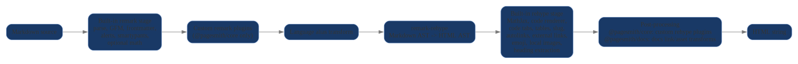

# Markdown Features

Pagesmith ships with a rich markdown pipeline by default. You can write standard markdown, GitHub-style alerts, GitHub Flavored Markdown extensions, LaTeX math, and advanced code block metadata without wiring up your own plugin stack.

No extra configuration is required to use the built-in features. The pages in this section are organized as feature-focused demos so you can see realistic rendered output instead of only API notes.

When you use stock `@pagesmith/docs`, the `pagesmith.config.json5` `markdown` field stays JSON-safe: `allowDangerousHtml`, `math`, and `shiki`. Function-valued `remarkPlugins` and `rehypePlugins` belong to lower-level `@pagesmith/core` integrations, not the default docs-site config file.

## Feature Guides

- [Alerts & Callouts](/guide/alerts-and-callouts) - GitHub-style callouts, multi-paragraph notes, lists, and code blocks inside alerts
- [GFM Extensions](/guide/gfm-extensions) - tables, task lists, strikethrough, autolinks, and footnotes
- [Typography](/guide/typography) - headings, links, images, blockquotes, lists, and smart punctuation
- [Math & LaTeX](/guide/math-and-latex) - inline and display equations rendered with MathJax
- [Code Blocks](/guide/code-blocks) - titles, line numbers, highlighting, diff markers, collapse, and tabs

## Built In By Default

| Feature | Plugin or stage | Where to explore it |
|---|---|---|
| Alerts | `remark-github-alerts` | [Alerts & Callouts](/guide/alerts-and-callouts) |
| GitHub Flavored Markdown | `remark-gfm` | [GFM Extensions](/guide/gfm-extensions) |
| Smart typography | `remark-smartypants` | [Typography](/guide/typography) |
| Math | `remark-math`, `rehype-mathjax` | [Math & LaTeX](/guide/math-and-latex) |
| Code blocks | built-in Pagesmith renderer on top of Shiki | [Code Blocks](/guide/code-blocks) |
| External link handling | `rehype-external-links` | Overview below |
| Heading anchors | `rehype-slug`, `rehype-autolink-headings` | Overview below |
| Accessible emojis | `rehype-accessible-emojis` | Overview below |
| Local images | `rehype-local-images` | Overview below |

## External Links

Any link with an absolute URL (starting with `http://` or `https://`) automatically gets `target="_blank"` and `rel="noopener noreferrer"`. Internal links and anchor links are left alone.

```markdown
[GitHub repository](https://github.com/sujeet-pro/pagesmith)
[Getting Started](/guide/getting-started)
[Jump to code blocks](#built-in-by-default)
```

Rendered sample:

- [GitHub repository](https://github.com/sujeet-pro/pagesmith)
- [Getting Started](/guide/getting-started)
- [Jump to code blocks](#built-in-by-default)

## Accessible Emojis

Emoji characters are wrapped with accessible markup so screen readers announce their meaning instead of skipping them.

```markdown
Ship it 🚀
```

Rendered sample:

Ship it 🚀

HTML output:

```html
Ship it <span role="img" aria-label="rocket">🚀</span>
```

## Local Images

When Pagesmith knows the markdown source path, relative local images inherit intrinsic dimensions automatically. Relative JPEGs can also render as a `<picture>` with AVIF and WebP fallbacks while keeping the original JPEG as the `` fallback.

```markdown

```

Collection entries keep those refs inside the collection directory, and stock docs keeps them inside `contentDir`. If a relative ref escapes that allowed root, Pagesmith leaves the image tag unchanged instead of inferring dimensions or picture fallbacks. If you call `convert()` or `layer.convert()` outside a collection entry, pass `sourcePath` when you want the same behavior for local assets; add `assetRoot` when the allowed root should be broader than the markdown file's own directory.

## Heading IDs and Anchors

All headings automatically receive:

1. A URL-safe `id` via `rehype-slug`
2. A self-link via `rehype-autolink-headings`

```markdown
## My Section
```

This renders to HTML like:

```html
<h2 id="my-section"><a href="#my-section">My Section</a></h2>
```

## Custom Plugins In `@pagesmith/core` Integrations

If you wire markdown through `@pagesmith/core` APIs such as `defineConfig()`, you can extend the built-in pipeline with your own remark and rehype plugins:

```ts
import remarkToc from 'remark-toc'
import rehypeFigure from 'rehype-figure'

const config = defineConfig({
  collections: { posts },
  markdown: {
    remarkPlugins: [remarkToc],
    rehypePlugins: [rehypeFigure],
  },
})
```

Custom remark plugins run after the built-in remark plugins but before `remark-rehype`. Custom rehype plugins run after the built-in rehype plugins but before `rehype-stringify`.

Stock `@pagesmith/docs` keeps `pagesmith.config.json5` JSON-safe and does not execute function-valued remark or rehype plugins. Use the docs package when the built-in pipeline is enough; drop to `@pagesmith/core` when you need custom plugin functions or a custom site shell.

## Docs-Specific Link And Asset Transforms

Stock `@pagesmith/docs` adds a docs-site pass after heading extraction:

- **Relative link resolution** — relative links between content pages (e.g., `../getting-started`, `./sub-page`, or `../reference/architecture/README.md`) are resolved to root-relative URLs under `basePath`. The `trailingSlash` config controls whether the output uses `/guide/getting-started` or `/guide/getting-started/`.
- **Absolute link formatting** — absolute internal links like `/guide/getting-started/` are normalized to match the `trailingSlash` setting and prefixed with `basePath`.
- **Asset path publishing** — relative images and diagrams keep the intrinsic dimensions from the shared local-image pass, then publish under flat content-hashed paths (`/assets/name.hash.ext`).
- `*.inline.svg` images inline only when they stay inside the current page directory subtree.
- The `.invert.` filename convention and light/dark pair handling are core features (see the [Markdown Reference](/reference/markdown-reference)); the docs asset pass only handles URL rewriting to published paths.

Example:

```markdown
[Architecture](../reference/architecture)
[Getting Started](../getting-started)


```

## Pipeline Order

The diagram below shows the shared core pipeline plus the docs-only post-processing that stock `@pagesmith/docs` adds after heading extraction. If you are using `@pagesmith/core` directly, the custom plugin slots are where your own remark and rehype plugins fit.




For `@pagesmith/core` integrations:

```text
remark-parse              Parse markdown to AST
remark-gfm                Tables, strikethrough, task lists, autolinks, footnotes
remark-frontmatter        Strip YAML frontmatter from AST
remark-github-alerts      > [!NOTE], > [!TIP], etc.
remark-smartypants        Smart quotes, en/em dashes, ellipses
remark-math (optional)    Enabled when `markdown.math` is `true` or `'auto'` detects math markers
[user remark plugins]     From MarkdownConfig.remarkPlugins
lang-alias transform      Map fenced-code language tags via markdown.shiki.langAlias
remark-rehype             Markdown AST -> HTML AST
rehype-mathjax            Render math to SVG before code rendering when math is enabled
applyPagesmithCodeRenderer Syntax highlighting, code frames, copy button
rehype-code-tabs          Group consecutive titled blocks into tabs
rehype-scrollable-tables  Wrap markdown tables for horizontal scrolling
rehype-slug               Add id="" to headings
rehype-autolink-headings  Wrap heading text in anchor links
rehype-external-links     target="_blank" on external URLs
rehype-accessible-emojis  aria-label on emoji characters
rehype-local-images       Fill intrinsic image dimensions and JPEG picture fallbacks
heading extraction        Collect headings for TOC
[user rehype plugins]     From MarkdownConfig.rehypePlugins
rehype-stringify          HTML AST -> HTML string
```

For stock `@pagesmith/docs`:

```text
remark-parse              Parse markdown to AST
remark-gfm                Tables, strikethrough, task lists, autolinks, footnotes
remark-frontmatter        Strip YAML frontmatter from AST
remark-github-alerts      > [!NOTE], > [!TIP], etc.
remark-smartypants        Smart quotes, en/em dashes, ellipses
remark-math (optional)    Enabled when `markdown.math` is `true` or `'auto'` detects math markers
[custom remark plugins in lower-level integrations]
                          Available when a docs integration intentionally drops below the JSON-safe config surface
lang-alias transform      Map fenced-code language tags via markdown.shiki.langAlias
remark-rehype             Markdown AST -> HTML AST
rehype-mathjax            Render math to SVG before code rendering when math is enabled
applyPagesmithCodeRenderer Syntax highlighting, code frames, copy button
rehype-code-tabs          Group consecutive titled blocks into tabs
rehype-scrollable-tables  Wrap markdown tables for horizontal scrolling
rehype-slug               Add id="" to headings
rehype-autolink-headings  Wrap heading text in anchor links
rehype-external-links     target="_blank" on external URLs
rehype-accessible-emojis  aria-label on emoji characters
rehype-local-images       Fill intrinsic image dimensions and JPEG picture fallbacks
heading extraction        Collect headings for TOC
docs link/asset transforms Rewrite relative docs links and companion assets for the docs site
rehype-stringify          HTML AST -> HTML string
```

For validation details and lifecycle notes, see [Validation & Rendering](/guide/validation-and-rendering).
