# Philosophy

Pagesmith is built around seven locked principles. They are not style preferences; they are load-bearing constraints that govern every change to the public API and every change to the docs.

## 1. Filesystem-first source of truth

Content lives on disk. Collections, assets, navigation, and diagrams are all discovered from folders, not from a database or a service. This makes Pagesmith trivially portable, trivially diff-able, and trivially reproducible in any Node environment.

## 2. Strict package boundaries

`@pagesmith/core` owns the headless content layer. `@pagesmith/site` owns the site-building surface. `@pagesmith/docs` owns the opinionated docs preset. These boundaries are enforced in tests and in the markdown pipeline. If code has to leak across them to work, the design is wrong.

## 3. Validation before render or runtime use

Every content entry is validated against its Zod schema and optional content validators before it can be rendered. Invalid content fails fast at the content-layer boundary, not at runtime in the browser.

## 4. Vite-native execution

Pagesmith does not build its own toolchain. Dev servers, HMR, plugin composition, SSR, and SSG all run on Vite. When Vite changes, Pagesmith tracks it.

## 5. Progressive enhancement over JS-heavy runtime

Pages render as HTML first. Runtime JS from `@pagesmith/site/runtime/*` is small, optional, and layered on. A Pagesmith page without JavaScript still reads and navigates.

## 6. Configuration before customization

Users should be able to configure the common case in `pagesmith.config.json5` without touching TypeScript. TypeScript config, custom presets, and custom layouts exist for edge cases only. If a frequently-requested behavior forces users into TS-land, the JSON schema is missing a knob.

## 7. Docs, examples, and published AI guidance change together

When public behavior changes, the implementation, the per-package `skills/`, the README / REFERENCE, the root docs under `docs-site/content/`, and the affected examples all change in the same branch. The `prj-update-content` and `prj-examples-parity` skills exist to make this automatic.

## Why this list is small

Every principle on this list rules out a class of changes. A tenth principle would rule out a hundredth of a class of changes at the cost of slowing every other decision. We keep the list tight on purpose.
