# Docs Theme Reference

`@pagesmith/docs` ships a default docs theme, but most of the implementation now lives in `@pagesmith/site`. The docs package owns config resolution, navigation and listing data, docs-only content transforms, and layout selection. The site package owns the reusable document shell, shared components, page shell, CSS bundles, and runtime modules.

## Theme Architecture At A Glance

The main pattern is: docs layouts shape docs-specific page data, then hand off to the shared site shell for document markup, chrome, styles, and progressive enhancement.




## Ownership Split

- `@pagesmith/docs` owns docs config, page discovery, section metadata, breadcrumbs, prev/next resolution, listing data, and the default docs layouts.
- `@pagesmith/site` owns `SiteDocument`, `PageShell`, the shared header/sidebar/TOC/footer components, shared CSS bundles, and runtime modules.
- `@pagesmith/docs/components` and `@pagesmith/docs/layouts` are the supported override seams for the preset.

## Theme File Structure

The default theme lives in `packages/docs/theme/`:

```text
theme/
  components/
    Html.tsx              Re-export of `@pagesmith/docs/components` -> shared `SiteDocument`
    DocHeader.tsx         Re-export of shared site header
    DocSidebar.tsx        Re-export of shared site sidebar
    DocTOC.tsx            Re-export of shared table of contents
    DocFooter.tsx         Re-export of shared site footer
  layouts/
    DocHome.tsx           Docs landing page layout
    DocPage.tsx           Standard docs article layout
    DocListing.tsx        Section listing layout
    DocNotFound.tsx       404 layout
  runtime/
    main.ts               Browser entry that imports `@pagesmith/site/runtime/standalone`
  styles/
    main.css              Imports shared site fonts + standalone CSS, plus docs home / 404 overrides
  utils/
    chrome.ts             Resolves `frontmatter.chrome` booleans
```

The runtime and stylesheet entries are intentionally tiny because the real reusable implementation ships from `@pagesmith/site`.

## Default Layouts

### DocHome

`DocHome` renders the landing page experience for the docs preset. It can compose:

- A hero from `hero` frontmatter or the fallback `title` / `tagline` / `description` / `actions` fields
- An install snippet bar from `install`
- A features grid from `features`
- A packages grid from `packages`
- A highlighted code example from `codeExample`
- Optional rendered markdown content below the landing sections

It uses the shared header/footer components and can still surface a mobile navigation drawer when top-level nav items exist.

### DocPage

`DocPage` is the standard article layout. It delegates almost all shell behavior to `PageShell` from `@pagesmith/site/layouts` and passes in:

- `sidebarSections`
- `breadcrumbs`
- `headings`
- `prev` / `next`
- edit metadata
- the rendered HTML body

The shared shell then decides when to render the header, left sidebar, right TOC, mobile TOC accordion, footer, and mobile sidebar modal.

### DocListing

`DocListing` is the section-index layout for listing pages. It uses the same `PageShell`, but swaps the article body for listing cards or grouped listing cards derived from the docs navigation model.

### DocNotFound

`DocNotFound` is the built-in 404 layout. It is intentionally thin: shared `Html`, optional shared header, and a centered not-found content block.

## Shared Document And Shell

### Html

`theme/components/Html.tsx` re-exports `@pagesmith/docs/components`, which in turn re-exports `SiteDocument` from `@pagesmith/site/components`.

`SiteDocument` is responsible for:

- `<html lang>` and default theme classes
- SEO, canonical, OpenGraph, theme-color, and CSP meta tags
- stylesheet and script tags
- font preloading
- Google Analytics injection when configured
- the Pagefind UI assets and `<pagefind-modal>` markup when `search.enabled !== false`

### PageShell

`DocPage` and `DocListing` both rely on `PageShell` from `@pagesmith/site/layouts`. That shell coordinates:

- shared header rendering
- sidebar and mobile sidebar modal
- breadcrumbs
- desktop TOC and mobile TOC accordion
- the article container with `data-pagefind-body`
- the shared footer

This is the main reason docs-theme overrides should prefer `@pagesmith/docs/components` and `@pagesmith/docs/layouts` instead of cloning an older docs-only shell.

## Responsive Behavior

The preset uses the shared character-based layout breakpoints from the standalone site shell:

- Below `110ch`: main content only, with the TOC moved into a mobile `<details>` accordion.
- At `110ch` and above: the right TOC column appears.
- At `140ch` and above: the left sidebar joins the main grid.
- At `160ch` and above: the three-column layout recenters around a capped content width.

### Mobile Sidebar

The mobile sidebar is no longer a checkbox hack. It is a shared `<dialog>`-based modal from `SiteSidebarModal`:

- the header toggle button uses `data-sidebar-toggle`
- the modal root uses `data-sidebar-modal`
- backdrop and close buttons use `data-sidebar-close`
- the shared runtime handles focus trapping, Escape, close buttons, and closing after link clicks

### Chrome Flags

`frontmatter.chrome` can disable parts of the shell on a per-page basis:

```yaml
chrome:
  header: false
  sidebar: false
  toc: false
  footer: false
```

Omitted keys default to `true`.

## Styling

The default docs stylesheet is mostly composition, not a separate design system:

```css
@import "@pagesmith/site/css/fonts";
@import "@pagesmith/site/css/standalone";
@import "./layout/home.css";
@import "./components/not-found.css";
```

That means:

- prose, code block chrome, tabs, layout grid, sidebar, footer, TOC, theme controls, and shared tokens come from `@pagesmith/site`
- the docs theme adds docs-home and not-found styling on top
- docs overrides should usually start by layering more CSS on top of the shared bundles, not by forking the entire preset

For token-level theming and runtime-owned preferences, see [Runtime](/reference/runtime) and [Theming](/reference/theming).

## Runtime

`theme/runtime/main.ts` is just:

```ts
import '@pagesmith/site/runtime/standalone'
```

So the default docs preset inherits the full shared standalone runtime:

- footer year sync
- responsive search-trigger density
- mobile sidebar dialog behavior
- skip-link focus handling
- theme and text-size persistence
- TOC highlight
- code copy / tabs / collapse interactions

Search UI itself is also shared: `SiteDocument` loads the Pagefind web component assets and emits the modal markup when search is enabled.

## Overriding Layouts

Register custom layouts in `pagesmith.config.json5`:

```json5
theme: {
  layouts: {
    home: './theme/layouts/CustomHome.tsx',
    page: './theme/layouts/CustomPage.tsx',
    listing: './theme/layouts/CustomListing.tsx',
    notFound: './theme/layouts/CustomNotFound.tsx',
  },
}
```

The engine resolves layout exports in this order:

1. `default`
2. A matching named export such as `DocHome`, `Home`, `DocPage`, or `Page`

Section-level `meta.json5` can also select registered layouts through `layout` and `itemLayout`.

When overriding, prefer reusing the shipped seams:

- `@pagesmith/docs/components` for `Html`, shared header/sidebar/TOC/footer, and listing cards
- `@pagesmith/docs/layouts` for `PageShell`
- `@pagesmith/docs/jsx-runtime` for JSX

## Overriding Styles

The default build emits a single stylesheet to `assets/style.css`. To customize it:

- add your own stylesheet via the docs config or a custom layout
- override shared `--ps-*` and layout-related CSS custom properties where possible
- override component classes when you need a structural change
- replace a layout only when the shared shell can no longer express the change cleanly

If you are building a custom site rather than a docs preset, drop to `@pagesmith/site` directly. The docs theme is a preset layered on top of that shared site surface.
