# AI Assistants

Pagesmith ships versioned AI guidance inside each npm package and can also install project-local memory, skills, and markdown rules into your repo.

## Start With The Right Package Prompt

Before you ask an agent to scaffold anything, hand it the package-owned setup prompt that matches your goal:

| Goal                                   | Read first                                                                          |
| -------------------------------------- | ----------------------------------------------------------------------------------- |
| Typed content layer in an existing app | `node_modules/@pagesmith/core/skills/pagesmith-core-setup/references/setup-core.md` |
| Custom site on top of core             | `node_modules/@pagesmith/site/skills/pagesmith-site-setup/references/setup-site.md` |
| Convention-based docs site             | `node_modules/@pagesmith/docs/skills/pagesmith-docs-setup/references/setup-docs.md` |

Hosted copies for copy-paste are available under `/prompts/` on this docs site:

- [`/prompts/setup-core.md`](/prompts/setup-core.md)
- [`/prompts/setup-site.md`](/prompts/setup-site.md)
- [`/prompts/setup-docs.md`](/prompts/setup-docs.md)

## Install AI Artifacts

Use the command that matches the package workflow:

Pick the branch that matches your project: docs init scaffolds the site plus AI files, while the core CLI only layers AI artifacts onto an existing app.




### Core or site projects

```bash
npx pagesmith-core ai --profile default
```

This installs assistant memory files, package-aware skills/commands, `.pagesmith/markdown-guidelines.md`, and `llms.txt` / `llms-full.txt` without scaffolding a docs site.

If a repo stays on `@pagesmith/site` only and does not install `@pagesmith/core` directly, you can rely on the package-owned prompts and references under `node_modules/@pagesmith/site/skills/pagesmith-site-setup/references/` instead of adding core only for AI artifact generation.

### Docs projects

```bash
npx pagesmith-docs init --ai
```

This scaffolds `pagesmith.config.json5`, content, and the same AI artifacts in one flow. If the repo already has custom root `llms.txt` files, add `--no-llms`.

## What Gets Installed

| Artifact                              | Purpose                                                                                         |
| ------------------------------------- | ----------------------------------------------------------------------------------------------- |
| `CLAUDE.md`, `AGENTS.md`, `GEMINI.md` | Project memory files that point future sessions at the right package docs                       |
| Assistant-specific skills/commands    | Reusable package-aware commands such as `/pagesmith`, `/update-docs`, and `/ps-update-all-docs` |
| `.pagesmith/markdown-guidelines.md`   | Shared markdown authoring rules for Pagesmith content                                           |
| `llms.txt` / `llms-full.txt`          | Compact and expanded LLM context files                                                          |

## Install Consumer Agent Skills With `pagesmith-core skills`

In addition to the assistant-specific commands above, each Pagesmith package ships its own `skills/` folder inside the npm package (not as separate npm packages). Use the bundled installer to copy them into the project:

```bash
npx pagesmith-core skills
```

By default this scans `@pagesmith/core`, `@pagesmith/site`, and `@pagesmith/docs` for `skills/<name>/SKILL.md` files and writes them in two places:

- A canonical copy at `.agents/skills/<name>/SKILL.md` (the source of truth).
- Thin wrappers at `.claude/skills/<name>/SKILL.md` and `.cursor/skills/<name>/SKILL.md` that point Claude Code and Cursor at the canonical file.

Useful flags:

- `--package <pkg>` (repeatable) — limit the install to specific packages.
- `--cwd <dir>` — install into a different project directory.
- `--dry-run` — print what would change without writing files.
- `--no-overwrite` — leave existing canonical skills untouched (wrappers always refresh).

Available skills (all live inside the package they document):

| Package           | Skills                                                                                                                                                                                                        |
| ----------------- | ------------------------------------------------------------------------------------------------------------------------------------------------------------------------------------------------------------- |
| `@pagesmith/docs` | `pagesmith-docs-setup`, `pagesmith-docs-add-page`, `pagesmith-docs-configure-nav`, `pagesmith-docs-add-search`, `pagesmith-docs-customize-theme`, `pagesmith-docs-deploy-gh-pages`, `pagesmith-generate-docs` |
| `@pagesmith/site` | `pagesmith-site-setup`, `pagesmith-site-use-preset`, `pagesmith-site-customize-theme`                                                                                                                         |
| `@pagesmith/core` | `pagesmith-core-setup`, `pagesmith-core-add-collection`, `pagesmith-core-add-loader`, `pagesmith-core-customize-markdown`, `pagesmith-core-write-validator`                                                   |

Each skill always reads `node_modules/@pagesmith/<pkg>/REFERENCE.md` first so the agent uses the CLI flags and config schema that match the version actually installed in the project, instead of relying on globally cached or generic guidance.

Browse the full set in the [pagesmith repo `packages/<pkg>/skills/` folders](https://github.com/sujeet-pro/pagesmith/tree/main/packages). Each folder is self-contained, so you can also copy one into `.cursor/skills/`, `.claude/skills/`, or `.agents/skills/` by hand.

## Version-Matched Package Files

The installed package is the source of truth for AI guidance:

- `node_modules/@pagesmith/core/skills/pagesmith-core-setup/references/*`
- `node_modules/@pagesmith/site/skills/pagesmith-site-setup/references/*`
- `node_modules/@pagesmith/docs/skills/pagesmith-docs-setup/references/*`
- `node_modules/@pagesmith/docs/schemas/*.schema.json`

Use the docs site when you want the latest main-branch guidance. Use `node_modules/` when you want the exact version that is actually installed in the project.

## Recommended Read Order

| Task                             | Read first                                                   |
| -------------------------------- | ------------------------------------------------------------ |
| Core bootstrap / retrofit        | `setup-core.md`, then `usage.md`, then `REFERENCE.md`        |
| Site bootstrap / retrofit        | `setup-site.md`, then `usage.md`, then `REFERENCE.md`        |
| Docs bootstrap / retrofit        | `setup-docs.md`, then `usage.md`, then `REFERENCE.md`        |
| Docs config or frontmatter edits | `setup-docs.md`, `REFERENCE.md`, and `schemas/*.schema.json` |
| Markdown authoring               | `.pagesmith/markdown-guidelines.md`                          |
| Large code or docs audit         | `llms-full.txt`                                              |

## Profiles

| Profile   | Used for                                        | Generated context                                                         |
| --------- | ----------------------------------------------- | ------------------------------------------------------------------------- |
| `default` | `@pagesmith/core` or `@pagesmith/site` projects | Core content-layer guidance plus site references when relevant            |
| `docs`    | `@pagesmith/docs` projects                      | Default profile plus docs config, navigation, layout, and schema guidance |

## Docs Maintenance Skills

Project-level Claude installs also generate docs-maintenance skills for docs-profile projects:

| Skill                 | Use for                                          |
| --------------------- | ------------------------------------------------ |
| `/update-docs`        | Focused docs refresh after a code change         |
| `/ps-update-all-docs` | Full docs and AI-context refresh across the repo |

These skills read `pagesmith.config.json5`, `meta.json5`, package guidance, and `.pagesmith/markdown-guidelines.md` before editing docs content.

## MCP Commands

Docs projects expose the docs-aware MCP server through `@pagesmith/docs`:

```bash
pagesmith-docs mcp --stdio
```

That gives editors and agents access to docs-specific tools: `docs_validate_config`, `docs_resolve_config`, `docs_list_pages`, `docs_get_page`, and `docs_search_pages`.

## Keep AI Context Current

Regenerate AI artifacts whenever the installed Pagesmith version or package mix changes:

```bash
npx pagesmith-core ai --profile default
# or, for docs projects
npx pagesmith-docs init --ai --no-llms
```

The installer updates managed sections inside existing memory files, so custom content outside those managed blocks is preserved.

## Related Pages

- [Choose Your Path](../choose-your-path/README.md)
- [Docs Getting Started](../docs-getting-started/README.md)
- [Prompts Cookbook](../prompts-cookbook/README.md)
- [MCP Setup](../mcp-setup/README.md)
