# Choose Your Path

Need ready-to-run prompt templates for setup and maintenance? See the [Prompts Cookbook](../prompts-cookbook/README.md).

Use this diagram as the fast filter: docs-first projects go to `@pagesmith/docs`, host-owned apps start with `@pagesmith/core`, and `@pagesmith/site` is the app-facing package when a project wants the content layer plus shared JSX, CSS/runtime, and Vite SSG helpers from one place.

## AI-First Starting Point

Pick the package that matches your goal, then give your agent the package-owned setup prompt instead of a vague install request.

### `@pagesmith/docs`

Use this when you want a docs site with config, conventions, navigation, search, and the default docs theme.

Copy-paste prompt:

> Install `@pagesmith/docs`, then read `node_modules/@pagesmith/docs/skills/pagesmith-docs-setup/references/setup-docs.md` and follow it exactly. Use `npx pagesmith-docs init --yes --ai` for bootstrap work, keep `pagesmith.config.json5` at the repo root, and explain any GitHub Pages `origin` or `basePath` decisions before finishing.

### `@pagesmith/site`

Use this when you want a custom site with Pagesmith's content layer plus the shared Pagesmith site layer: JSX runtime, CSS/runtime bundles, Vite SSG helpers, or a preset-driven `pagesmith-site` workflow.

Copy-paste prompt:

> Install `@pagesmith/site`, then read `node_modules/@pagesmith/site/skills/pagesmith-site-setup/references/setup-site.md` and follow it exactly. Keep the app-facing imports on `@pagesmith/site`, use `@pagesmith/core` directly only if the repo intentionally wants the lower-level headless package, and choose between a Vite SSG setup or a framework-hosted setup based on the repo.

### `@pagesmith/core`

Use this when the host app already owns routing, layout, or build tooling and only needs Pagesmith as a typed content layer plus markdown pipeline.

Copy-paste prompt:

> Install `@pagesmith/core`, then read `node_modules/@pagesmith/core/skills/pagesmith-core-setup/references/setup-core.md` and follow it exactly. Keep the work focused on collections, schemas, `createContentLayer()`, and either `entry.render()` or `pagesmithContent` for Vite.

## Package Roles

### `@pagesmith/core` — Content Layer

Owns:

- collection definitions and schemas
- filesystem loading
- markdown rendering and validators
- `pagesmithContent` for Vite

Best for:

- Next.js or framework-hosted markdown
- custom SSR apps
- projects that want typed content data without a Pagesmith-owned site shell

Manual guide: [Getting Started](../getting-started/README.md)

### `@pagesmith/site` — Site Toolkit

Owns:

- `pagesmith-site`
- re-exported content APIs from `@pagesmith/core`
- `@pagesmith/site/jsx-runtime`
- `@pagesmith/site/css/*`
- `@pagesmith/site/runtime/*`
- `@pagesmith/site/vite`

Best for:

- custom static sites that want one Pagesmith package for content + site behavior
- projects that want the shared Pagesmith presentation layer
- preset-driven site workflows

### `@pagesmith/docs` — Docs Preset

Owns:

- `pagesmith-docs`
- `pagesmith.config.json5`
- docs navigation from folders and `meta.json5`
- built-in Pagefind search
- docs layouts, schema files, and docs MCP

Best for:

- documentation sites
- product guides
- API references
- knowledge bases

Manual guide: [Docs Getting Started](../docs-getting-started/README.md)

## Decision Matrix

| Question                                        | `@pagesmith/core` | `@pagesmith/site` | `@pagesmith/docs` |
| ----------------------------------------------- | ----------------- | ----------------- | ----------------- |
| Do I already have my own router/build?          | Yes               | Maybe             | Usually no        |
| Do I want Pagesmith to own the site shell?      | No                | Partly            | Yes               |
| Do I need built-in docs navigation and search?  | No                | No                | Yes               |
| Do I want shared Pagesmith CSS/runtime and JSX? | Optional via site | Yes               | Included          |
| Canonical CLI                                   | `pagesmith-core`  | `pagesmith-site`  | `pagesmith-docs`  |
| Fastest AI entrypoint                           | `setup-core.md`   | `setup-site.md`   | `setup-docs.md`   |

Start with `@pagesmith/docs` when the project is truly docs-first. Start with `@pagesmith/core` when the host app already owns the shell and only needs the headless content layer. Start with `@pagesmith/site` when the app should stay on one Pagesmith package for content plus site behavior.

## What To Read Next

- [AI Assistants](../ai-assistants/README.md) for package-owned AI setup flows
- [Prompts Cookbook](../prompts-cookbook/README.md) for copy-paste prompts
- [Getting Started](../getting-started/README.md) for core-first integrations
- [Docs Getting Started](../docs-getting-started/README.md) for docs-first integrations
- [Next.js (App Router)](../framework-nextjs/README.md) for a framework-hosted core example
