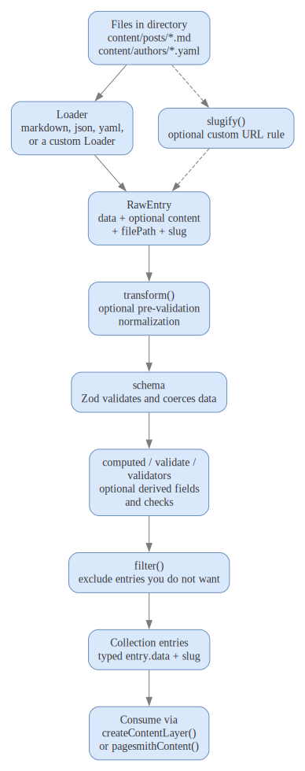
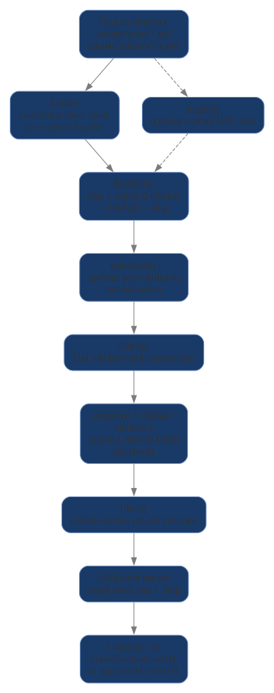

# Collections and Loaders

> [!TIP] AI Quick Start
> Ask your AI agent: "Set up a content collection with schema validation for my blog posts in `content/posts/`. Use a Zod schema with title, date, tags, and draft fields. Read `node_modules/@pagesmith/core/ai-guidelines/usage.md` for reference."
> Then read on to understand what happened and customize further.

Collections are the core FS-CMS primitive in Pagesmith. Each collection maps a filesystem directory to:

- a loader (how to parse the files)
- a schema (how to validate the data)
- optional transforms, computed fields, filters, and validators

The diagram below gives the page's mental model in one pass: files flow through a loader into a raw entry, then Pagesmith applies normalization, validation, derived fields, and optional filtering before you consume typed entries.

<figure>
  
  
  <figcaption>Collection pipeline showing files flowing through a loader, transform, schema, derived fields, filters, and into typed entries that are consumed through the content layer or Vite plugin</figcaption>
</figure>

## Defining a Collection

Use `defineCollection()` to create a type-safe collection definition:

```ts title="content.config.ts"
import { defineCollection, z } from '@pagesmith/core'

const posts = defineCollection({
  loader: 'markdown',
  directory: 'content/posts',
  schema: z.object({
    title: z.string(),
    date: z.coerce.date(),
    tags: z.array(z.string()).default([]),
    draft: z.boolean().default(false),
  }),
})
```

The `defineCollection()` function is a type-safe identity function -- it does not transform the definition, but provides TypeScript inference from the Zod schema so that `entry.data` is fully typed.

## CollectionDef Fields

The full `CollectionDef<S>` type accepts:

| Field | Type | Required | Description |
|---|---|---|---|
| `loader` | `LoaderType \| Loader` | Yes | Built-in loader type string or a custom `Loader` instance |
| `directory` | `string` | Yes | Directory containing collection files (relative to `root`) |
| `schema` | `ZodType` | Yes | Zod schema for validating entry data |
| `include` | `string[]` | No | Glob patterns to include (defaults based on loader extensions) |
| `exclude` | `string[]` | No | Glob patterns to exclude |
| `computed` | `Record<string, (entry) => any>` | No | Computed fields derived from entry data |
| `transform` | `(entry) => RawEntry` | No | Pre-validation transform |
| `filter` | `(entry) => boolean` | No | Filter entries (return false to exclude) |
| `slugify` | `(filePath, directory) => string` | No | Custom slug generation |
| `validate` | `(entry) => string \| undefined` | No | Custom validation hook |
| `validators` | `ContentValidator[]` | No | Custom content validators |
| `disableBuiltinValidators` | `boolean` | No | Disable built-in markdown validators |

## Built-In Loaders

Each loader implements the `Loader` interface:

```ts title="Loader Interface"
interface Loader {
  name: string
  kind: 'markdown' | 'data'
  extensions: string[]
  load(filePath: string): LoaderResult | Promise<LoaderResult>
}

interface LoaderResult {
  data: Record<string, any>   // Parsed data (frontmatter or full object)
  content?: string            // Raw body content (markdown only)
}
```

The `kind` field distinguishes between markdown loaders (which produce a body for rendering) and data loaders (which produce structured data only).

| Loader | Type String | Extensions | Kind | Parser | Notes |
|---|---|---|---|---|---|
| `MarkdownLoader` | `markdown` | `.md` | `markdown` | `gray-matter` | YAML frontmatter extracted as `data`, markdown body as `content` |
| `JsonLoader` | `json` / `json5` | `.json` | `data` | `JSON.parse` / `json5` | Full object returned as `data` |
| `JsoncLoader` | `jsonc` | `.json`, `.jsonc` | `data` | `json5` | JSON with comments |
| `YamlLoader` | `yaml` | `.yml`, `.yaml` | `data` | `yaml` package | Structured config and content data |
| `TomlLoader` | `toml` | `.toml` | `data` | `smol-toml` | Useful for feature flags or settings |

Loader resolution happens through `resolveLoader()`. If you pass a string like `'markdown'`, it creates a new `MarkdownLoader()` instance. If you pass an object implementing the `Loader` interface, it uses it directly.

Default include patterns are derived from the loader's `extensions` array: each extension becomes a `**/*<ext>` glob pattern.

## Custom Loaders

Custom loaders are objects implementing the `Loader` interface. Use them for CSV, XML, or proprietary export formats when the built-in loaders are not enough.

```ts title="csv-loader.ts"
import type { Loader, LoaderResult } from '@pagesmith/core/loaders'
import { readFileSync } from 'fs'
import { parse as parseCsv } from 'csv-parse/sync'

const csvLoader: Loader = {
  name: 'csv',
  kind: 'data',
  extensions: ['.csv'],
  load(filePath: string): LoaderResult {
    const raw = readFileSync(filePath, 'utf-8')
    const records = parseCsv(raw, { columns: true })
    // Return the first row as data (or adapt to your needs)
    return { data: records[0] ?? {} }
  },
}

const metrics = defineCollection({
  loader: csvLoader,
  directory: 'content/metrics',
  schema: z.object({
    name: z.string(),
    value: z.coerce.number(),
  }),
})
```

## Collection Hooks

### Transform

The `transform` hook runs before schema validation and receives a `RawEntry` (which has `data`, optional `content`, `filePath`, and `slug`). Use it to normalize data before validation:

```ts title="content.config.ts"
const posts = defineCollection({
  loader: 'markdown',
  directory: 'content/posts',
  schema: z.object({
    title: z.string(),
    tags: z.array(z.string()).default([]),
  }),
  transform(entry) {
    // Normalize tags to lowercase before validation
    if (entry.data.tags) {
      entry.data.tags = entry.data.tags.map((tag: string) => tag.toLowerCase())
    }
    return entry
  },
})
```

Transforms can also be async:

```ts
transform: async (entry) => {
  entry.data.wordCount = entry.content?.split(/\s+/).length ?? 0
  return entry
},
```

### Computed Fields

Computed fields are derived from entry data and merged into `entry.data` after schema validation. They are defined as a map of field names to functions:

```ts title="content.config.ts" mark={9-12}
const posts = defineCollection({
  loader: 'markdown',
  directory: 'content/posts',
  schema: z.object({
    title: z.string(),
    date: z.coerce.date(),
    tags: z.array(z.string()).default([]),
  }),
  computed: {
    slugPath: (entry) => `/posts/${entry.slug}/`,
    year: (entry) => new Date(entry.data.date).getFullYear(),
    hasMultipleTags: (entry) => entry.data.tags.length > 1,
  },
})
```

Computed field types are inferred and included in `InferCollectionData<T>`, so `entry.data.slugPath` will be typed as `string` automatically.

### Filter

The `filter` hook runs after validation and computed fields. Return `false` to exclude an entry from the collection results:

```ts title="content.config.ts"
const posts = defineCollection({
  loader: 'markdown',
  directory: 'content/posts',
  schema: z.object({
    title: z.string(),
    draft: z.boolean().default(false),
  }),
  filter(entry) {
    // Exclude drafts in production
    return process.env.NODE_ENV === 'development' || !entry.data.draft
  },
})
```

### Custom Slug Generation

By default, Pagesmith generates slugs from relative file paths using `toSlug()`. Override this with `slugify`:

```ts title="content.config.ts"
const posts = defineCollection({
  loader: 'markdown',
  directory: 'content/posts',
  schema: z.object({
    title: z.string(),
    date: z.coerce.date(),
  }),
  slugify(filePath, directory) {
    // Use date-prefixed slugs: 2024-01-15-hello-world -> hello-world
    const base = path.relative(directory, filePath).replace(/\.md$/, '')
    return base.replace(/^\d{4}-\d{2}-\d{2}-/, '')
  },
})
```

### Custom Validate Hook

The `validate` hook provides a lightweight way to add entry-level validation without implementing a full `ContentValidator`. Return a string to report an error, or `undefined` to pass:

```ts title="content.config.ts"
const posts = defineCollection({
  loader: 'markdown',
  directory: 'content/posts',
  schema: z.object({
    title: z.string(),
    date: z.coerce.date(),
  }),
  validate(entry) {
    if (entry.data.title.length > 100) {
      return 'Title must be 100 characters or fewer'
    }
    // Return undefined to pass
  },
})
```

## Slugs

Pagesmith generates slugs from relative file paths by default. The `toSlug()` utility strips file extensions and directory-based `README`/`index` suffixes:

| File Path (relative to directory) | Generated Slug |
|---|---|
| `hello-world.md` | `hello-world` |
| `getting-started/README.md` | `getting-started` |
| `guide/setup/index.md` | `guide/setup` |
| `2024/my-post.yaml` | `2024/my-post` |

Use `slugify(filePath, directory)` when you need custom URL rules.

## Schema Strategy

Prefer schemas that describe exactly what your templates need:

- **Coerce dates at the schema level** -- use `z.coerce.date()` so string dates from frontmatter become `Date` objects automatically
- **Default array and boolean fields** -- use `.default([])` and `.default(false)` to avoid undefined checks in templates
- **Keep markdown-derived fields as computed fields** -- read time, word count, and URL paths work well as computed fields rather than requiring them in frontmatter
- **Use `.passthrough()` sparingly** -- prefer explicit schemas that document all expected fields
- **Use `.optional()` for truly optional fields** -- the schema should reflect what is required vs. optional

Example of a well-structured schema:

```ts title="content.config.ts"
const posts = defineCollection({
  loader: 'markdown',
  directory: 'content/posts',
  schema: z.object({
    title: z.string(),
    description: z.string().optional(),
    date: z.coerce.date(),
    lastUpdated: z.coerce.date().optional(),
    tags: z.array(z.string()).default([]),
    category: z.enum(['tutorial', 'guide', 'reference']).default('guide'),
    draft: z.boolean().default(false),
    featured: z.boolean().default(false),
    coverImage: z.string().optional(),
  }),
  computed: {
    url: (entry) => `/blog/${entry.slug}/`,
    readTime: (entry) => Math.ceil((entry.content?.split(/\s+/).length ?? 0) / 200),
  },
  filter: (entry) => !entry.data.draft || process.env.NODE_ENV === 'development',
})
```

## Multiple Collections

Use `defineCollections()` for defining several collections at once with strong literal type inference:

```ts title="content.config.ts"
import { defineCollection, defineCollections, z } from '@pagesmith/core'

const collections = defineCollections({
  posts: defineCollection({
    loader: 'markdown',
    directory: 'content/posts',
    schema: z.object({ title: z.string(), date: z.coerce.date() }),
  }),
  authors: defineCollection({
    loader: 'yaml',
    directory: 'content/authors',
    schema: z.object({ name: z.string(), bio: z.string() }),
  }),
  settings: defineCollection({
    loader: 'json',
    directory: 'content/config',
    schema: z.object({ siteName: z.string(), features: z.record(z.boolean()) }),
  }),
})
```

## Using Collections with the Content Layer

```ts title="build.ts"
import { createContentLayer, defineConfig } from '@pagesmith/core'

const config = defineConfig({
  collections: { posts, authors },
  markdown: {
    shiki: { themes: { light: 'github-light', dark: 'github-dark' } },
  },
})

const layer = createContentLayer(config)

// Get all entries in a collection
const allPosts = await layer.getCollection('posts')

// Get a single entry by slug
const post = await layer.getEntry('posts', 'hello-world')

// Render markdown to HTML (lazy, cached)
if (post) {
  const rendered = await post.render()
  // rendered.html, rendered.headings, rendered.readTime
}

// Validate all collections
const results = await layer.validate()
```

## Using Collections with the Vite Plugin

For Vite-based projects, use the `pagesmithContent()` plugin to expose collections as virtual modules:

```ts title="vite.config.ts"
import { pagesmithContent } from '@pagesmith/core/vite'
import collections from './content.config'

export default defineConfig({
  plugins: [pagesmithContent(collections)],
})
```

Then import collection data in your application code:

```ts title="app.ts"
import posts from 'virtual:content/posts'

// Markdown entries: { id, contentSlug, html, headings, frontmatter }
// Data entries: { id, contentSlug, data }
for (const post of posts) {
  console.log(post.frontmatter.title, post.html)
}
```

The Vite plugin generates TypeScript declarations (`pagesmith-content.d.ts`) so imports are fully typed.

## Content Plugins

Content plugins extend the markdown pipeline and validation system. A `ContentPlugin` can inject remark and rehype plugins and add custom validation:

```ts title="content.config.ts"
import { defineConfig } from '@pagesmith/core'

const myPlugin = {
  name: 'my-plugin',
  rehypePlugin: () => (tree) => {
    // Transform the HAST tree
  },
  remarkPlugin: () => (tree) => {
    // Transform the MDAST tree
  },
  validate: (entry) => {
    const errors = []
    if (!entry.data.title) {
      errors.push('Missing required title field')
    }
    return errors
  },
}

const config = defineConfig({
  collections: { posts },
  plugins: [myPlugin],
})
```

Plugin remark and rehype plugins are appended to the pipeline during rendering. Plugin validators run during the loading phase, after schema and content validators.

## Practical Guidance

- Use one collection per durable content type.
- Keep singleton config files in their own collection.
- Prefer markdown collections for longform content and structured loaders for metadata-heavy content.
- Use `include` and `exclude` patterns when a directory contains mixed file types.
- Keep schemas strict -- they serve as documentation for your content model.
- Use transforms for data normalization and computed fields for derived values.
- Use filters to exclude draft content in production without removing files from the filesystem.
