# Blog Site with Pagesmith

## Overview

The Blog Site pattern is the "custom site, no framework" shape in Pagesmith. It keeps the app-facing surface on `@pagesmith/site`: the example defines collections in `src/content.ts`, renders HTML with `@pagesmith/site/jsx-runtime`, and lets `pagesmithSsg` handle the dev/build/preview flow.

That means:

- no React, Solid, Svelte, or template engine runtime
- no `virtual:content/*` imports
- no separate docs preset
- one package (`@pagesmith/site`) covering content loading, JSX, shared CSS/runtime, and SSG

Source: [`examples/blog-site/`](https://github.com/sujeet-pro/pagesmith/tree/main/examples/blog-site) | Output: <a href="/pagesmith/examples/blog-site" target="_blank" rel="noopener noreferrer">Live Demo</a>

The diagram below highlights the ownership split: your project owns collections, routes, and page assembly, while Pagesmith provides the content layer, JSX runtime, shared site chrome, and static generation.




## Prerequisites

- Node.js 24+
- [vite-plus](https://github.com/nicolo-ribaudo/vite-plus) for the `vp` workflow used in this repo

## Project Setup

### package.json

The example keeps its dependencies intentionally small:

```json
{
  "name": "@pagesmith/example-blog-site",
  "private": true,
  "type": "module",
  "scripts": {
    "dev": "vite dev",
    "build": "vite build",
    "check": "vp check"
  },
  "dependencies": {
    "@pagesmith/site": "*",
    "pagefind": "^1.5.0"
  },
  "devDependencies": {
    "vite": "^8.0.3",
    "vite-plus": "0.1.16"
  }
}
```

Install with `vp install` from the repo root, or `npm install` inside a standalone copy of the example.

### Project Structure

```text
blog-site/
  content/
    guide/               # Guide articles for the example
    pages/               # Standalone pages (for example about)
  public/
    favicon.svg          # Static assets copied to the output root
  src/
    content.ts           # Collection definitions, content layer helpers
    components.tsx       # JSX components and document shell
    entry-server.tsx     # getRoutes() / render() SSG contract
    runtime.ts           # Shared standalone runtime + one small custom enhancement
    theme.css            # Shared standalone CSS + example-specific overrides
  client.js              # Browser entry imports theme.css + runtime.ts
  vite.config.ts         # Vite + pagesmithSsg + sharedAssetsPlugin
  package.json
  tsconfig.json
```

## Vite Setup

`vite.config.ts` wires only the site-level SSG pieces. This example does not use `pagesmithContent()` because the SSR entry loads the content layer directly.

```ts
import { defineConfig } from 'vite-plus'
import { pagesmithSsg, sharedAssetsPlugin } from '@pagesmith/site/vite'

export default defineConfig({
  base: '/pagesmith/examples/blog-site',
  plugins: [
    sharedAssetsPlugin(),
    ...pagesmithSsg({ entry: './src/entry-server.tsx', contentDirs: ['./content'] }),
  ],
  build: {
    outDir: '../../gh-pages/examples/blog-site',
    emptyOutDir: true,
    rolldownOptions: {
      checks: {
        pluginTimings: false,
      },
    },
  },
  oxc: {
    jsx: {
      runtime: 'automatic',
      importSource: '@pagesmith/site',
    },
  },
})
```

`sharedAssetsPlugin()` serves the bundled fonts during development, and the production build copies the packaged font assets into the final output. `pagesmithSsg()` provides the SSR contract, companion-asset publishing, Pagefind indexing, and the dev middleware used by the example.

## Content Layer

`src/content.ts` owns the collections and content helpers. The example keeps collection setup separate from routing, then imports those helpers into the SSR entry.

```ts
import { resolve } from 'path'
import { createContentLayer, defineCollection, defineConfig, z } from '@pagesmith/site'

export function buildLayer(root?: string) {
  const contentRoot = root ? resolve(root) : resolve(import.meta.dirname, '..')

  return createContentLayer(
    defineConfig({
      root: contentRoot,
      collections: {
        guide: defineCollection({
          loader: 'markdown',
          directory: resolve(contentRoot, 'content/guide'),
          schema: z.object({
            title: z.string(),
            description: z.string().optional(),
            date: z.coerce.date(),
            tags: z.array(z.string()).default([]),
            series: z.string().optional(),
            seriesOrder: z.number().optional(),
          }),
        }),
        pages: defineCollection({
          loader: 'markdown',
          directory: resolve(contentRoot, 'content/pages'),
          schema: z.object({
            title: z.string(),
            description: z.string().optional(),
          }),
        }),
      },
    }),
  )
}
```

This is the important difference from the framework examples: there is no separate `content.config.ts` and no virtual-module import layer. The site asks the content layer for entries directly and then calls `await entry.render()`.

## SSR Entry Contract

`src/entry-server.tsx` implements the contract that `pagesmithSsg()` expects:

```ts
import type { SsgRenderConfig } from '@pagesmith/site/vite'

export async function getRoutes(config: SsgRenderConfig): Promise<string[]> {
  // return every route you want emitted as static HTML
}

export async function render(url: string, config: SsgRenderConfig): Promise<string> {
  // return a full HTML document for that URL
}
```

In this example, `getRoutes()` derives routes from the loaded `guide` and `pages` entries, while `render()` looks up the matching rendered entry and feeds it into JSX components from `src/components.tsx`.

## JSX Components

The document shell and page-body components live in `src/components.tsx`. Because the example uses `@pagesmith/site/jsx-runtime`, the JSX rules are Pagesmith's server-side rules, not React's:

- use `class`, not `className`
- use `innerHTML` to inject rendered markdown
- return HTML strings only; there is no hydration step

## CSS and Runtime

The browser entry is intentionally tiny:

```js
import './src/theme.css'
import './src/runtime.ts'
```

`src/theme.css` starts from `@pagesmith/site/css/standalone`, then layers example-specific layout and theme rules on top. `src/runtime.ts` imports `@pagesmith/site/runtime/standalone`, so the shared search, sidebar, TOC, theme, and code-block behaviors come from the package. The example only adds one tiny enhancement of its own: scrolling the active sidebar item into view.

## Content Structure

The example content tree is deliberately simple:

```text
content/
  guide/
    overview.md
    content-layer.md
    project-structure.md
    css-approach.md
    jsx-runtime.md
    build-and-deploy.md
    kitchen-sink.md
  pages/
    about.md
```

Guide entries use frontmatter like `title`, `description`, `date`, `tags`, `series`, and `seriesOrder`. Because entries live beside their own assets, normal relative image paths work well here too. For the canonical local-image and JPEG `<picture>` rules, see [Markdown Features](../markdown-features/README.md).

## Running The Example

From the repo root:

```bash
vp install
vp run dev:eg:blog-site
```

Inside the example directory itself, the local scripts are:

```bash
vite dev
vite build
vp check
```

## When To Use This Shape

Choose this pattern when:

- your app owns routing and page assembly
- you want Pagesmith's content layer, JSX runtime, CSS/runtime bundles, and SSG helpers from one package
- you do not want a framework runtime or the `@pagesmith/docs` preset

If you want a convention-based docs app instead, move up to [`@pagesmith/docs`](../framework-doc-site/README.md). If you only want the headless content layer and your framework already owns the whole shell, step down to [`@pagesmith/core`](../../reference/api/README.md) or a framework-hosted `@pagesmith/site` setup.
