# Doc Site with @pagesmith/docs

## Overview

The Doc Site pattern is the high-level Pagesmith docs workflow. Instead of wiring collections, JSX chrome, and SSG by hand, you install `@pagesmith/docs`, point it at a docs content directory, and let the preset handle navigation, the default theme, Pagefind search, and the build pipeline.

That means:

- the docs preset owns page discovery, sidebar generation, and search wiring
- you write markdown in a docs tree plus a `pagesmith.config.json5`
- optional layout overrides stay on `@pagesmith/docs` via `@pagesmith/docs/jsx-runtime`
- the example can stay focused on docs content and a couple of custom layouts

Source: [`examples/doc-site/`](https://github.com/sujeet-pro/pagesmith/tree/main/examples/doc-site) | Output: <a href="/pagesmith/examples/doc-site" target="_blank" rel="noopener noreferrer">Live Demo</a>

The diagram below highlights the boundary: your project supplies content, config, and optional overrides, while `@pagesmith/docs` owns the docs-specific runtime and generation pipeline.




## Prerequisites

- Node.js 24+

## Project Setup

### package.json

The example depends only on `@pagesmith/docs`. Because this repo builds the workspace package directly, the scripts call the local CLI entrypoint; in an installed project you would use `pagesmith-docs ...` instead.

```json
{
  "name": "@pagesmith/example-doc-site",
  "private": true,
  "type": "module",
  "scripts": {
    "dev": "node ../../packages/docs/dist/cli/bin.mjs dev --config ./pagesmith.config.json5",
    "build": "node ../../packages/docs/dist/cli/bin.mjs build --config ./pagesmith.config.json5",
    "check": "tsc --noEmit"
  },
  "dependencies": {
    "@pagesmith/docs": "*"
  },
  "devDependencies": {
    "typescript": "^6.0.2"
  }
}
```

For a standalone project after installation, the equivalent commands are simply `pagesmith-docs dev --config ./pagesmith.config.json5` and `pagesmith-docs build --config ./pagesmith.config.json5`.

### Project Structure

```text
doc-site/
  pagesmith.config.json5
  content/
    README.md                # Home page
    guide/
      meta.json5             # Section metadata and series
      installation.md
      project-structure.md
      content-collections.md
      layouts-and-rendering.md
      configuration.md
      search-integration.md
      kitchen-sink.md
    pages/
      about.md
  theme/
    layouts/
      DocHome.tsx            # Home layout override
      DocPage.tsx            # Inner-page layout override
      shared.tsx             # Shared helpers/components for the overrides
  public/
    favicon.svg
  package.json
```

This example intentionally uses an explicit `content/` directory. In zero-config repos, `@pagesmith/docs` prefers `docs/` when that folder exists and falls back to `content/` otherwise.

## pagesmith.config.json5

The example is configured entirely through `pagesmith.config.json5`. This excerpt shows the main knobs:

```json5
{
  $schema: "../../node_modules/@pagesmith/docs/schemas/pagesmith-config.schema.json",
  preset: "@pagesmith/docs",
  name: "Pagesmith",
  title: "Example Docs",
  description: "Documentation site built with @pagesmith/docs",
  origin: "https://projects.sujeet.pro",
  contentDir: "./content",
  outDir: "../../gh-pages/examples/doc-site",
  basePath: "/pagesmith/examples/doc-site",
  homeLink: "/pagesmith",
  maintainer: {
    name: "Sujeet Jaiswal",
    link: "https://sujeet.pro",
  },
  copyright: {
    projectName: "Example Docs",
    startYear: 2024,
    endYear: null,
  },
  sidebar: { collapsible: true },
  theme: {
    defaultColorScheme: "auto",
    defaultTheme: "paper",
    layouts: {
      home: "./theme/layouts/DocHome.tsx",
      page: "./theme/layouts/DocPage.tsx",
    },
  },
  footerLinks: [
    {
      header: "Guide",
      links: [
        { label: "Installation", path: "/guide/installation" },
        { label: "Configuration", path: "/guide/configuration" },
      ],
    },
  ],
  editLink: {
    repo: "https://github.com/sujeet-pro/pagesmith",
    branch: "main",
    label: "Edit this page",
  },
  lastUpdated: true,
  search: {
    enabled: true,
    showImages: false,
    showSubResults: true,
  },
}
```

Key points from the example:

- `contentDir` is explicit here, but `@pagesmith/docs` can also run zero-config when `docs/` or `content/` follows the standard layout
- `theme.layouts` overrides only the `home` and `page` layouts; the rest of the docs preset stays intact
- `search.enabled` turns on Pagefind without any extra plugin wiring
- the monorepo example builds into `../../gh-pages/examples/doc-site`, while a standalone docs site would typically build into `gh-pages`

## Content Structure and Navigation

Top-level folders under `content/` become sections. This example keeps one primary guide section plus a small `pages/` section for standalone pages.

`content/guide/meta.json5` uses the current series-based structure:

```json5
{
  displayName: "Guide",
  orderBy: "manual",
  series: [
    {
      slug: "getting-started",
      displayName: "Getting Started",
      articles: ["installation", "project-structure", "content-collections"],
    },
    {
      slug: "customization",
      displayName: "Customization",
      articles: ["layouts-and-rendering", "configuration", "search-integration"],
    },
    {
      slug: "markdown-showcase",
      displayName: "Markdown Showcase",
      articles: ["kitchen-sink"],
    },
  ],
}
```

That is the important convention to copy from the example: current docs projects use `series` groups, not the older flat `items: [...]`-only pattern shown in some pre-refresh docs.

## Layout Overrides

Layout overrides stay on the docs package surface. The example uses `@pagesmith/docs/jsx-runtime` and reuses the shared docs shell pieces instead of reimplementing everything from scratch.

```tsx
import { h } from "@pagesmith/docs/jsx-runtime";
import { Html } from "@pagesmith/docs/theme";
```

`theme/layouts/DocHome.tsx` maps the home page frontmatter (`hero`, `features`, `packages`, `install`, `codeExample`) onto the stock docs home structure. `theme/layouts/DocPage.tsx` keeps the expected article landmarks such as:

- `data-pagefind-body` on the article content
- the shared docs header/sidebar/footer components
- mobile and desktop table-of-contents regions
- prev/next and edit-link props that `@pagesmith/docs` resolves for you

If you want to customize layout behavior, prefer composing `@pagesmith/docs/theme`, `@pagesmith/docs/components`, and `@pagesmith/docs/layouts` instead of cloning the whole preset.

## Search and Runtime

Pagefind is built in. This example only configures it in `pagesmith.config.json5`:

```json5
{
  search: {
    enabled: true,
    showImages: false,
    showSubResults: true,
  },
}
```

When search is enabled, `@pagesmith/docs` handles:

1. indexing during the build
2. shipping the Pagefind web component assets
3. rendering the modal markup in the document shell
4. wiring the trigger and keyboard shortcuts through the shared standalone runtime

## Running The Example

From the repo root:

```bash
vp install
vp run dev:eg:doc-site
```

Inside the example directory, the local scripts are:

```bash
node ../../packages/docs/dist/cli/bin.mjs dev --config ./pagesmith.config.json5
node ../../packages/docs/dist/cli/bin.mjs build --config ./pagesmith.config.json5
```

In a published project with `@pagesmith/docs` installed, the same workflow becomes:

```bash
pagesmith-docs dev --config ./pagesmith.config.json5
pagesmith-docs build --config ./pagesmith.config.json5
pagesmith-docs preview --config ./pagesmith.config.json5
```

## When To Use This Shape

Choose this pattern when:

- you want a convention-based docs site with minimal app code
- you want navigation, Pagefind, and the docs theme handled for you
- you still want the option to override layouts without leaving the docs package surface

If you need a fully custom site shell, step down to [`@pagesmith/site`](../framework-blog-site/README.md). If your framework already owns the entire shell and you only want the headless content layer, use a lower-level `@pagesmith/core` or framework-hosted `@pagesmith/site` integration instead.
