# Getting Started

## Agent Quick Start

Use the package-owned setup prompt instead of a generic install request:

> Set up `@pagesmith/core` in this project. Read `node_modules/@pagesmith/core/ai-guidelines/setup-core.md` first and follow it exactly. Keep the work focused on collections, schemas, `createContentLayer()`, and either `entry.render()` or `pagesmithContent` for Vite.

If the project also needs the shared Pagesmith site layer, tell the agent to read `node_modules/@pagesmith/site/ai-guidelines/setup-site.md` too. If you want the convention-based docs workflow instead, use [Docs Getting Started](/guide/docs-getting-started).

To add AI memory files without scaffolding a docs site, run:

```bash title="Terminal"
npx pagesmith-core ai --profile default
```

---

## Manual Setup

Pagesmith works best when you treat content as typed data first and rendered HTML second. The core workflow is:

1. Define collections with Zod schemas.
2. Point them at filesystem directories.
3. Load them through a content layer.
4. Render only the entries you need.

If you want a convention-based docs site with built-in navigation and search, see the [Docs Getting Started](/guide/docs-getting-started) guide instead.

Use this diagram as the mental map: both integration styles start from the same typed content config, then branch into direct `entry.render()` usage or a Vite workflow with virtual content modules and optional SSG helpers.

<figure>
  
  
  <figcaption>Overview of Pagesmith core setup flowing from content files into a shared content config, then branching into direct entry.render usage or a Vite integration with pagesmithContent and optional pagesmithSsg</figcaption>
</figure>

## Install

```bash title="Terminal"
npm add @pagesmith/core
```

For a custom site that also wants the shared Pagesmith presentation layer, install `@pagesmith/site` too:

```bash title="Terminal"
npm add @pagesmith/core @pagesmith/site
```

## Create a Content Config

A content config defines your collections, schemas, and markdown settings. Use `defineCollection`, `defineConfig`, and `z` (a re-export of Zod) from `@pagesmith/core`:

```ts title="content.config.ts"
import {
  createContentLayer,
  defineCollection,
  defineConfig,
  z,
} from '@pagesmith/core'

const posts = defineCollection({
  loader: 'markdown',
  directory: 'content/posts',
  schema: z.object({
    title: z.string(),
    description: z.string().optional(),
    date: z.coerce.date(),
    tags: z.array(z.string()).default([]),
    draft: z.boolean().default(false),
  }),
})

const authors = defineCollection({
  loader: 'json',
  directory: 'content/authors',
  schema: z.object({
    name: z.string(),
    bio: z.string().optional(),
  }),
})

const contentConfig = defineConfig({
  collections: { posts, authors },
  markdown: {
    shiki: {
      themes: { light: 'github-light', dark: 'github-dark' },
    },
  },
})

export default contentConfig.collections
export const layer = createContentLayer(contentConfig)
```

`defineCollection()` is a type-safe identity function. It does not transform the definition, but it provides full TypeScript inference from the Zod schema so that `entry.data` is fully typed.

## Recommended Content Layout

```text title="Project Structure"
content/
  posts/
    hello-world/
      README.md          # Entry markdown
      hero.png           # Sibling asset
    getting-started/
      README.md
  authors/
    jane-doe.json
```

Folder-based entries (a directory with a `README.md` inside) are the safest default whenever a markdown entry references sibling assets like images. Pagesmith generates slugs from relative file paths, stripping `README` and file extensions:

| File Path | Generated Slug |
|---|---|
| `hello-world/README.md` | `hello-world` |
| `getting-started.md` | `getting-started` |
| `2024/my-post.md` | `2024/my-post` |

## Load and Render

```ts title="build.ts" mark={1,6}
const posts = await layer.getCollection('posts')

for (const post of posts) {
  console.log(post.slug, post.data.title)

  const rendered = await post.render()
  console.log(rendered.html)      // Processed HTML
  console.log(rendered.headings)  // Heading[] for TOC
  console.log(rendered.readTime)  // Minutes (200 wpm)
}
```

Rendering is lazy. When you call `getCollection()`, Pagesmith discovers files, loads them through the registered loader, validates data against the Zod schema, and runs content validators. The raw markdown is available immediately as `entry.rawContent`, but HTML rendering only happens when you call `entry.render()`. Results are cached after the first call.

## Using Core Without Vite

If your app already owns routing and build tooling, you can stop at `createContentLayer()` plus `entry.render()`. This is the recommended shape for framework hosts such as Next.js or custom SSR apps that do not want Pagesmith's Vite plugins.

Pair `@pagesmith/core` with `@pagesmith/site` only when you also want the shipped markdown presentation layer:

- `@pagesmith/site/css/content` for prose and code-block chrome
- `@pagesmith/site/runtime/content` for copy buttons, code tabs, and collapse toggles

See [Next.js (App Router)](/guide/framework-nextjs) for a complete example of this pattern.

## Using the Vite Plugin

For Vite-based projects, split Pagesmith by layer:

- **`pagesmithContent`** from `@pagesmith/core/vite` exposes collections as virtual modules with full type safety.
- **`pagesmithSsg`** from `@pagesmith/site/vite` handles dev-time SSR middleware and build-time static site generation.

```ts title="vite.config.ts"
import { defineConfig } from 'vite'
import { pagesmithContent } from '@pagesmith/core/vite'
import { pagesmithSsg } from '@pagesmith/site/vite'
import collections from './content.config'

export default defineConfig({
  plugins: [
    pagesmithContent(collections),
    pagesmithSsg({ entry: './src/entry-server.tsx' }),
  ],
})
```

Then import collection data in your application code:

```ts title="src/entry-server.tsx"
import posts from 'virtual:content/posts'

// Markdown collections: { id, contentSlug, html, headings, frontmatter }
for (const post of posts) {
  console.log(post.frontmatter.title, post.html)
}
```

The `pagesmithContent` plugin generates TypeScript declarations (`pagesmith-content.d.ts`) so that `virtual:content/posts` has full type safety derived from the Zod schema in your `content.config.ts`.

The SSR entry module must export two functions:

```ts title="src/entry-server.tsx"
export function getRoutes(config: SsgRenderConfig): string[] {
  // Return all route paths to pre-render
  return ['/', '/posts/hello-world', '/404']
}

export function render(url: string, config: SsgRenderConfig): string {
  // Return the full HTML string for a given route
  return '<html>...</html>'
}
```

## Documentation Sites

> Looking to build a documentation site? See the [Docs Getting Started](/guide/docs-getting-started) guide for a complete walkthrough of `@pagesmith/docs`, including config, content structure, navigation, search, and deployment.

## AI Files To Read

When you are working with an installed project, these are the first files to hand to an agent:

- `node_modules/@pagesmith/core/ai-guidelines/setup-core.md`
- `node_modules/@pagesmith/core/ai-guidelines/usage.md`
- `node_modules/@pagesmith/core/REFERENCE.md`
- `node_modules/@pagesmith/site/ai-guidelines/setup-site.md` when the project also uses `@pagesmith/site`
- `.pagesmith/markdown-guidelines.md` after AI artifacts are installed

## Import Map

| I want to... | Import from |
|---|---|
| Define collections and schemas | `@pagesmith/core` |
| Use the content Vite plugin | `@pagesmith/core/vite` |
| Use SSG / shared asset Vite helpers | `@pagesmith/site/vite` |
| Write JSX layouts | `@pagesmith/site/jsx-runtime` |
| Add content CSS | `@pagesmith/site/css/content` |
| Add full layout CSS | `@pagesmith/site/css/standalone` |
| Process markdown directly | `@pagesmith/core/markdown` |
| Use Zod schemas | `@pagesmith/core/schemas` |
| Use built-in loaders | `@pagesmith/core/loaders` |
| Access runtime CSS/JS paths | `@pagesmith/site/runtime` |

## What to Read Next

- [Collections and Loaders](/guide/collections-and-loaders) -- defining collections, built-in loaders, custom loaders, schemas
- [Validation and Rendering](/guide/validation-and-rendering) -- schema validation, content validators, the markdown pipeline
- [Next.js (App Router)](/guide/framework-nextjs) -- direct `createContentLayer()` + `entry.render()` inside a framework app
- [API Reference](/reference/api) -- full API surface of `@pagesmith/core`
- [Configuration Reference](/reference/configuration) -- all configuration options
- [AI Assistants](/guide/ai-assistants) -- installing assistant memory and skill files
