# MCP Server Setup

> [!TIP] AI Quick Start
> Ask your AI agent: "Configure the Pagesmith docs MCP server in my Claude Code settings with `pagesmith-docs mcp --stdio`. If this repo also owns a custom `@pagesmith/core` content layer, add a small wrapper around `@pagesmith/core/mcp` too."
> Then read on to understand what each tool does and how to use them in workflows.

Pagesmith exposes two MCP surfaces that give AI assistants direct access to your content, configuration, and validation:

- `pagesmith-docs mcp --stdio` for docs projects using `@pagesmith/docs`
- `@pagesmith/core/mcp` for projects that create a `ContentLayer` directly in app code

This enables workflows like "validate my config, list all pages, then update the one about getting started."

Use this diagram as the mental model: the docs server is a ready-made CLI entry point, while the core server only exists after you wrap a live `ContentLayer` from your app code.




## Quick Setup

### Claude Code

Add to `.claude/settings.json` (project-level) or `~/.claude/settings.json` (user-level):

```json title=".claude/settings.json"
{
  "mcpServers": {
    "pagesmith-docs": {
      "command": "npx",
      "args": ["pagesmith-docs", "mcp", "--stdio"]
    }
  }
}
```

After saving, restart Claude Code. If you only need docs tools, this is enough.

### Cursor / Other MCP Clients

Any MCP-compatible client can connect using the stdio transport:

```bash
npx pagesmith-docs mcp --stdio
```

Pass `--config <path>` to specify a custom config file, or `--root <dir>` to set the project root.

## Docs MCP Server (@pagesmith/docs)

The docs MCP server provides tools scoped to your documentation site.

### docs_validate_config

Validate `pagesmith.config.json5` and return any warnings or errors.

**When to use:** Before building, after editing config, or when debugging configuration issues.

```json title="Input"
{ "configPath": "pagesmith.config.json5" }
```

**Returns:** Array of `{ type: "error" | "warning", message, field? }` issues. Empty array means valid.

**Example workflow:**

> "Validate my docs config and fix any issues" -- The agent calls `docs_validate_config`, reads the issues, then edits the config file to resolve them.

### docs_resolve_config

Return the fully resolved configuration with all defaults applied, including auto-detected basePath, favicon, and edit link patterns.

**When to use:** To understand what effective configuration is being used, especially when smart defaults are in play.

```json title="Input"
{ "configPath": "pagesmith.config.json5" }
```

**Returns:** The complete resolved config object with every field populated.

### docs_list_pages

List all pages with their slug, title, section, and source file path.

**When to use:** Before editing content, to understand what pages exist and where they are.

```json title="Input"
{ "section": "guide" }
```

The `section` parameter is optional. Omit it to list all pages across all sections.

**Returns:** Array of `{ slug, title, section, sourcePath, description? }`.

**Example workflow:**

> "List all guide pages and check which ones need updating after the API change" -- The agent calls `docs_list_pages` with `section: "guide"`, then reads relevant pages to check accuracy.

### docs_get_page

Get a single page by slug, including full metadata and raw markdown source.

**When to use:** To read a specific page's content before editing or reviewing it.

```json title="Input"
{ "slug": "guide/getting-started" }
```

**Returns:** `{ slug, title, description, section, sourcePath, markdown, frontmatter }`.

### docs_search_pages

Case-insensitive substring search across each page's title, description, and raw markdown source. Optional `section` filter narrows the search.

**When to use:** To find pages related to a topic without knowing the exact slug.

```json title="Input"
{ "query": "validation", "section": "reference" }
```

**Returns:** Up to 20 matching pages with snippets. Results are returned in discovery order — there is no relevance ranking.

## Core MCP Server (@pagesmith/core)

The core MCP server provides tools for inspecting collections and content entries. It is useful for custom sites built on `@pagesmith/core` directly.

Unlike the docs server, the core server is programmatic because it needs a live `ContentLayer` instance. There is no standalone `pagesmith-core mcp` CLI.

One straightforward setup is a tiny wrapper script:

```js title="scripts/pagesmith-core-mcp.mjs"
import collections from "../content.config.js";
import { createContentLayer, defineConfig } from "@pagesmith/core";
import { startCoreMcpServer } from "@pagesmith/core/mcp";

const layer = createContentLayer(
  defineConfig({
    collections,
  }),
);

await startCoreMcpServer({
  layer,
  rootDir: process.cwd(),
});
```

Then register that wrapper with your MCP client:

```json title=".claude/settings.json"
{
  "mcpServers": {
    "pagesmith-core": {
      "command": "node",
      "args": ["./scripts/pagesmith-core-mcp.mjs"]
    }
  }
}
```

### core_list_collections

List all defined collections with their loader type, directory, and schema field names.

### core_list_entries

List entries in a collection with pagination support.

```json title="Input"
{ "collection": "posts", "limit": 20, "offset": 0 }
```

### core_get_entry

Get a single entry with its validated data and rendered HTML (for markdown collections).

```json title="Input"
{ "collection": "posts", "slug": "hello-world" }
```

### core_validate

Run all validators (schema + content) on one or all collections and return issues.

```json title="Input"
{ "collection": "posts" }
```

### core_search_entries

Search entries by slug, title, description, or tags before pulling full rendered content.

```json title="Input"
{ "query": "search", "collection": "posts" }
```

## Available Resources

Each MCP server exposes versioned documentation as resources tied to the installed package version, so AI agents always get version-matched guidance.

**Docs MCP server (`pagesmith-docs mcp --stdio`):**

| Resource URI                    | Content                                                                           |
| ------------------------------- | --------------------------------------------------------------------------------- |
| `pagesmith://docs/agents/usage` | `@pagesmith/docs` usage rules (`skills/pagesmith-docs-setup/references/usage.md`) |
| `pagesmith://docs/llms-full`    | Full docs reference (`llms-full.txt`)                                             |
| `pagesmith://docs/reference`    | `@pagesmith/docs` `REFERENCE.md`                                                  |
| `pagesmith://core/reference`    | `@pagesmith/core` `REFERENCE.md` resolved from the installed core package         |

**Core MCP server (your custom wrapper around `@pagesmith/core/mcp`):**

| Resource URI                    | Content                                                                           |
| ------------------------------- | --------------------------------------------------------------------------------- |
| `pagesmith://core/agents/usage` | `@pagesmith/core` usage rules (`skills/pagesmith-core-setup/references/usage.md`) |
| `pagesmith://core/llms-full`    | Full core reference (`llms-full.txt`)                                             |
| `pagesmith://core/reference`    | `@pagesmith/core` `REFERENCE.md`                                                  |

The docs server intentionally also exposes the core `REFERENCE.md` so docs-only setups can read the underlying content-layer reference without registering a second server.

## Practical Workflows

### Validate, list, and update

1. `docs_validate_config` -- ensure config is clean
2. `docs_list_pages` -- see what exists
3. `docs_search_pages` -- narrow to matching docs pages when the site is large
4. `docs_get_page` -- read the page to update
5. Optionally read `pagesmith://docs/reference` or `pagesmith://core/reference` for version-matched package docs
6. Edit the markdown file
7. `docs_validate_config` -- verify nothing broke

### Content audit

1. `docs_list_pages` -- get all pages
2. `docs_search_pages` -- find pages by changed API names or concepts
3. For each page: `docs_get_page` -- read content
4. Compare against source code
5. Update outdated pages

### Debug a build issue

1. `docs_validate_config` -- check for config errors
2. `docs_resolve_config` -- see effective config with defaults
3. `docs_list_pages` -- verify content discovery

## When to Use MCP vs CLI vs Skills

| Task                          | MCP                    | CLI                    | Skill                 |
| ----------------------------- | ---------------------- | ---------------------- | --------------------- |
| Validate config               | `docs_validate_config` |                        |                       |
| List/inspect pages            | `docs_list_pages`      |                        |                       |
| Search content                | `docs_search_pages`    |                        |                       |
| Build the site                |                        | `pagesmith-docs build` |                       |
| Start dev server              |                        | `pagesmith-docs dev`   |                       |
| Initialize a project          |                        | `pagesmith-docs init`  |                       |
| Update docs after code change |                        |                        | `/update-docs`        |
| Full docs refresh             |                        |                        | `/ps-update-all-docs` |

MCP tools are best for **reading and validating**. Skills are best for **writing and updating**. The CLI is for **building and serving**.
