# Architecture

Pagesmith is organized as a multi-package workspace under the `@pagesmith/` npm scope. The three public packages:

```text title="Package Overview"
@pagesmith/core
  content layer (collections, loaders, store, validation)
  markdown pipeline (unified + built-in Pagesmith renderer)
  Vite content plugin
  assistant artifact APIs

@pagesmith/site (built on @pagesmith/core)
  app-facing content-layer re-exports
  pagesmith-site CLI
  JSX runtime
  CSS builder + shared CSS/runtime bundles
  Vite SSG helpers
  shared site utilities

@pagesmith/docs (built on @pagesmith/core + @pagesmith/site)
  convention-based documentation
  docs build/dev/preview pipeline
  content collector and generators
  doc theme (layouts + styles + runtime)
  bundled search and layout override slots
```

The package layering and the intended entry points for consumers look like this:




Notice that `@pagesmith/core` stays reusable on its own, while `@pagesmith/site` and `@pagesmith/docs` add progressively higher-level site and docs behavior on top of that foundation.

## 1.0 Architecture Principles

These principles are the long-term guardrails for implementation and docs decisions:

1. **Filesystem-first source of truth**: content and companion assets live in the repository.
2. **Strict package boundaries**: shared content primitives belong in `@pagesmith/core`; shared site primitives belong in `@pagesmith/site`; docs conventions belong in `@pagesmith/docs`.
3. **Boundary validation**: schema + content validation happens before rendering.
4. **Vite-native tooling for Pagesmith-managed site builds**: docs, CLI, and SSG flows remain Vite-centric, while the headless content layer stays usable from non-Vite apps.
5. **Static-first delivery**: default output is static HTML with small progressive enhancements.
6. **Configuration-first experience**: sensible defaults first, explicit overrides second.
7. **Docs and AI guidance parity**: user docs and assistant guidance must track behavior changes in the same release.

## Package Dependency Graph

`@pagesmith/core` is standalone with no internal workspace dependencies. `@pagesmith/site` depends on `@pagesmith/core`, and `@pagesmith/docs` depends on both packages:

| Package           | Depends on                           | Notes                                   |
| ----------------- | ------------------------------------ | --------------------------------------- |
| `@pagesmith/core` | —                                    | Headless content layer                  |
| `@pagesmith/site` | `@pagesmith/core`                    | CLI, JSX, CSS/runtime bundles, Vite SSG |
| `@pagesmith/docs` | `@pagesmith/core`, `@pagesmith/site` | Docs preset, theme, schemas, MCP        |

Site-driven custom sites (most of the `examples/` projects) depend on `@pagesmith/site`, which in turn depends on `@pagesmith/core` internally. Framework-hosted apps can still use `@pagesmith/core` directly and add `@pagesmith/site/css/content` plus `@pagesmith/site/runtime/content` only when they want the shared markdown presentation layer.

## Core Package Internals

### Entry Points

The package exposes multiple entry points via the `exports` field in `package.json`:

| Import path                | Source                  | Purpose                                                                              |
| -------------------------- | ----------------------- | ------------------------------------------------------------------------------------ |
| `@pagesmith/core`          | `src/index.ts`          | Main barrel -- config helpers, content layer, markdown, schemas, loaders, validation |
| `@pagesmith/core/vite`     | `src/vite/index.ts`     | Vite content plugin -- `pagesmithContent()`                                          |
| `@pagesmith/core/markdown` | `src/markdown/index.ts` | `processMarkdown()` function                                                         |
| `@pagesmith/core/schemas`  | `src/schemas/index.ts`  | Zod schemas and inferred TypeScript types                                            |
| `@pagesmith/core/loaders`  | `src/loaders/index.ts`  | Loader classes and the `resolveLoader()` registry                                    |
| `@pagesmith/core/assets`   | `src/assets/index.ts`   | Static file copying, content-hash filenames, AVIF/WebP variant generation            |
| `@pagesmith/core/ai`       | `src/ai/index.ts`       | AI assistant artifact installer                                                      |
| `@pagesmith/core/create`   | `src/create/index.ts`   | Project scaffolding utilities                                                        |
| `@pagesmith/core/cli-kit`  | `src/cli-kit/index.ts`  | Shared CLI building blocks (cac wrapper, clack prompts, config loader)               |
| `@pagesmith/core/mcp`      | `src/mcp/index.ts`      | Programmatic MCP server (`createCoreMcpServer`, `startCoreMcpServer`)                |

### Module Map

```text title="packages/core/src/"
config.ts                 defineConfig(), defineCollection(), defineCollections()
content-layer.ts          ContentLayer interface + createContentLayer() factory
entry.ts                  ContentEntry class (slug, data, lazy render())
store.ts                  ContentStore -- file discovery, loading, validation, caching
convert.ts                convert() -- markdown-to-HTML convenience wrapper
frontmatter.ts            extractFrontmatter(), validateFrontmatter()
toc.ts                    extractToc() -- heading extraction from HTML

markdown/
  pipeline.ts             Unified pipeline (remark + built-in Pagesmith renderer + rehype)

schemas/
  collection.ts           CollectionDef<S>, RawEntry, CollectionMap, InferCollectionData
  content-config.ts       ContentLayerConfig, ContentPlugin
  markdown-config.ts      MarkdownConfig, MarkdownConfigSchema
  frontmatter.ts          BaseFrontmatterSchema, BlogFrontmatterSchema, ProjectFrontmatterSchema
  heading.ts              Heading { depth, text, slug }

loaders/
  index.ts                resolveLoader() registry, defaultIncludePatterns()
  types.ts                Loader, LoaderResult, LoaderType, LoaderKind interfaces
  markdown.ts             MarkdownLoader (gray-matter + body)
  json.ts / jsonc.ts      JSON and JSON-with-comments loaders
  yaml.ts / toml.ts       YAML and TOML loaders

validation/
  runner.ts                       runValidators(), builtinMarkdownValidators
  types.ts                        ContentValidator, ValidatorContext
  schema-validator.ts             validateSchema() via Zod safeParse
  link-validator.ts               linkValidator + createLinkValidator() — empty link text, missing alt, raw  outside <picture>, broken internal links, themed-image pair mismatches, optional external reachability
  heading-validator.ts            Warn on no headings, empty heading text, multiple h1, skipped levels
  code-block-validator.ts         Warn on meta without language, unknown meta keys, malformed line ranges
  image-structure-validator.ts    Enforce <figure><picture>...</picture><figcaption?></figure> structure
  content-validator.ts            validateContent() + formatContentValidationReport() for the validate CLI
  load-content-config.ts          discover content.config.* and build per-file schema maps

vite/
  index.ts                pagesmithContent() plugin + type exports
  content-plugin.ts       Virtual module resolution, HMR, and DTS generation
  dts.ts                  TypeScript declaration file generator for virtual modules

assets/
  index.ts                collectContentAssets, CONTENT_ASSET_EXTS, ContentAssetMap
  images.ts               sharp-based dimensions + AVIF/WebP variant generation
  copier.ts               copyPublicFiles()
  hasher.ts               hashAssets() — content-hash + HTML rewrite pipeline

ai/
  index.ts                installAiArtifacts(), getAiArtifacts(), getAiArtifactContent()
  content-shared.ts       llms.txt / llms-full.txt / markdown-guidelines renderers
  content-claude.ts / content-codex.ts / content-gemini.ts
  content-memory.ts       CLAUDE.md / AGENTS.md / GEMINI.md renderer

cli/
  bin.ts                  pagesmith-core CLI entry
  defaults.ts             readCoreCliDefaults()
  skills-install.ts       installPackageSkills()
  commands/               templates, create, ai, skills, validate

cli-kit/
  parse.ts                defineCli(), withInteractivityFlags, withConfigFlag (cac wrapper)
  modes.ts                resolveInteractive, isInteractive, isNonInteractiveEnv, assertValue
  prompts.ts              promptText/Confirm/Select/Multiselect, intro/outro/note/log/spinner
  load-config.ts          findPagesmithConfig, loadPagesmithConfig, readPagesmithConfig
  errors.ts               CliError, formatCliError, exitCodeFor

mcp/
  server.ts               createCoreMcpServer, startCoreMcpServer
  shared.ts               package version + REFERENCE resolution helpers

create/
  index.ts                listTemplates(), createProject(), templates registry

plugins/
  index.ts                collectRemarkPlugins, collectRehypePlugins, runPluginValidators

utils/
  slug.ts                 toSlug()
  glob.ts                 discoverFiles() (fast-glob)
  read-time.ts            computeReadTime()
```

## Content Loading Flow

The content layer follows a strict pipeline when `getCollection(name)` is called:

```text title="Loading Pipeline"
1. Resolve collection definition
   CollectionDef { loader, directory, schema, include, exclude, ... }

2. Discover files
   discoverFiles({ directory, include, exclude }) via fast-glob
   Default include patterns derived from loader extensions

3. Load each file through the registered loader
   resolveLoader(def.loader) -> Loader instance
   loader.load(filePath) -> { data, content? }

4. Generate slug
   def.slugify(filePath, directory) or toSlug(filePath, directory)

5. Apply transform (pre-validation)
   def.transform(rawEntry) -> RawEntry

6. Apply computed fields
   def.computed: { fieldName: (entry) => value }
   Merged into entry.data before validation

7. Apply filter
   def.filter(entry) -> boolean (false excludes from results)

8. Schema validation
   validateSchema(data, def.schema) via Zod safeParse
   Produces ValidationIssue[] with field paths
   Validates the enriched data including computed fields

9. Custom validation
   def.validate(rawEntry) -> string | undefined
   Appended as error-severity issue

10. Content validators (markdown collections only)
    Parse MDAST once, shared across all validators via ValidatorContext.mdast
    Built-in: linkValidator, headingValidator, codeBlockValidator, imageStructureValidator
    Custom: def.validators[]
    Disable built-ins: def.disableBuiltinValidators

11. Plugin validators
    ContentPlugin.validate() runs after all other validation

12. Cache
    ContentStore stores { entry: ContentEntry<T>, issues: ValidationIssue[] }
    Subsequent calls return from cache until invalidated

13. Return ContentEntry<T>[]
    entry.data is available immediately
    entry.render() triggers lazy markdown processing
```

Results are cached per collection in `ContentStore`. Cache invalidation is available at three granularities:

- `invalidate(collection, slug)` -- single entry
- `invalidateCollection(collection)` -- all entries in a collection
- `invalidateAll()` -- entire store

## Markdown Pipeline

The markdown pipeline is built in `src/markdown/pipeline.ts` using the `unified` ecosystem with the built-in Pagesmith code renderer on top of Shiki for syntax highlighting and code block features. The processor is cached per `MarkdownConfig` object reference via a `WeakMap` to avoid rebuilding the plugin chain on every call.

```text title="Pipeline Order"
remark-parse                    Parse markdown to MDAST
  -> remark-gfm                Tables, strikethrough, task lists, autolinks
  -> remark-frontmatter        Strip YAML frontmatter from AST
  -> remark-github-alerts      > [!NOTE], > [!TIP], etc.
  -> remark-smartypants        Smart quotes, dashes, ellipses
  -> remark-math (optional)    Enabled when `markdown.math` is `true` or `'auto'` detects math markers
  -> [user remark plugins]     From MarkdownConfig.remarkPlugins
  -> lang-alias transform      Map unsupported languages to known aliases
  -> remark-rehype             MDAST -> HAST (`allowDangerousHtml` defaults to true)
  -> rehype-mathjax/svg        Render math to SVG when math is enabled
  -> applyPagesmithCodeRenderer Syntax highlighting, code frames, copy/collapse UI
  -> rehype-code-tabs          Group consecutive titled code blocks into tabs
  -> rehype-scrollable-tables  Wrap markdown tables for horizontal scrolling
  -> rehype-slug               Add id="" to headings
  -> rehype-autolink-headings  Wrap heading text in anchor links (behavior: 'wrap')
  -> rehype-external-links     target="_blank" on external URLs
  -> rehype-accessible-emojis  aria-label on emoji characters
  -> rehype-local-images       Fill intrinsic image dimensions and JPEG picture fallbacks
  -> heading extraction        Custom plugin: walk HAST, collect Heading[]
  -> [user rehype plugins]     From MarkdownConfig.rehypePlugins
  -> rehype-stringify           Serialize HAST to HTML string
```

The built-in renderer defaults to `github-light` / `github-dark` dual themes and responds to Pagesmith's color-scheme classes for automatic light/dark switching. It handles code block frames, titles, line numbers, copy buttons, line highlighting (`mark` / `ins` / `del`), collapsible sections, and word wrapping. Shared code block chrome ships in Pagesmith's CSS bundles, while Shiki token colors are injected during markdown processing and the shared browser runtime wires copy/collapse behavior.

The built-in renderer and shared code block styles use Pagesmith design tokens via CSS custom properties such as `--ps-font-sans`, `--ps-font-mono`, `--ps-font-size-sm`, `--ps-radius-lg`, and `--ps-color-border-subtle`.

## Vite Plugin Architecture

Pagesmith still implements Vite responsibilities across `@pagesmith/core/vite` and `@pagesmith/site/vite`, but `@pagesmith/site/vite` re-exports `pagesmithContent` so site consumers can keep Vite imports on one package:

### `pagesmithContent(collections, options?)` -- Content Virtual Modules

This plugin:

1. **Registers virtual modules** for each collection. The default module ID is `virtual:content`. Each collection gets a sub-module at `virtual:content/<collection-name>`.

2. **Generates TypeScript declarations** (`pagesmith-content.d.ts`) so that importing `virtual:content/posts` has full type safety derived from the Zod schema in your `content.config.ts`.

3. **Serializes collection data** at load time. For markdown collections, entries are rendered to HTML with headings and frontmatter. For data collections, the raw validated data is serialized.

4. **Handles HMR** by watching content directories and the config file. When a content file changes, it invalidates the content layer cache, invalidates all virtual modules in Vite's module graph, and triggers a full page reload.

The plugin uses `enforce: 'pre'` so virtual module resolution runs before other plugins.

### `@pagesmith/site/vite` and `pagesmithSsg(options)` -- Static Site Generation

Returns two plugins:

- **`pagesmith:ssg-dev`** (`apply: 'serve'`): Adds a middleware to the Vite dev server that intercepts HTML navigation requests, loads the SSR entry module on-the-fly via `server.ssrLoadModule()`, and renders pages in real time. It also serves companion content assets (images referenced from markdown) and injects the Vite HMR client for live reload.

- **`pagesmith:ssg-build`** (`apply: 'build'`): Runs as a `closeBundle` hook after the client build. It builds a separate SSR bundle via a child process, loads the SSR module, calls `getRoutes()` to discover all route paths, renders each route to an HTML file, copies content assets and fonts to the output, and optionally runs Pagefind for search indexing.

The SSR entry module must export:

- `getRoutes(config: SsgRenderConfig): string[]` -- returns route paths to pre-render
- `render(url: string, config: SsgRenderConfig): string | Promise<string>` -- renders a route to an HTML string

### `sharedAssetsPlugin()` -- Font Assets in Dev

A simple middleware plugin that serves `@pagesmith/site`'s bundled font files (woff2) and `fonts.css` during development. In production, fonts are copied to the output directory by the SSG build plugin.

### `prerenderRoutes(options)` -- Lower-Level Pre-rendering

A utility function (not a Vite plugin) for simpler SSG scenarios where you run separate client and SSR builds yourself. It loads the SSR entry, renders each route, and injects the rendered HTML into the client template by replacing a `<!--ssr-outlet-->` placeholder.

## Docs Package Internals

The `@pagesmith/docs` package builds on `@pagesmith/core` and `@pagesmith/site` to provide a convention-based documentation site.

### Site Engine

The central module that implements `build()`, `startDev()`, and `preview()`. It:

1. **Reads `pagesmith.config.json5`** and resolves all paths to absolute
2. **Discovers content** by walking the `contentDir` filesystem tree
3. **Reads `meta.json5` files** at the root and section levels for navigation order, display names, series grouping, and layout assignments
4. **Processes markdown** through `@pagesmith/core/markdown`, then applies docs-specific link and asset transforms so relative `.md` links resolve to site routes and local content assets publish under `/assets/`
5. **Builds a site model** containing navigation items, sidebar sections (per content section), and a page map
6. **Renders pages** using JSX theme layouts (DocHome, DocPage, DocNotFound) or custom layouts registered via `theme.layouts` in the config
7. **Bundles CSS** using `@pagesmith/site/css` (LightningCSS)
8. **Bundles runtime JS** for the shared site chrome and content runtime: footer year sync, responsive search trigger, sidebar modal behavior, skip-link focus, theme controls, TOC highlight, plus code copy/tab/collapse interactions
9. **Runs Pagefind** indexing on the built output (when search is enabled)

### Layout Override System

The docs package has four built-in layout keys: `home`, `page`, `listing`, and `notFound`. Each maps to a default JSX component (`DocHome`, `DocPage`, `DocListing`, `DocNotFound`). Custom layouts can be registered in `pagesmith.config.json5` under `theme.layouts`, and section-level `meta.json5` files can assign layouts to sections or individual items via `layout` and `itemLayout` fields.

When a custom layout module is loaded, the engine looks for exports in this priority order:

- `default` export
- Named export matching the layout key (e.g., `DocHome`, `Home` for the `home` layout)

## Build Pipeline Phases

### Development (`pagesmith-docs dev`)

```text title="Dev Server Flow"
1. Load and resolve pagesmith.config.json5
2. Build initial site model (discover content, parse markdown, build nav/sidebar)
3. Bundle CSS from theme styles
4. Bundle runtime JS
5. Start HTTP server
6. Start WebSocket server for live reload
7. Watch content/ directory and config file via chokidar
8. On change: rebuild site model -> notify connected browsers via WebSocket
```

### Production Build (`pagesmith-docs build`)

```text title="Build Flow"
1. Load and resolve pagesmith.config.json5
2. Build site model
3. Bundle CSS (minified via LightningCSS)
4. Bundle runtime JS (minified)
5. Render all pages to HTML via JSX layouts
6. Copy public/ directory to output
7. Copy font assets from @pagesmith/site
8. Copy content companion assets (images) to `output/assets/`, preserving their content-relative paths so same-name files from different pages do not collide
9. Run Pagefind indexer on output HTML (if search enabled)
10. Write sitemap and any generated artifacts
```

### Preview (`pagesmith-docs preview`)

```text title="Preview Flow"
1. Load config to determine output directory
2. Start static HTTP server serving the output directory
3. Handle MIME types for all common web file formats
```

## Caching Strategy

Pagesmith uses multiple layers of caching for performance:

| Cache                | Location                         | Scope                                 | Invalidation                                                  |
| -------------------- | -------------------------------- | ------------------------------------- | ------------------------------------------------------------- |
| Content entries      | `ContentStore` (in-memory `Map`) | Per collection, keyed by slug         | `invalidate()`, `invalidateCollection()`, `invalidateAll()`   |
| Markdown processor   | `WeakMap` in `pipeline.ts`       | Per `MarkdownConfig` object reference | Automatic GC when config object is unreferenced               |
| Rendered HTML        | `ContentEntry._rendered`         | Per entry                             | `entry.clearRenderCache()` or `entry.render({ force: true })` |
| Vite virtual modules | Vite module graph                | Per virtual module ID                 | HMR handler invalidates on content file changes               |

## Important Design Decisions

- **Pagesmith ships its own renderer instead of ad-hoc Shiki glue** -- the built-in renderer handles syntax highlighting, code frames, line numbers, copy buttons, tabs, and line highlighting behind a Pagesmith-specific DOM/runtime contract.
- **Markdown validation shares one MDAST parse** across all validators via `ValidatorContext.mdast`, avoiding redundant parsing.
- **Schema validation parses once** via Zod `safeParse` and reuses the coerced result for the entry data.
- **Loader parse failures** are wrapped with structured file-aware errors so the content layer can report which file failed and why.
- **The docs experience uses the package-owned `pagesmith-docs` CLI** while custom-site examples build directly on `@pagesmith/site`, reinforcing the separation between convention-based docs and flexible custom sites.
- **Processor caching via WeakMap** means the unified plugin chain is built once per unique `MarkdownConfig` and reused for all entries sharing that config.
