# CSS Customization

The Pagesmith visual layer is built on CSS custom properties, making it straightforward to adjust colors, typography, spacing, and code block styling without modifying source files. This reference covers the design token system, import paths, and techniques for overriding the default theme.

> [!TIP]
> **AI quick-start:** Tell your AI agent "change the accent color to blue" or "customize the font to Inter" and it will generate the correct CSS overrides using the design token system.

## Design Tokens

All visual tokens are defined as CSS custom properties on `:root` in the core package's token file. The default theme and all built-in styles reference these properties.

### Color Tokens

Colors use the `light-dark()` function, so they automatically adapt to the user's system preference. The `color-scheme: light dark` declaration on `:root` enables this behavior.

```css title="Color tokens"
:root {
  color-scheme: light dark;

  /* Backgrounds */
  --color-bg: light-dark(#f5f4f0, #111110);
  --color-bg-alt: light-dark(#efefeb, #1a1a18);
  --color-bg-elevated: light-dark(#f5f4f0, #1e1e1c);
  --color-bg-code: light-dark(#efefeb, #1a1a18);
  --color-bg-hover: light-dark(#efefeb, #222220);

  /* Text */
  --color-text: light-dark(#111110, #f5f4f0);
  --color-text-secondary: light-dark(#333330, #ccccca);
  --color-text-muted: light-dark(#7a7a72, #888882);

  /* Borders */
  --color-border: light-dark(#d0cfc9, #2a2a28);
  --color-border-subtle: light-dark(#e5e4de, #222220);
  --color-border-hover: light-dark(#c0bfb9, #3a3a38);

  /* Accent (links, highlights) */
  --color-accent: light-dark(#d4381e, #e04a2e);
  --color-accent-hover: light-dark(#b82e16, #f05a3e);
  --color-accent-subtle: light-dark(rgba(212, 56, 30, 0.06), rgba(224, 74, 46, 0.08));

  /* Code */
  --color-code-bg: light-dark(#efefeb, #1a1a18);
  --color-code-text: light-dark(#333330, #ccccca);

  /* Blockquotes */
  --color-blockquote-border: light-dark(#d0cfc9, #333330);
  --color-blockquote-bg: light-dark(#efefeb, #1a1a18);

  /* UI overlays */
  --color-overlay-bg: light-dark(rgba(0, 0, 0, 0.3), rgba(0, 0, 0, 0.5));
  --color-header-bg: light-dark(rgba(245, 244, 240, 0.85), rgba(17, 17, 16, 0.85));
  --color-text-inverse: light-dark(#f5f4f0, #111110);
}
```

### Shadow Tokens

```css title="Shadow tokens"
:root {
  --shadow-color: light-dark(rgba(0, 0, 0, 0.04), rgba(0, 0, 0, 0.2));
  --shadow-color-md: light-dark(rgba(0, 0, 0, 0.04), rgba(0, 0, 0, 0.25));
  --shadow-color-lg: light-dark(rgba(0, 0, 0, 0.06), rgba(0, 0, 0, 0.3));
  --shadow-sm: 0 1px 2px var(--shadow-color);
  --shadow-md: 0 4px 6px var(--shadow-color-md);
  --shadow-lg: 0 10px 25px var(--shadow-color-lg);
}
```

### Typography Tokens

```css title="Typography tokens"
:root {
  /* Font families */
  --font-sans: 'Open Sans', system-ui, -apple-system, 'Segoe UI', sans-serif;
  --font-mono: 'JetBrains Mono', 'Fira Code', Menlo, Consolas, monospace;

  /* Font sizes */
  --font-size-xs: 0.75rem;
  --font-size-sm: 0.875rem;
  --font-size-base: 1rem;
  --font-size-lg: 1.125rem;
  --font-size-xl: 1.25rem;
  --font-size-2xl: 1.5rem;
  --font-size-3xl: 2rem;
}
```

### Spacing and Layout Tokens

```css title="Spacing and layout tokens"
:root {
  --radius-sm: 2px;
  --radius-md: 4px;
  --radius-lg: 6px;
  --transition-fast: 150ms cubic-bezier(0.4, 0, 0.2, 1);
  --transition-normal: 250ms cubic-bezier(0.4, 0, 0.2, 1);
  --header-height: 60px;
}
```

## CSS Import Paths

`@pagesmith/site` exposes several CSS entry points through its package `exports` map. These are used directly by `@pagesmith/docs` but can also be imported in custom sites built on `@pagesmith/core` + `@pagesmith/site`.

| Import Path | Contents |
|---|---|
| `@pagesmith/site/css/content` | Prose typography, inline code, viewport base, reset |
| `@pagesmith/site/css/standalone` | Full standalone bundle: reset + prose + code + layout + TOC |
| `@pagesmith/site/css/viewport` | Responsive viewport base only |
| `@pagesmith/site/css/fonts` | Bundled Open Sans and JetBrains Mono font-face declarations |

In a Vite-based project, import these directly in your CSS:

```css title="styles/main.css"
@import '@pagesmith/site/css/content';
@import '@pagesmith/site/css/fonts';
```

Or in JavaScript/TypeScript:

```ts title="main.ts"
import '@pagesmith/site/css/content'
import '@pagesmith/site/css/fonts'
```

## Overriding Theme Styles

### Adding Custom CSS

For `@pagesmith/docs` sites, the recommended approach is to create a custom CSS file and import it in a layout override. Since the docs theme compiles its own stylesheet, direct injection requires a layout override that adds your stylesheet to the HTML head.

For sites built on `@pagesmith/core` + `@pagesmith/site`, add your overrides after the Pagesmith imports:

```css title="styles/custom.css"
@import '@pagesmith/site/css/content';

/* Override accent color */
:root {
  --color-accent: light-dark(#2563eb, #60a5fa);
  --color-accent-hover: light-dark(#1d4ed8, #93c5fd);
}
```

### Specificity Tips

The design token system is intentionally flat -- most styles reference custom properties rather than deeply nested selectors. To override effectively:

- **Change a token value**: Redefine the custom property on `:root`. This propagates everywhere.
- **Change one component**: Target the specific element class. The default theme uses BEM-style class names.
- **Avoid `!important`**: Redefining the custom property is almost always sufficient.

```css title="Targeted override example"
/* Change just the sidebar background */
.sidebar {
  --color-bg-alt: light-dark(#ffffff, #0a0a0a);
}

/* Change prose link color without affecting navigation */
.prose a {
  --color-accent: light-dark(#0969da, #58a6ff);
}
```

### Theme Colors in Config

The `theme.lightColor` and `theme.darkColor` config fields control the `<meta name="theme-color">` tag, which affects browser chrome (address bar color) on mobile devices. These do not change CSS custom properties:

```json5 title="pagesmith.config.json5"
{
  theme: {
    lightColor: '#ffffff',
    darkColor: '#0a0a0a',
  },
}
```

## Color Schemes and Themes

Pagesmith uses a class-based multi-theme system with two orthogonal axes on `<html>`:

- **Color scheme** (`color-scheme-auto` | `color-scheme-light` | `color-scheme-dark`) — controls which side of `light-dark()` the browser picks
- **Theme variant** (`theme-paper` | `theme-high-contrast`) — overrides design tokens for distinct visual styles

### How The Customization Layers Fit Together

Notice that most visual changes flow through CSS custom properties: color-scheme classes choose the `light-dark()` branch, theme variants and your own overrides adjust token values, and `theme.lightColor` / `theme.darkColor` stay separate as browser-chrome metadata.

<figure>
  
  
  <figcaption>CSS customization layers showing base tokens and root overrides feeding resolved custom properties, which drive the shipped Pagesmith CSS bundles and final UI, while theme-color config only affects browser chrome</figcaption>
</figure>

The `@pagesmith/docs` theme includes built-in UI for switching both axes (header dropdown + footer selector), with preferences persisted to `localStorage`. See the [Theming](/reference/theming/) reference for the full system, built-in themes, and how to create custom theme variants.

### How light-dark() Works

The `light-dark()` function takes two values: the first for light mode, the second for dark mode. The browser selects the appropriate value based on the `color-scheme` property:

```css
/* light-dark(light-value, dark-value) */
--color-bg: light-dark(#f5f4f0, #111110);
```

### Overriding Per-Scheme Colors

To change colors for only one scheme, redefine the token with a new `light-dark()` value:

```css
:root {
  /* Change background in dark mode only, keep light mode default */
  --color-bg: light-dark(#f5f4f0, #0d1117);
}
```

### Forcing a Single Scheme

To force light-only or dark-only mode, use the color scheme class or CSS:

```css
:root {
  color-scheme: light; /* Force light mode */
}
```

This causes all `light-dark()` functions to use their first argument. Alternatively, use `theme.defaultColorScheme: 'light'` in `pagesmith.config.json5` for `@pagesmith/docs` sites, or set the `color-scheme-light` class on `<html>` for core sites.

## Code Block Styling

Syntax-highlighted code blocks are rendered by the built-in Pagesmith renderer during markdown processing. Shared code block chrome comes from the shipped Pagesmith CSS bundles, while Shiki token colors are injected into the HTML output and the shared Pagesmith content runtime wires copy/collapse behavior in the browser.

### Default Themes

The default syntax highlighting themes are `github-light` and `github-dark`. Pagesmith maps them to the site's color-scheme classes so code blocks follow the same light/dark toggle as the rest of the UI.

Configure different themes in your config:

```json5 title="pagesmith.config.json5"
{
  markdown: {
    shiki: {
      themes: {
        light: 'github-light',
        dark: 'github-dark-dimmed',
      },
    },
  },
}
```

Any theme supported by Shiki is available. Popular options include `one-dark-pro`, `dracula`, `nord`, `catppuccin-latte`, and `catppuccin-mocha`.

### Code Block Font and Size

The built-in renderer and shared code block styles read CSS custom properties for font settings and chrome:

```css
/* These properties are consumed by the Pagesmith code block styles */
--ps-font-sans    → UI elements (file titles, line numbers)
--ps-font-mono    → Code text
--ps-font-size-sm → Code font size (default: 0.875rem)
```

The default code block chrome uses these variables:

| CSS Variable | Used For |
|---|---|
| `--ps-font-sans` | Toolbar labels, line numbers, copy/collapse controls |
| `--ps-font-mono` | Code text |
| `--ps-font-size-sm` | Code text and toolbar sizing |
| `--ps-radius-lg` | Code block border radius |
| `--ps-color-border-subtle` | Borders and subtle chrome accents |

To adjust code block appearance, define the `--ps-*` custom properties:

```css
:root {
  --ps-font-mono: 'Fira Code', monospace;
  --ps-font-size-sm: 0.8rem;
  --ps-radius-lg: 8px;
}
```

### Inline Code

Inline code (backtick-delimited) is styled by the core CSS, not the code block renderer. Override inline code appearance through the standard custom properties:

```css
:root {
  --color-code-bg: light-dark(#f0f0f0, #1a1a2e);
  --color-code-text: light-dark(#333333, #e0e0e0);
}
```

## Typography Customization

### Changing the Body Font

Override `--font-sans` to change the body text font. If using a custom font, load it via `@font-face` or a CSS import:

```css title="styles/custom-fonts.css"
@import url('https://fonts.googleapis.com/css2?family=Inter:wght@400;500;600;700&display=swap');

:root {
  --font-sans: 'Inter', system-ui, sans-serif;
}
```

### Changing the Code Font

Override `--font-mono` for both inline code and code blocks (via the `--ps-font-mono` alias):

```css
:root {
  --font-mono: 'Fira Code', 'Cascadia Code', monospace;
  --ps-font-mono: var(--font-mono);
}
```

### Font Size Scale

The type scale uses `rem` units anchored to the browser's base font size (typically 16px). Override individual steps:

```css
:root {
  --font-size-base: 1.0625rem;  /* 17px */
  --font-size-sm: 0.9375rem;    /* 15px */
  --font-size-lg: 1.1875rem;    /* 19px */
}
```

## CSS Architecture

The docs theme CSS is organized as follows:

```text title="@pagesmith/docs theme styles"
main.css
  foundations/
    reset.css           → CSS reset (box-sizing, margins)
    color-scheme.css    → Color scheme classes (auto/light/dark)
    fonts.css           → @font-face for bundled fonts
    tokens.css          → Design tokens (custom properties)
    themes.css          → Theme variant overrides (paper, high-contrast)
  content/
    prose.css           → Prose typography (headings, paragraphs, lists, tables)
    toc.css             → Table of contents sidebar styles
    alerts.css          → GitHub-flavored alert boxes
    page-meta.css       → Last updated, edit link, breadcrumbs
  code/
    inline.css          → Inline code styling (backtick code)
  layout/
    grid.css            → Page grid (header, sidebar, content, TOC)
    header.css          → Site header and navigation
    sidebar.css         → Sidebar navigation
    footer.css          → Page footer
    home.css            → Home page hero and features
  components/
    search.css          → Search modal styles
    theme-toggle.css    → Header dropdown and footer theme selector
    not-found.css       → 404 page styles
```

The full theme CSS is bundled and minified by LightningCSS during `pagesmith-docs build`, producing a single `assets/style.css` file in the output directory. LightningCSS handles vendor prefixing, nesting compilation, and minification targeting Chrome 100+, Firefox 100+, and Safari 16+.
