# Docs CLI Reference

Docs projects use the package-owned `pagesmith-docs` CLI from `@pagesmith/docs`. It is the canonical command surface for scaffolding, developing, building, previewing, and exposing docs-aware MCP tools.

## Installation

```bash title="Terminal"
npm add @pagesmith/docs
```

Then run commands with `npx pagesmith-docs ...` or through package scripts.

## Command Summary

```bash title="Terminal"
pagesmith-docs init [options]
pagesmith-docs dev [options]
pagesmith-docs build [options]
pagesmith-docs preview [options]
pagesmith-docs mcp --stdio [options]
```

## How The Commands Fit Together

Notice that `init` is a setup step you can rerun safely, `dev`/`build`/`preview` form the main docs workflow, and `mcp --stdio` is a separate path for assistant tooling rather than static-site output.




## `pagesmith-docs init`

Use `init` when you want Pagesmith to scaffold or backfill a docs project.

What it does:

1. Creates or updates `pagesmith.config.json5`.
2. Adds the `$schema` reference to `node_modules/@pagesmith/docs/schemas/pagesmith-config.schema.json`.
3. Scaffolds starter content when the expected docs pages are missing.
4. Detects GitHub Pages-friendly defaults from the repo name and git remote.
5. Optionally installs AI artifacts with `--ai`.

Common flags:

| Flag | Purpose |
|---|---|
| `-y`, `--yes` | Accept detected defaults without prompting |
| `--ai` | Install AI memory files, skills, Markdown guidance, and `llms*.txt` |
| `--no-llms` | Skip `llms.txt` and `llms-full.txt` generation |
| `--config <path>` | Write the config to a non-default path |
| `--content-dir <path>` | Choose a specific docs directory |
| `--base-path <path>` | Override the detected GitHub Pages-style base path |
| `--origin <url>` | Override the detected site origin |

Examples:

```bash title="Terminal"
npx pagesmith-docs init
npx pagesmith-docs init --yes --ai
npx pagesmith-docs init --yes --ai --content-dir docs --base-path /my-repo --origin https://my-user.github.io
```

`init` is safe to rerun. It backfills missing config fields instead of blindly replacing the whole file.

## `pagesmith-docs dev`

Starts the docs development server with live reload.

```bash title="Terminal"
npx pagesmith-docs dev
```

Common flags:

| Flag | Purpose |
|---|---|
| `--port <number>` | Change the dev port |
| `--open` | Open the browser automatically |
| `--config <path>` | Use a non-default config file |
| `--out-dir <path>` | Override the output directory |
| `--base-path <path>` | Override the configured base path |
| `--log-level <level>` | Set `silent`, `error`, `warn`, `info`, or `verbose` |

Use `dev` for content editing, layout work, navigation checks, and local theme iteration.

## `pagesmith-docs build`

Builds the full static docs site.

```bash title="Terminal"
npx pagesmith-docs build
```

The build resolves config, loads content and `meta.json5`, renders markdown through the shared Pagesmith pipeline, renders docs layouts, copies static assets, publishes markdown companion assets under preserved content-relative `/assets/...` paths, and runs Pagefind when search is enabled.

Examples:

```bash title="Terminal"
npx pagesmith-docs build
npx pagesmith-docs build --base-path /my-repo
BASE_URL=/my-repo npx pagesmith-docs build
```

Base-path precedence:

1. `--base-path`
2. `BASE_URL`
3. `basePath` in config
4. Git remote detection
5. `/`

## `pagesmith-docs preview`

Serves the built output directly from disk.

```bash title="Terminal"
npx pagesmith-docs preview
```

Use preview to verify production behavior such as built search assets, slashless routing, and `basePath` handling.

## `pagesmith-docs mcp --stdio`

Starts the docs-aware MCP server from `@pagesmith/docs`.

```bash title="Terminal"
npx pagesmith-docs mcp --stdio
```

Common flags:

| Flag | Purpose |
|---|---|
| `--config <path>` | Config used by the docs MCP tools |
| `--root <path>` | Project root for resolving config and content |

The server exposes tools such as:

- `docs_validate_config`
- `docs_resolve_config`
- `docs_list_pages`
- `docs_get_page`
- `docs_search_pages`

Version-matched resources exposed by the docs MCP server:

- `pagesmith://docs/agents/usage`
- `pagesmith://docs/llms-full`
- `pagesmith://docs/reference`
- `pagesmith://core/reference`

## Zero-Config Behavior

`pagesmith-docs dev`, `build`, `preview`, and `mcp --stdio` can run without `pagesmith.config.json5` when the project already follows the default conventions:

- `<repo-root>/docs` if it exists, otherwise `<repo-root>/content`
- standard docs pages like `README.md`
- optional `meta.json5` files for navigation
- default output under `gh-pages`

`init` is still the preferred way to make the contract explicit, add schema validation, and install AI artifacts.

## Recommended Scripts

```json title="package.json"
{
  "scripts": {
    "docs:dev": "pagesmith-docs dev",
    "docs:build": "pagesmith-docs build",
    "docs:preview": "pagesmith-docs preview"
  }
}
```

## Typical Workflow

```bash title="Terminal"
npx pagesmith-docs init --yes --ai
npx pagesmith-docs dev --open
npx pagesmith-docs build
npx pagesmith-docs preview
```

## Related References

- [Docs Getting Started](/guide/docs-getting-started/)
- [AI Assistants](/guide/ai-assistants/)
- [Prompts Cookbook](/guide/prompts-cookbook/)
