# Performance

This reference covers the performance characteristics of Pagesmith builds and the techniques used internally to keep things fast. Understanding these mechanisms helps you make informed decisions when working with large content collections or optimizing your CI/CD pipeline.

At a high level, Pagesmith stays fast by reusing expensive work at several layers and by narrowing rebuild scope when only content changes.

First, Pagesmith reuses a shared MarkdownConfig, processor cache, ContentStore, and lazy render cache so the heavy setup costs are paid once:




Second, Pagesmith narrows rebuild scope: a content file change only re-renders pages, while a config or theme change triggers a full rebuild that also rebundles CSS and JS and reruns Pagefind:




Notice that the biggest wins come from paying setup costs once, caching loaded and rendered content, and skipping CSS, JS, and Pagefind work when a change only affects page content.

## Markdown Processor Caching

The unified markdown processor is the most expensive object to create -- it initializes the built-in code renderer (which creates the Shiki highlighter and loads grammars/themes), all remark and rehype plugins, and the serialization layer. Pagesmith caches the processor using a `WeakMap` keyed by the `MarkdownConfig` object reference.

```ts title="How processor caching works"
// Internal: pipeline.ts
const processorCache = new WeakMap<MarkdownConfig, Processor>();

export async function processMarkdown(raw: string, config?: MarkdownConfig) {
  const resolvedConfig = config ?? DEFAULT_MARKDOWN_CONFIG;
  let processor = processorCache.get(resolvedConfig);
  if (!processor) {
    processor = createProcessor(resolvedConfig);
    processorCache.set(resolvedConfig, processor);
  }
  return processor.process(content);
}
```

### What this means for you

- **Reuse config objects**: If you create a new `MarkdownConfig` object for every page (even with identical values), each one triggers a full processor rebuild. Pass the same object reference to all calls.
- **The docs package handles this automatically**: `@pagesmith/docs` creates a single `MarkdownConfig` during page loading and reuses it across all pages. The only per-page variation is the rehype plugin list (for relative link transforms), but the base processor is shared.
- **Config objects are frozen**: The pipeline freezes the config object on first use (`Object.freeze(resolvedConfig)`) to prevent accidental mutation after caching.

### Impact

Processor creation takes 200-500ms depending on the number of themes and plugins. With caching, this cost is paid once per config object, not once per page. For a 500-page site, this saves 100-250 seconds of build time.

## Parallel Page Building

Both `@pagesmith/core` (collection loading) and `@pagesmith/docs` (its own page tree) process markdown files with bounded concurrency using a worker-pool pattern, so a large site never fans out one in-flight operation per file.

`@pagesmith/core`'s `ContentStore` uses the shared, publicly exported primitive:

```ts title="@pagesmith/core"
function defaultConcurrency(): number; // max(1, os.availableParallelism())

function mapWithConcurrency<T, R>(
  items: readonly T[],
  mapper: (item: T, index: number) => Promise<R>,
  concurrency?: number, // defaults to defaultConcurrency()
): Promise<R[]>;
```

Collection loading calls it with `defaultConcurrency() * 2` (I/O-bound file reads mixed with CPU-bound parsing, so oversubscription improves throughput). It is the single shared fan-out primitive across the packages -- also used by `emitGeneratedImageVariants` (image variant rendering in `@pagesmith/core/assets`) and by `@pagesmith/site`'s route pre-rendering (`pagesmithSsg` and the lower-level `prerenderRoutes({ concurrency })`). Import it directly whenever your own code would otherwise run an unbounded `Promise.all(items.map(...))` over a large collection or asset set.

`@pagesmith/docs` keeps its own equivalent worker pool for its page tree (markdown files are read and rendered directly, not through a `ContentLayer` collection), using the same `os.availableParallelism() * 2` policy. On an 8-core machine, this means 16 concurrent page renders.

### Why bounded concurrency matters

Without a concurrency limit, processing 1000+ pages simultaneously would:

- Allocate thousands of AST trees in memory at once
- Overwhelm the event loop with concurrent Shiki highlighting operations
- Risk out-of-memory errors on CI runners with limited RAM

The bounded approach keeps memory usage proportional to the concurrency limit, not the total page count. Results always preserve input order regardless of completion order, and a thrown mapper/worker rejects the whole batch (mirroring `Promise.all`), so partial-failure handling stays inside each call site.

## Image Loading Hints (Lazy / Eager)

Content images get automatic browser loading hints during markdown rendering, tuned for the Largest Contentful Paint (LCP): the first `markdown.images.eagerCount` images (default `1`) in document order get `fetchpriority="high"`, and every image after that gets `loading="lazy" decoding="async"`. This applies to the `` inside a generated `<picture>` as well as to a plain image, and an author-set `loading`/`fetchpriority` on an `` always wins over the automatic hint.

```json5 title="pagesmith.config.json5 / content.config.ts markdown block"
markdown: {
  images: {
    eagerCount: 2, // treat a hero image plus one immediate follow-up as eager
  },
}
```

Set `markdown.images.lazyLoading: false` to opt out entirely if a page's own layout already manages image loading strategy. There is no runtime cost to this feature -- the hints are stamped once during the same rehype pass that already wraps images in `<picture>`, not at request time.

## Incremental Dev Rebuilds

The dev server distinguishes between two types of changes:

| Change Type | Trigger                                 | What Rebuilds                                     |
| ----------- | --------------------------------------- | ------------------------------------------------- |
| **Content** | Markdown file edited, added, or deleted | Pages only (markdown processing + HTML rendering) |
| **Full**    | Config file changed, theme file changed | CSS bundling + JS bundling + pages + Pagefind     |

Content-only rebuilds skip:

1. **CSS bundling** -- the theme stylesheet does not change when content changes
2. **JS bundling** -- the runtime script is unchanged
3. **Pagefind indexing** -- search index updates are deferred to the next full build

This makes content-only rebuilds significantly faster. On a typical site:

| Operation                 | Full Build | Content Rebuild |
| ------------------------- | ---------- | --------------- |
| CSS bundle (LightningCSS) | ~50ms      | Skipped         |
| JS bundle (Rolldown)      | ~100ms     | Skipped         |
| Pagefind indexing         | ~200-500ms | Skipped         |
| Page rendering            | ~varies    | ~varies         |

The dev server also coalesces rapid changes. If multiple files change in quick succession (e.g. a git checkout), only one rebuild runs. Pending changes escalate to a full rebuild if any change requires it.

### Change detection logic

```ts title="Change type detection"
function getChangeType(changedPath: string): "full" | "content" {
  if (changedPath === configPath) return "full";
  if (changedPath.startsWith(themeRoot)) return "full";
  return "content";
}
```

Changes to `pagesmith.config.json5` or any file inside the theme directory trigger a full rebuild. Everything else (content directory, public directory) triggers a content-only rebuild.

## Lazy Rendering

When using `@pagesmith/core` directly, `ContentEntry.render()` is lazy and cached:

```ts title="Lazy render with caching"
const entries = await layer.getCollection("posts");

// First call: processes markdown, caches result
const rendered = await entries[0].render();

// Second call: returns cached result instantly
const same = await entries[0].render();

// Force re-render (e.g. after config change)
entries[0].clearRenderCache();
const fresh = await entries[0].render();
```

This pattern is useful in framework integrations where the same entry might be referenced multiple times (e.g. in a list page and a detail page). The markdown pipeline runs only once per entry per application lifecycle.

### Force re-rendering

Call `clearRenderCache()` when:

- The markdown configuration has changed (new plugins, different themes)
- The source file has been modified and you have invalidated the collection
- You need to re-process with different pipeline settings

```ts
// Invalidate a specific entry
layer.invalidate("posts", "my-post");

// Or invalidate the entire collection
layer.invalidateCollection("posts");

// Then re-fetch and render
const entries = await layer.getCollection("posts");
const rendered = await entries[0].render();
```

Invalidation clears the store cache, so `getCollection` re-discovers and re-loads files. The render cache on each `ContentEntry` is separate -- new entries from a fresh `getCollection` call start with no render cache.

## Build Output Optimization

### CSS Minification

The theme CSS is bundled by LightningCSS with minification enabled:

```ts title="CSS build step"
const css = buildCss(themeStylesEntry, { minify: true });
```

LightningCSS performs:

- Dead code elimination
- Shorthand property merging
- Vendor prefix insertion (targeting Chrome 100+, Firefox 100+, Safari 16+)
- Whitespace and comment removal
- CSS nesting compilation for older browser targets

### JS Bundling

Runtime JavaScript is bundled by Rolldown with minification:

```ts title="JS build step"
await build({
  input: themeRuntimeEntry,
  output: {
    dir: assetsDir,
    entryFileNames: "main.js",
    format: "esm",
    minify: true,
  },
  platform: "browser",
});
```

The runtime JS is small -- it handles TOC heading highlighting, search modal initialization, and sidebar interaction. Typical output is under 10KB minified.

### Pagefind Search Index

Pagefind generates a compact search index by:

- Extracting text from elements with `data-pagefind-body`
- Breaking content into sections by heading
- Building a compressed inverted index
- Lazy-loading index chunks on first search

The Pagefind UI and index are loaded only when the user opens the search modal (`Ctrl+K` / `Cmd+K`), so they do not affect initial page load.

### Static Asset Handling

Fonts (Open Sans, JetBrains Mono) are bundled as woff2 files and copied to `assets/fonts/`. The woff2 format provides the best compression for web fonts. No external font CDN requests are made.

## Large Content Collections

When working with 1000+ entries, consider these factors:

### File Discovery

File discovery uses `readdirSync` with recursive directory walking in `@pagesmith/docs`, and `fast-glob` in `@pagesmith/core`. Both approaches are efficient for typical documentation sites. For very large directories:

- Keep content files in a flat or shallow structure to reduce directory traversal depth
- Use the `exclude` option in collection definitions to skip unnecessary files
- Files starting with `.` are always skipped

### Schema Validation

Every entry runs through Zod `safeParse` during loading. For large collections:

- Keep schemas simple -- avoid deeply nested `.refine()` or `.transform()` chains
- Use `.passthrough()` for frontmatter schemas that only validate a few known fields
- The docs frontmatter schema already uses `.passthrough()` by default

### Memory Profile

Each page in `@pagesmith/docs` holds:

- Raw markdown source (string)
- Processed HTML output (string)
- Extracted headings (small array)
- Frontmatter data (small object)

For a 500-page site with average 5KB per markdown file, the total in-memory footprint is roughly 20-30MB. The bounded concurrency during processing keeps peak memory lower than processing all pages simultaneously.

### Build Time Benchmarks

Rough guidelines for build times on a modern machine (M-series Mac or comparable):

| Page Count | Content Build | Full Build (with Pagefind) |
| ---------- | ------------- | -------------------------- |
| 50 pages   | ~1s           | ~2s                        |
| 200 pages  | ~3s           | ~5s                        |
| 500 pages  | ~7s           | ~10s                       |
| 1000 pages | ~15s          | ~20s                       |

These estimates assume average-complexity markdown with code blocks. Pages heavy in syntax highlighting (many large code blocks) will be slower due to Shiki processing.

## CI/CD Optimization

### Caching node_modules

The biggest time savings in CI comes from caching `node_modules`. The Shiki grammar and theme data bundled inside `@shikijs/core` is several MB and takes time to install.

```yaml title="GitHub Actions caching"
- uses: actions/setup-node@v4
  with:
    node-version: 24
    cache: "npm"
```

### Parallel steps

If your project builds both the docs and runs tests, run them in parallel:

```yaml title="Parallel CI jobs"
jobs:
  test:
    runs-on: ubuntu-latest
    steps:
      - uses: actions/checkout@v4
      - run: npm ci
      - run: npm test

  docs:
    runs-on: ubuntu-latest
    steps:
      - uses: actions/checkout@v4
        with:
          fetch-depth: 0
      - run: npm ci
      - run: npx pagesmith-docs build
```

### Skipping search indexing

If you are building docs for a preview deployment where search is not needed, disable it to save build time:

```json5 title="pagesmith.config.json5 (preview-only)"
{
  search: {
    enabled: false,
  },
}
```

Or use a separate config for preview builds that disables search.

## Profiling Builds

To understand where build time is spent, the build command prints a summary:

```text
  Built 150 pages in 4 sections (3.2s)
```

For more detailed profiling, use Node's built-in profiler:

```bash
node --prof $(which pagesmith) build
node --prof-process isolate-*.log > processed.txt
```

The processed output shows which functions consumed the most CPU time. For most sites, the majority of time is spent in the built-in renderer / Shiki syntax highlighting.
