# Runtime

`@pagesmith/site` provides pre-built CSS and JS assets for styling rendered markdown content. This page is the comprehensive guide for CSS imports, runtime JavaScript, design tokens, and customization across Vite sites and framework-hosted apps such as Next.js.

<figure>
  
  
  <figcaption>How the shipped CSS tiers stack: foundations and content styles are prerequisites for standalone layout rules; fonts stay a separate import you add when you want bundled faces.</figcaption>
</figure>

Notice standalone is a superset of the content tier (same markdown and code chrome) plus TOC, grid, and sidebar layout.

## CSS Export Paths

Pagesmith provides four CSS export paths that can be imported directly in Vite projects or any framework/bundler that supports package exports:

| Import Path | Contents | Use Case |
|---|---|---|
| `@pagesmith/site/css/content` | Reset + tokens + prose typography + inline code + viewport | Embedding rendered markdown in an existing app |
| `@pagesmith/site/css/standalone` | Reset + tokens + prose + inline code + TOC + page grid + sidebar | Full documentation site layout |
| `@pagesmith/site/css/viewport` | Viewport overflow protection and responsive base | Minimal responsive shell |
| `@pagesmith/site/css/fonts` | Font face declarations for Open Sans and JetBrains Mono (variable woff2) | Self-hosted fonts matching the design tokens |

### Importing CSS in App Code

Import CSS directly in your entry file, theme stylesheet, or framework app layout:

```ts title="src/theme.css"
@import '@pagesmith/site/css/fonts';
@import '@pagesmith/site/css/content';
```

Or import from JavaScript/TypeScript:

```ts title="src/main.ts"
import '@pagesmith/site/css/fonts'
import '@pagesmith/site/css/content'
```

In a Next.js App Router project, the equivalent is a global import from `app/layout.js` plus a tiny client component for the runtime:

```js title="components/pagesmith-content-runtime.js"
'use client'

import '@pagesmith/site/runtime/content'

export function PagesmithContentRuntime() {
  return null
}
```

For a full documentation layout:

```ts title="src/theme.css"
@import '@pagesmith/site/css/fonts';
@import '@pagesmith/site/css/standalone';
```

### CSS File Contents

#### `@pagesmith/site/css/content` (Content Tier)

The content CSS bundle includes everything needed for styled markdown output without any layout:

```text title="Content CSS Imports"
foundations/reset.css       CSS reset
foundations/color-scheme.css Color-scheme classes
foundations/tokens.css      Design tokens as custom properties
foundations/themes.css      Theme variant overrides
content/prose.css           Typography for rendered markdown
content/alerts.css          GitHub Alerts / callout styling
code/block.css              Code block frame, line, and copy styles
code/inline.css             Inline code styling
code/tabs.css               Tab chrome for grouped code blocks
viewport.css                Viewport overflow protection
```

Code block styling **is** included in the shared CSS bundle. Shiki token colors still arrive inline per block, but the frame chrome, line layout, copy button styling, and tabs come from the shipped Pagesmith CSS.

#### `@pagesmith/site/css/standalone` (Standalone Tier)

The standalone CSS bundle adds layout components on top of the content tier:

```text title="Standalone CSS Imports"
chrome.css                  Shared shell chrome (TOC, page meta, viewport, grid, header, sidebar, footer, listing, search, theme toggle)
content/prose.css           Typography for rendered markdown
content/alerts.css          GitHub Alerts / callout styling
code/block.css              Code block frame, line, and copy styles
code/inline.css             Inline code styling
code/tabs.css               Tab chrome for grouped code blocks
```

#### `@pagesmith/site/css/viewport`

Minimal viewport and responsive base styles. Useful when you only need overflow protection without the full content or standalone bundles.

#### `@pagesmith/site/css/fonts`

Font face declarations for the two bundled variable fonts:

- **Open Sans** (variable, 300-800 weight) -- used for body text (`--font-sans`)
- **JetBrains Mono** (variable, 400-700 weight) -- used for code (`--font-mono`)

The font files are distributed as woff2 in the `@pagesmith/site/assets/fonts/` directory. The `fonts.css` file references them with relative URLs.

## How Pagesmith Handles Code Block CSS

Pagesmith splits code block rendering into two layers:

- Shared CSS bundles provide frame chrome, line layout, tabs, diff markers, and button styling.
- The renderer adds inline theme variables for syntax token colors and per-block light/dark backgrounds.
- The shared Pagesmith content runtime enables tabs, copy, and collapse interactions.

If you want to customize code block appearance, override the `--ps-*` custom properties or target the Pagesmith code block classes in your own stylesheet.

## Runtime JS Accessor Functions

The `@pagesmith/site/runtime` module provides functions that read pre-built CSS and JS files for server-side rendering scenarios where you need to inline assets or reference file paths.

### Chrome Tier (Shared Shell)

For projects that want the reusable site chrome without the full standalone shell helpers:

| Function | Returns |
|---|---|
| `getChromeCSS()` | Shared header/sidebar/footer/TOC CSS as a string |
| `getChromeCSSPath()` | Absolute file path to the shared chrome CSS file |
| `getChromeJS()` | Shared chrome runtime JS as a string |
| `getChromeJSPath()` | Absolute file path to the shared chrome JS file |

### Standalone Tier (Full Site)

For projects that want a complete page layout with navigation, table of contents, and interactive features:

| Function | Returns |
|---|---|
| `getRuntimeCSS()` | Full standalone CSS as a string |
| `getRuntimeCSSPath()` | Absolute file path to the standalone CSS file |
| `getRuntimeJS()` | Standalone runtime JS as a string (chrome runtime + content runtime) |
| `getRuntimeJSPath()` | Absolute file path to the standalone JS file |

### Content Tier (Markdown Rendering Only)

For projects that already have their own layout but want consistent styling for rendered markdown:

| Function | Returns |
|---|---|
| `getContentCSS()` | Content-only CSS as a string |
| `getContentCSSPath()` | Absolute file path to the content CSS file |
| `getContentJS()` | Content-only runtime JS as a string |
| `getContentJSPath()` | Absolute file path to the content JS file |

### Individual CSS Files

| Function | Returns |
|---|---|
| `getViewportCSS()` | Viewport/responsive base CSS as a string |
| `getViewportCSSPath()` | Absolute file path to the viewport CSS file |

All accessor functions read from the `@pagesmith/site` package directory, checking `src/` first (for development with linked packages) and falling back to `dist/` (for published builds).

## Runtime JavaScript Behavior

### Standalone Runtime

The standalone runtime adds the full Pagesmith site enhancements on top of the content runtime:

- **Footer year sync** (`footer-year.ts`) -- updates copyright year when the rendered site spans calendar years.
- **Search trigger density** (`search-trigger.ts`) -- collapses the Pagefind trigger on small screens.
- **Sidebar modal** (`sidebar.ts`) -- drives the mobile `<dialog>` navigation, including focus management and close targets.
- **Skip-link focus** (`skip-link.ts`) -- preserves accessible keyboard navigation back to main content.
- **Theme and text-size controls** (`theme.ts`) -- persists appearance, theme, and text-size preferences in `localStorage('pagesmith-theme')`.
- **TOC highlight** (`toc-highlight.ts`) -- Uses `IntersectionObserver` with a root margin of `-80px 0px -66% 0px` to track which heading is near the top of the viewport. When the active heading changes, the corresponding TOC item gets the `.active` class and is scrolled into view.
- **Content runtime behaviors** -- Copy buttons, code tabs, and collapse toggles for rendered markdown.

The standalone entry is therefore the combination of `getChromeJS()` plus the content runtime modules.

### Content Runtime

The content runtime wires the markdown-specific browser behaviors:

- **Code copy buttons**
- **Code tab switching**
- **Collapse / expand toggles**

It intentionally does **not** own your app shell, navigation, TOC implementation, or theme controls. That makes it a good fit for framework-hosted apps that already have their own layout and routing.

### Granular Runtime Entries

For advanced integrations, `@pagesmith/site` also exposes narrower browser entries that map to specific behaviors:

| Import Path | Purpose |
|---|---|
| `@pagesmith/site/runtime/code-blocks` | Copy buttons and collapse toggles for code blocks |
| `@pagesmith/site/runtime/code-tabs` | Tab switching for grouped code blocks |
| `@pagesmith/site/runtime/footer-year` | Footer year synchronization |
| `@pagesmith/site/runtime/search-trigger` | Responsive search-trigger density |
| `@pagesmith/site/runtime/sidebar` | Mobile sidebar dialog behavior |
| `@pagesmith/site/runtime/skip-link` | Skip-link focus handling |
| `@pagesmith/site/runtime/toc-highlight` | Active-heading tracking for TOC links |
| `@pagesmith/site/runtime/theme` | Theme and text-size persistence |

Use these when you want to assemble your own browser runtime instead of taking the full `content`, `chrome`, or `standalone` bundle.

### Progressive Enhancement

The runtime JavaScript is strictly a progressive enhancement layer. All content is readable without JavaScript. Copy buttons, code tabs, and collapse controls are rendered in the HTML output during markdown processing, but they need the matching runtime entry point to become interactive.

## Design Tokens (CSS Custom Properties)

> [!NOTE]
> These design tokens are for `@pagesmith/site`'s shared CSS bundles. The default `@pagesmith/docs` theme composes these bundles and layers docs-specific layout/home/not-found styling on top. See the [Docs Theme reference](/reference/docs-theme/) for the preset's ownership split and override points.

All visual properties in Pagesmith CSS are defined as CSS custom properties in `foundations/tokens.css` under `:root`. The tokens use the CSS `light-dark()` function for automatic dark mode support, with `color-scheme: light dark` on `:root`.

### Color Tokens

| Token | Light | Dark | Purpose |
|---|---|---|---|
| `--color-bg` | `#f5f4f0` | `#111110` | Primary background |
| `--color-bg-alt` | `#efefeb` | `#1a1a18` | Alternate/secondary background |
| `--color-bg-elevated` | `#f5f4f0` | `#1e1e1c` | Elevated surface (cards, modals) |
| `--color-bg-code` | `#efefeb` | `#1a1a18` | Code block background |
| `--color-bg-hover` | `#efefeb` | `#222220` | Hover state background |
| `--color-text` | `#111110` | `#f5f4f0` | Primary text |
| `--color-text-secondary` | `#333330` | `#ccccca` | Secondary text |
| `--color-text-muted` | `#7a7a72` | `#888882` | Muted/tertiary text |
| `--color-border` | `#d0cfc9` | `#2a2a28` | Default border |
| `--color-border-subtle` | `#e5e4de` | `#222220` | Subtle/lighter border |
| `--color-border-hover` | `#c0bfb9` | `#3a3a38` | Border on hover |
| `--color-accent` | `#d4381e` | `#e04a2e` | Accent color (active states, links) |
| `--color-accent-hover` | `#b82e16` | `#f05a3e` | Accent hover |
| `--color-accent-subtle` | `rgba(212,56,30,0.06)` | `rgba(224,74,46,0.08)` | Subtle accent background |
| `--color-code-bg` | `#efefeb` | `#1a1a18` | Inline code background |
| `--color-code-text` | `#333330` | `#ccccca` | Inline code text |
| `--color-blockquote-border` | `#d0cfc9` | `#333330` | Blockquote left border |
| `--color-blockquote-bg` | `#efefeb` | `#1a1a18` | Blockquote background |
| `--color-overlay-bg` | `rgba(0,0,0,0.3)` | `rgba(0,0,0,0.5)` | Modal/overlay backdrop |
| `--color-header-bg` | `rgba(245,244,240,0.85)` | `rgba(17,17,16,0.85)` | Header background (translucent) |
| `--color-text-inverse` | `#f5f4f0` | `#111110` | Inverted text color |

### Shadow Tokens

| Token | Description |
|---|---|
| `--shadow-sm` | Subtle small shadow (`0 1px 2px`) |
| `--shadow-md` | Medium shadow (`0 4px 6px`) |
| `--shadow-lg` | Large shadow (`0 10px 25px`) |

Shadow colors use dedicated shadow-color tokens with `light-dark()` for appropriate opacity in each scheme.

### Typography Tokens

| Token | Value | Purpose |
|---|---|---|
| `--font-sans` | `'Open Sans', system-ui, -apple-system, 'Segoe UI', sans-serif` | Body text font stack |
| `--font-mono` | `'JetBrains Mono', 'Fira Code', Menlo, Consolas, monospace` | Code font stack |
| `--font-size-xs` | `0.75rem` | Extra small text |
| `--font-size-sm` | `0.875rem` | Small text (sidebar, TOC, footer) |
| `--font-size-base` | `1rem` | Base body text |
| `--font-size-lg` | `1.125rem` | Large text |
| `--font-size-xl` | `1.25rem` | Extra large text |
| `--font-size-2xl` | `1.5rem` | Heading 2 size |
| `--font-size-3xl` | `2rem` | Heading 1 / hero size |

### Spacing and Shape Tokens

| Token | Value | Purpose |
|---|---|---|
| `--radius-sm` | `2px` | Small border radius (buttons, badges) |
| `--radius-md` | `4px` | Medium border radius (inputs, cards) |
| `--radius-lg` | `6px` | Large border radius (code blocks) |

### Transition Tokens

| Token | Value | Purpose |
|---|---|---|
| `--transition-fast` | `150ms cubic-bezier(0.4, 0, 0.2, 1)` | Quick interactions (hover, focus) |
| `--transition-normal` | `250ms cubic-bezier(0.4, 0, 0.2, 1)` | Standard transitions (sidebar, accordion) |

### Layout Token

| Token | Value | Purpose |
|---|---|---|
| `--header-height` | `60px` | Fixed header height used for spacing and sticky offsets |

## Customizing Design Tokens

Since all visual properties flow through CSS custom properties, you can retheme the entire runtime by redefining tokens:

```css title="custom-tokens.css"
:root {
  --color-accent: light-dark(#0066cc, #66b3ff);
  --font-sans: "Inter", system-ui, sans-serif;
  --radius-md: 8px;
}
```

For code-block styling and renderer chrome, override the `--ps-*` prefixed variables:

```css title="code-block-overrides.css"
:root {
  --ps-font-sans: "Inter", system-ui, sans-serif;
  --ps-font-mono: "Fira Code", monospace;
  --ps-font-size-sm: 0.8rem;
  --ps-radius-lg: 8px;
  --ps-color-border-subtle: light-dark(#e0e0e0, #333333);
}
```

## When to Use Each Tier

| Scenario | CSS Import | JS |
|---|---|---|
| Full documentation site with sidebar, TOC, navigation | `@pagesmith/site/css/standalone` | Standalone runtime |
| Blog or custom site with its own layout | `@pagesmith/site/css/content` | Content runtime |
| Embedding rendered markdown in an existing app | `@pagesmith/site/css/content` | Content runtime |
| Only need viewport protection | `@pagesmith/site/css/viewport` | None |
| Already own the entire presentation layer | None | None -- use `@pagesmith/core` for loading, validating, and rendering only |

When using the runtime programmatically (e.g., for SSR), use the accessor functions from `@pagesmith/site/runtime`:

```ts title="ssr-example.ts"
import { getContentCSS, getContentJS } from '@pagesmith/site/runtime'

const css = getContentCSS()
const js = getContentJS()

// Inject into your HTML template
const html = `
  <style>${css}</style>
  <script>${js}</script>
`
```

For Vite projects, prefer direct CSS imports over the accessor functions:

```ts title="src/theme.css"
@import '@pagesmith/site/css/fonts';
@import '@pagesmith/site/css/content';
```
