# Theming

Pagesmith uses a class-based multi-theme system with two orthogonal axes: **color scheme** (light vs dark) and **theme variant** (visual style). Both are controlled via CSS classes on `<html>` and can be switched at runtime with JavaScript, while working correctly without it.

## How It Works

The theme system sits on two independent CSS class axes applied to `<html>`:

| Axis | Classes / Attribute | Controls |
|---|---|---|
| **Color scheme** | `color-scheme-auto`, `color-scheme-light`, `color-scheme-dark` | Which side of `light-dark()` the browser picks |
| **Theme variant** | `theme-paper`, `theme-high-contrast` | Which set of token overrides is active |
| **Text size** | `html[data-text-size="small\|base\|large"]` | Root font size scaling |

### Theme State Flow

This state-flow view shows how server defaults, stored preferences, and theme controls all feed the `<html>` state. Notice that color scheme drives light/dark asset switching and code themes, while theme variant and text size change token resolution and typography.

<figure>
  
  
  <figcaption>Theme state flow showing config defaults, stored preferences, theme controls, and OS color preference feeding html classes and data attributes that control tokens, image switching, code themes, and text size</figcaption>
</figure>

The server-rendered default is:

```html
<html class="no-js color-scheme-auto theme-paper">
```

### Color Scheme Classes

The `color-scheme-*` classes control the CSS `color-scheme` property, which determines how `light-dark()` values resolve:

```css
/* Auto — follows OS preference */
.color-scheme-auto { color-scheme: light dark; }

/* Force light */
.color-scheme-light { color-scheme: light; }

/* Force dark */
.color-scheme-dark { color-scheme: dark; }
```

With `color-scheme-auto`, the browser reads `prefers-color-scheme` from the operating system. With `color-scheme-light` or `color-scheme-dark`, one side is forced regardless of the OS setting.

### Theme Variant Classes

Theme variants override the design tokens to create distinct visual styles. Each variant defines the full set of color tokens using `light-dark()`, so both light and dark modes work within every variant:

```css
.theme-paper {
  --color-bg: light-dark(#f5f4f0, #111110);
  --color-text: light-dark(#111110, #f5f4f0);
  --color-accent: light-dark(#d4381e, #e04a2e);
  /* ... all other tokens */
}

.theme-high-contrast {
  --color-bg: light-dark(#ffffff, #000000);
  --color-text: light-dark(#000000, #ffffff);
  --color-accent: light-dark(#0050a0, #60b0ff);
  /* ... all other tokens */
}
```

### Text Size

The text size feature scales the root `font-size` via a `data-text-size` attribute on `<html>`:

```css
html[data-text-size="small"] { font-size: 87.5%; }   /* 14px */
html[data-text-size="base"]  { font-size: 100%; }    /* 16px */
html[data-text-size="large"] { font-size: 112.5%; }  /* 18px */
```

When `data-text-size` is not set or equals `"base"`, the default `16px` size applies. All `rem`-based sizing throughout the site scales accordingly. The attribute is set and removed by the runtime JavaScript; the `"base"` value removes the attribute entirely since it matches the default.

## Built-in Themes

### Paper (default)

A warm, low-contrast theme with cream-tinted backgrounds and a red accent. Designed for comfortable long-form reading.

| Token | Light | Dark |
|---|---|---|
| `--color-bg` | `#f5f4f0` | `#111110` |
| `--color-bg-alt` | `#efefeb` | `#1a1a18` |
| `--color-text` | `#111110` | `#f5f4f0` |
| `--color-text-secondary` | `#333330` | `#ccccca` |
| `--color-text-muted` | `#7a7a72` | `#888882` |
| `--color-accent` | `#d4381e` | `#e04a2e` |
| `--color-border` | `#d0cfc9` | `#2a2a28` |

### High Contrast

Maximum contrast for accessibility. Pure white/black backgrounds, stronger borders, and a blue accent. Targets WCAG AAA color contrast ratios.

| Token | Light | Dark |
|---|---|---|
| `--color-bg` | `#ffffff` | `#000000` |
| `--color-bg-alt` | `#f0f0f0` | `#0a0a0a` |
| `--color-text` | `#000000` | `#ffffff` |
| `--color-text-secondary` | `#1a1a1a` | `#e6e6e6` |
| `--color-text-muted` | `#4a4a4a` | `#b0b0b0` |
| `--color-accent` | `#0050a0` | `#60b0ff` |
| `--color-border` | `#808080` | `#666666` |

## Building a Custom Theme

To create your own theme variant, define a CSS class that overrides the design tokens. Every color token must use `light-dark()` so that your theme works in both color schemes.

### Step 1: Define the Token Overrides

Create a CSS file with your theme class. Override all the color tokens you want to change:

```css title="styles/themes/ocean.css"
.theme-ocean {
  /* Backgrounds */
  --color-bg: light-dark(#f0f5fa, #0d1520);
  --color-bg-alt: light-dark(#e8eff5, #111b28);
  --color-bg-elevated: light-dark(#f0f5fa, #152030);
  --color-bg-code: light-dark(#e8eff5, #111b28);
  --color-bg-hover: light-dark(#dce6f0, #1a2535);

  /* Text */
  --color-text: light-dark(#0d1520, #e8eff5);
  --color-text-secondary: light-dark(#2a3a4a, #b8c8d8);
  --color-text-muted: light-dark(#6a7a8a, #7a8a9a);

  /* Borders */
  --color-border: light-dark(#c0d0e0, #253545);
  --color-border-subtle: light-dark(#dce6f0, #1a2535);
  --color-border-hover: light-dark(#a0b8cc, #354555);

  /* Accent */
  --color-accent: light-dark(#0066cc, #4da6ff);
  --color-accent-hover: light-dark(#0052a3, #80c0ff);
  --color-accent-subtle: light-dark(rgba(0, 102, 204, 0.08), rgba(77, 166, 255, 0.1));

  /* Code */
  --color-code-bg: light-dark(#e8eff5, #111b28);
  --color-code-text: light-dark(#2a3a4a, #b8c8d8);

  /* Blockquotes */
  --color-blockquote-border: light-dark(#c0d0e0, #354555);
  --color-blockquote-bg: light-dark(#e8eff5, #111b28);

  /* UI */
  --color-overlay-bg: light-dark(rgba(0, 0, 0, 0.3), rgba(0, 0, 0, 0.5));
  --color-header-bg: light-dark(rgba(240, 245, 250, 0.85), rgba(13, 21, 32, 0.85));
  --color-text-inverse: light-dark(#e8eff5, #0d1520);

  /* Shadows */
  --shadow-color: light-dark(rgba(0, 30, 60, 0.06), rgba(0, 0, 0, 0.3));
  --shadow-color-md: light-dark(rgba(0, 30, 60, 0.08), rgba(0, 0, 0, 0.35));
  --shadow-color-lg: light-dark(rgba(0, 30, 60, 0.1), rgba(0, 0, 0, 0.4));
}
```

### Step 2: Import in Your CSS Entry

For custom sites built on `@pagesmith/site`, add the import after your foundations:

```css title="src/theme.css"
@import '@pagesmith/site/css/content';
@import './themes/ocean.css';
```

For `@pagesmith/docs` sites, you'll need a layout override that includes your custom CSS. See the [Layout Overrides](/guide/layout-overrides/) guide.

### Step 3: Apply the Theme Class

In your HTML shell, set the theme class on `<html>`:

```html
<html class="color-scheme-auto theme-ocean">
```

For sites using `@pagesmith/site`'s `renderDocumentShell`, the initial classes are set in the shell function. For `@pagesmith/docs`, use the `defaultTheme` config option (see below).

## Complete Token Reference

These are all the CSS custom properties that a theme variant should override. Tokens not overridden will inherit from `:root` (which uses the Paper theme values).

### Color Tokens

| Token | Purpose |
|---|---|
| `--color-bg` | Primary page background |
| `--color-bg-alt` | Alternate/secondary background (sidebars, code) |
| `--color-bg-elevated` | Elevated surface (cards, dropdowns, modals) |
| `--color-bg-code` | Inline and block code background |
| `--color-bg-hover` | Hover state background |
| `--color-text` | Primary text |
| `--color-text-secondary` | Secondary text (descriptions, body copy) |
| `--color-text-muted` | Muted text (labels, timestamps, placeholders) |
| `--color-border` | Default border |
| `--color-border-subtle` | Subtle/lighter border (dividers, separators) |
| `--color-border-hover` | Border on hover |
| `--color-accent` | Primary accent (links, active states, highlights) |
| `--color-accent-hover` | Accent hover state |
| `--color-accent-subtle` | Subtle accent background (active nav items, tags) |
| `--color-code-bg` | Inline code background |
| `--color-code-text` | Inline code text |
| `--color-blockquote-border` | Blockquote left border |
| `--color-blockquote-bg` | Blockquote background |
| `--color-overlay-bg` | Modal/overlay backdrop |
| `--color-header-bg` | Translucent header background |
| `--color-text-inverse` | Inverted text (for use on accent backgrounds) |

### Shadow Tokens

| Token | Purpose |
|---|---|
| `--shadow-color` | Small shadow base color |
| `--shadow-color-md` | Medium shadow base color |
| `--shadow-color-lg` | Large shadow base color |

### Typography Tokens

These are defined on `:root` and are shared across all themes. Override them to change fonts site-wide.

| Token | Default | Purpose |
|---|---|---|
| `--font-sans` | `'Open Sans', system-ui, ...` | Body text font stack |
| `--font-mono` | `'JetBrains Mono', 'Fira Code', ...` | Code font stack |
| `--font-size-xs` | `0.75rem` | Extra small text |
| `--font-size-sm` | `0.875rem` | Small text |
| `--font-size-base` | `1rem` | Base body text |
| `--font-size-lg` | `1.125rem` | Large text |
| `--font-size-xl` | `1.25rem` | Extra large |
| `--font-size-2xl` | `1.5rem` | Heading 2 |
| `--font-size-3xl` | `2rem` | Heading 1 / hero |

### Spacing and Shape Tokens

| Token | Default | Purpose |
|---|---|---|
| `--radius-sm` | `2px` | Small border radius |
| `--radius-md` | `4px` | Medium border radius |
| `--radius-lg` | `6px` | Large border radius |
| `--transition-fast` | `150ms ease` | Quick interactions |
| `--transition-normal` | `250ms ease` | Standard transitions |
| `--header-height` | `60px` | Fixed header height |

## Docs Theme Configuration

When using `@pagesmith/docs`, configure the default color scheme and theme variant in `pagesmith.config.json5`:

```json5 title="pagesmith.config.json5"
{
  theme: {
    defaultColorScheme: 'auto',      // 'auto' | 'light' | 'dark'
    defaultTheme: 'paper',           // 'paper' | 'high-contrast'
    defaultTextSize: 'base',         // 'small' | 'base' | 'large'
    lightColor: '#f5f4f0',           // Browser chrome color (light)
    darkColor: '#111110',            // Browser chrome color (dark)
  },
}
```

| Field | Type | Default | Description |
|---|---|---|---|
| `defaultColorScheme` | `'auto' \| 'light' \| 'dark'` | `'auto'` | Initial color scheme. `'auto'` follows the OS preference. |
| `defaultTheme` | `'paper' \| 'high-contrast'` | `'paper'` | Initial theme variant applied to `<html>`. |
| `defaultTextSize` | `'small' \| 'base' \| 'large'` | `'base'` | Initial text size applied via `data-text-size` on `<html>`. |
| `lightColor` | `string` | `'#f8fafc'` | `<meta name="theme-color">` for light mode (browser chrome). |
| `darkColor` | `string` | `'#020617'` | `<meta name="theme-color">` for dark mode (browser chrome). |

## Theme Toggle UI

The `@pagesmith/docs` default theme includes two theme controls:

### Header Dropdown

A sun icon button in the header opens a dropdown with radio buttons for all three axes:

- **Appearance**: Auto / Light / Dark
- **Theme**: Paper / High Contrast
- **Text Size**: Small (A) / Default (A) / Large (A) — displayed as segmented buttons with sized "A" labels

The dropdown closes on outside click or Escape.

### Footer Selector

Segmented button groups at the bottom of each page for all three axes (Appearance, Theme, Text Size). Uses `aria-pressed` for accessibility. The text size buttons use `<span class="doc-text-size-label" data-size="...">A</span>` to visually differentiate the sizes.

### No-JS Behavior

Both controls are wrapped in `.no-js-hidden`, so they are invisible when JavaScript is disabled. The site starts with `class="no-js"` on `<html>`, and a small inline script removes it immediately. Without JS:

- The color scheme follows the OS `prefers-color-scheme` via `color-scheme: light dark`
- The default theme variant (Paper) is applied via the server-rendered class
- The site is fully functional — theme switching is a progressive enhancement

## FOUC Prevention

To avoid a flash of unstyled content when the user has previously selected a theme, a small inline `<script>` runs before CSS paints. It reads the stored preference from `localStorage` and swaps the HTML classes:

```js
(function() {
  try {
    var p = JSON.parse(localStorage.getItem('pagesmith-theme'))
    if (p) {
      var d = document.documentElement
      if (p.colorScheme)
        d.className = d.className.replace(
          /color-scheme-\w+/, 'color-scheme-' + p.colorScheme
        )
      if (p.theme)
        d.className = d.className.replace(
          /theme-[\w-]+/, 'theme-' + p.theme
        )
      if (p.textSize && p.textSize !== 'base')
        d.dataset.textSize = p.textSize
    }
  } catch(e) {}
})()
```

The script is inlined in the `<head>` before any stylesheet links. It is present in both `@pagesmith/site`'s `renderDocumentShell` and `@pagesmith/docs`'s `Html.tsx`. The `textSize` restoration uses `dataset.textSize` (a data attribute) rather than a CSS class, and only sets it when the value differs from the default `"base"`.

## Persistence

Theme preferences are stored in `localStorage` under the key `pagesmith-theme` as JSON:

```json
{ "colorScheme": "dark", "theme": "high-contrast", "textSize": "large" }
```

The runtime reads this on page load, applies the stored classes and data attributes, and syncs all UI controls (header dropdown radios and footer buttons). When the user changes a setting, the preference is immediately persisted.

## Image Switching

For content images that need different versions in light and dark modes, wrap the pair in a `<figure>` and use the `.only-light` and `.only-dark` utility classes:

```html
<figure>
  
  
</figure>
```

These classes are tied to the color-scheme class on `<html>`, not to `@media (prefers-color-scheme)`. This ensures images switch correctly when the user manually selects a color scheme via the theme toggle.

## Code Block Themes

Syntax-highlighted code blocks use separate Shiki themes for light and dark modes. The default pair is `github-light` / `github-dark`. Configure alternatives in the markdown settings:

```json5 title="pagesmith.config.json5"
{
  markdown: {
    shiki: {
      themes: {
        light: 'catppuccin-latte',
        dark: 'catppuccin-mocha',
      },
    },
  },
}
```

The built-in Pagesmith renderer maps its light and dark Shiki themes to the color-scheme classes, so code blocks respond to the same toggle as the rest of the site.

## Custom Sites with @pagesmith/site

For sites built directly on `@pagesmith/site` (not `@pagesmith/docs`), use the provided CSS and utilities:

1. **Import the CSS foundations** that include `color-scheme.css`, `tokens.css`, and `themes.css`:

```css title="src/theme.css"
@import '@pagesmith/site/css/standalone';
```

Or import `@pagesmith/site/css/content` for content-only styling (no layout grid).

2. **Use `renderDocumentShell`** from `@pagesmith/site/ssg-utils` which sets up the correct HTML classes and FOUC script:

```ts
import { renderDocumentShell } from '@pagesmith/site/ssg-utils'

const html = renderDocumentShell({
  title: 'My Page',
  basePath: '/my-site',
  cssPath: '/assets/style.css',
  jsPath: '/assets/main.js',
  bodyHtml: '<main>...</main>',
})
```

3. **Write your own theme toggle** using the class-based API:

```ts
function setColorScheme(scheme: 'auto' | 'light' | 'dark') {
  const root = document.documentElement
  root.className = root.className.replace(
    /color-scheme-\w+/, 'color-scheme-' + scheme
  )
  persist()
}

function setTextSize(size: 'small' | 'base' | 'large') {
  if (size === 'base') {
    delete document.documentElement.dataset.textSize
  } else {
    document.documentElement.dataset.textSize = size
  }
  persist()
}

function persist() {
  const classes = document.documentElement.className
  localStorage.setItem('pagesmith-theme', JSON.stringify({
    colorScheme: classes.match(/color-scheme-(\w+)/)?.[1] || 'auto',
    theme: classes.match(/theme-([\w-]+)/)?.[1] || 'paper',
    textSize: document.documentElement.dataset.textSize || 'base',
  }))
}
```

The key contract: replace `color-scheme-*` classes for scheme changes, `theme-*` classes for variant changes, set `data-text-size` for size changes, and persist to `localStorage('pagesmith-theme')` as `{ colorScheme, theme, textSize }`.
