# Virtual Modules

> [!TIP] AI Quick Start
> Ask your AI agent: "Explain how Pagesmith virtual modules work and set up typed imports for my collections."

The `pagesmithContent` Vite plugin exposes your collections as virtual modules. This lets you `import` collection data directly in application code with full type safety.

If your app is not using Pagesmith's Vite integration, skip virtual modules and use `createContentLayer()` plus `entry.render()` directly instead. See [Next.js (App Router)](/guide/framework-nextjs) for that pattern.

## How It Works

When you configure `pagesmithContent` in your Vite config:

```ts title="vite.config.ts"
import { defineConfig } from 'vite'
import { pagesmithContent, pagesmithSsg } from '@pagesmith/site/vite'
import collections from './content.config'

export default defineConfig({
  plugins: [
    pagesmithContent(collections),
    ...pagesmithSsg({ entry: './src/entry-server.tsx' }),
  ],
})
```

The plugin creates virtual modules for each collection defined in your config. If your `content.config.ts` exports collections named `posts` and `authors`, you get:

| Virtual Module | Content |
|---|---|
| `virtual:content` | Root module re-exporting all collections |
| `virtual:content/posts` | Array of processed `posts` entries |
| `virtual:content/authors` | Array of processed `authors` entries |

At a glance, `pagesmithContent()` sits between your content sources and the imports your app consumes:

<figure>
  
  
  <figcaption>Flowchart showing content.config.ts and content files feeding pagesmithContent(), which generates virtual:content modules and pagesmith-content.d.ts for application imports and editor type checking</figcaption>
</figure>

Notice that the same plugin generates both the runtime virtual modules and the declaration file, so imported content stays aligned with your collection schemas.

## Importing Collections

```ts title="src/entry-server.tsx"
// Import a single collection
import posts from 'virtual:content/posts'

// Import all collections at once
import content from 'virtual:content'
const { posts, authors } = content
```

### Markdown Collections

For collections using the `markdown` loader, each entry contains:

```ts
type MarkdownContentModuleEntry = {
  id: string            // Same as contentSlug
  contentSlug: string   // URL-safe slug derived from file path
  html: string          // Rendered HTML from markdown pipeline
  headings: Heading[]   // Extracted headings for TOC
  frontmatter: T        // Validated data matching the Zod schema
}
```

### Data Collections

For collections using `json`, `yaml`, `toml`, or other data loaders:

```ts
type DataContentModuleEntry = {
  id: string            // Same as contentSlug
  contentSlug: string   // URL-safe slug derived from file path
  data: T               // Validated data matching the Zod schema
}
```

## Type Safety

The plugin auto-generates a TypeScript declaration file (`pagesmith-content.d.ts`) that provides full type inference from your Zod schemas. When you use the site-facing Vite barrel, the generated declarations stay on that same public import path:

```ts title="src/pagesmith-content.d.ts (auto-generated)"
// Generated by @pagesmith/site/vite. Do not edit manually.
type __PagesmithCollections = typeof import('../content.config').default

declare module 'virtual:content' {
  const content: import('@pagesmith/site/vite').ContentModuleMap<__PagesmithCollections>
  export default content
}

declare module 'virtual:content/posts' {
  const collection: import('@pagesmith/site/vite').ContentCollectionModule<
    __PagesmithCollections['posts']
  >
  export default collection
}
```

This means `post.frontmatter.title` is typed as `string`, `post.frontmatter.date` is typed as `Date`, etc. -- all inferred from the Zod schema in your `content.config.ts`.

### DTS Output Location

By default, the declaration file is written to:
- `src/pagesmith-content.d.ts` if a `src/` directory exists
- `pagesmith-content.d.ts` at project root otherwise

Override with the `dts` option:

```ts
pagesmithContent(collections, {
  dts: './types/content.d.ts',
})

// Or disable entirely
pagesmithContent(collections, { dts: false })
```

## Configuration Options

```ts
pagesmithContent(collections, {
  // Custom virtual module prefix (default: 'virtual:content')
  moduleId: 'virtual:my-content',

  // Path to content config for DTS generation (default: './content.config.ts')
  configPath: './src/content.config.ts',

  // Shared content root for slug computation
  contentRoot: './content',

  // DTS generation (default: auto-detect)
  dts: true | false | './path/to/output.d.ts',
})
```

## Hot Module Replacement

During development, the plugin watches your content files and config:

- **Content file change**: Invalidates the affected collection's cache and its virtual module in Vite's module graph, then triggers a **full page reload** in the browser.
- **Config file change**: Regenerates type declarations, invalidates all collections, and triggers a full page reload.

Cache invalidation is scoped to the affected collection -- editing a file in `content/posts/` only invalidates the `posts` collection cache, not `authors`. However, the browser always receives a full page reload since virtual module changes cannot be hot-patched.

## Slug Generation

Virtual module entries get their `contentSlug` from the file path relative to the content root:

| File Path | Content Slug |
|---|---|
| `content/posts/hello-world/README.md` | `posts/hello-world` |
| `content/posts/getting-started.md` | `posts/getting-started` |
| `content/authors/jane.json` | `authors/jane` |

The content root defaults to the deepest common parent directory of all collection directories. Override with `contentRoot`.

## SSG Entry Contract

The `pagesmithSsg` plugin expects your entry module to export two functions:

```ts title="src/entry-server.tsx"
import type { SsgRenderConfig } from '@pagesmith/site/vite'

export function getRoutes(config: SsgRenderConfig): string[] {
  // Return all URL paths to pre-render
  return ['/', '/posts/hello-world', '/404']
}

export function render(url: string, config: SsgRenderConfig): string {
  // Return the complete HTML document for a given URL
  return '<html>...</html>'
}
```

`SsgRenderConfig` provides `base` (base path), `root` (absolute project root), `cssPath`, `jsPath`, `searchEnabled`, and `isDev`.

## SSG Utilities

The `@pagesmith/site/ssg-utils` module provides shared utilities commonly needed in SSG entries:

```ts
import {
  normalizeRoute,    // Strip base path from URLs
  leafSlug,          // Strip collection prefix from contentSlug
  routeFor,          // Generate route URL for an entry
  escapeHtml,        // HTML entity escaping
  formatDate,        // Locale-aware date formatting
  estimateReadTime,  // Word-count read time estimate
  renderDocumentShell, // Full HTML document with search/sidebar dialogs
  menuIcon,          // SVG icon strings
  closeIcon,
  searchIcon,
} from '@pagesmith/site/ssg-utils'
```

See the framework examples (`examples/with-react/`, `examples/with-svelte/`, etc.) for complete Vite usage. For non-Vite host apps, see [Next.js (App Router)](/guide/framework-nextjs).
