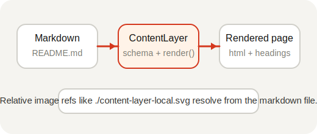

# Content Layer API

The blog-site intentionally wires **`createContentLayer`** from `@pagesmith/site` at the SSR entry so the example can stay on one package for content, JSX runtime, CSS, and SSG. That is the same content layer the `pagesmithContent` plugin uses internally; this example skips the plugin and calls the API directly.

## Defining collections

Collections are defined when the layer is created (see `buildLayer` in `src/content.ts`):

```ts title="src/content.ts (excerpt)"
import { resolve } from 'path'
import { createContentLayer, defineCollection, defineConfig, z } from '@pagesmith/site'

function buildLayer(root?: string) {
  const contentRoot = root ? resolve(root) : resolve(import.meta.dirname, '..')

  return createContentLayer(
    defineConfig({
      root: contentRoot,
      collections: {
        guide: defineCollection({
          loader: 'markdown',
          directory: resolve(contentRoot, 'content/guide'),
          schema: z.object({
            title: z.string(),
            description: z.string().optional(),
            date: z.coerce.date(),
            tags: z.array(z.string()).default([]),
            series: z.string().optional(),
            seriesOrder: z.number().optional(),
          }),
        }),
        pages: defineCollection({
          loader: 'markdown',
          directory: resolve(contentRoot, 'content/pages'),
          schema: z.object({
            title: z.string(),
            description: z.string().optional(),
          }),
        }),
      },
    }),
  )
}
```

## Loading and rendering entries

`getCollection` returns `ContentEntry` values with validated `data` and a lazy **`render()`** method. **That** is the supported seam for Markdown in this example: it runs the shared pipeline and returns `{ html, headings, readTime }`.

```ts
const entries = await layer.getCollection('guide')

for (const entry of entries) {
  const rendered = await entry.render()
  // rendered.html, rendered.headings, rendered.readTime
}
```

For ad-hoc strings (not collection files), the package also exposes `processMarkdown` / `convert` — this site does not need them because every page comes from the filesystem collections above.

## Local assets beside markdown

Pagesmith resolves sibling assets from the markdown file path, so regular relative images work without extra configuration:



That same rule is why folder-based entries are recommended when a page has companion screenshots or diagrams.

For the canonical JPEG `<picture>` fallback and intrinsic-dimension examples, see the root docs page at `/guide/markdown-features/`.

## Comparison with virtual modules

| Virtual modules (`pagesmithContent`) | Direct API (`createContentLayer`) |
|--------------------------------------|-----------------------------------|
| Collections defined in `content.config.ts` | Collections defined inline in the SSR entry |
| Imported via `virtual:content/guide` | Loaded via `layer.getCollection('guide')` |
| Markdown resolved through the plugin graph | Markdown resolved when you `await entry.render()` |
| Type declarations auto-generated | Types inferred from your Zod schemas |
| Requires the `pagesmithContent` plugin | No content plugin — only `pagesmithSsg` |

Both paths share the same markdown implementation once content is rendered.
