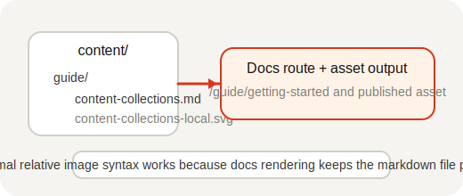

## Automatic Collection Discovery

Unlike the other examples in this repo, which keep an explicit `content.config.ts` or `.mjs` built on `@pagesmith/site` (or on `@pagesmith/core` for headless-only integrations) and then layer framework rendering on top, `@pagesmith/docs` discovers “collections” implicitly from the docs directory tree. There is no separate collection registration file in this workflow — the filesystem layout is the source of truth, and the docs build maps folders to routes and sidebars. The default convention is `docs/` at the repo root, with `content/` as the fallback when you choose a different explicit setup like this example.

Each top-level folder becomes a section with its own header/sidebar navigation:

| Folder | Route | Navigation |
|--------|-------|------------|
| `content/guide/` | `/guide/*` | Guide section |
| `content/guide/kitchen-sink.md` | `/guide/kitchen-sink` | Single markdown regression page inside the Guide |

Nested markdown files stay in the same top-level section even when their URLs are deeper, and the section sidebar stays flat from the reader's perspective. Files or folders starting with `.` or `_` are ignored during discovery.

## Frontmatter Schema

All pages share a common frontmatter schema:

```yaml
---
title: Page Title
description: Optional description
publishedDate: 2026-03-18T00:00:00.000Z
lastUpdatedOn: 2026-03-18T00:00:00.000Z
tags: [tag1, tag2]
draft: false
layout: page
---
```

The `layout` field is optional — pages use the section's default layout, which can be configured in `meta.json5` or the site config. When you do set it, use the registered layout key from `theme.layouts` (for this example, keys like `page` and `home`), not the component filename.

## Local assets beside docs pages

Docs pages can keep companion images next to the markdown file and reference them with normal relative URLs:



The docs build publishes that asset with the page while keeping the markdown source filesystem-first.

For the canonical JPEG `<picture>` fallback and intrinsic-dimension examples, see the root docs page at `/guide/markdown-features/`.

## Section Metadata

Each section can include a `meta.json5` file for ordering and series grouping:

```json5
{
  displayName: 'Guide',
  orderBy: 'manual',
  series: [
    { slug: 'getting-started', displayName: 'Getting Started', articles: ['installation', 'project-structure'] },
  ],
}
```

When a section defines `series`, any pages not referenced by a series remain visible under an automatic `Miscellaneous` group instead of disappearing from the sidebar.
